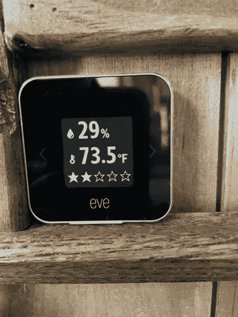
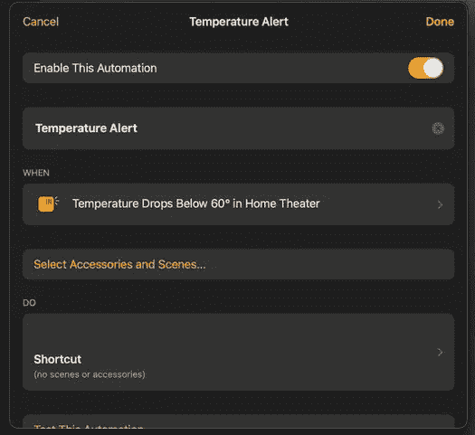
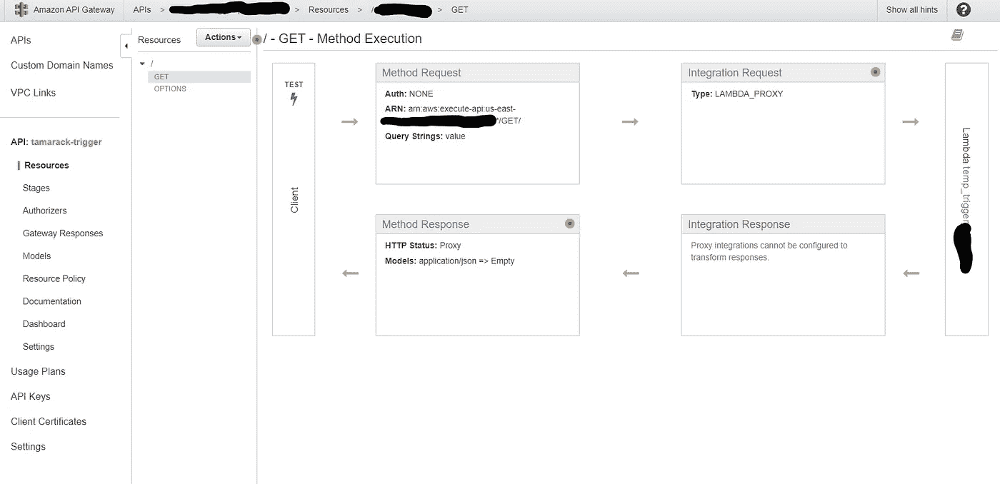
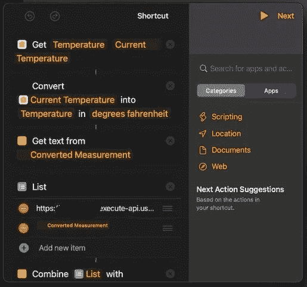

# HomeKit 和温度事件，天啊！

> 原文：<https://medium.com/geekculture/homekit-and-temperature-events-oh-my-2b77d51cbf5d?source=collection_archive---------2----------------------->



Eve Room Sensor

使用 Apple HomeKit、Eve Room、AWS Lambda 和 AWS SES 电子邮件进行冻结警报。或者说，如何让本该简单的东西变得坚硬。

问题是我想在我房间的温度低于华氏 60 度时得到通知。这应该很容易，因为我有温度传感器和使用苹果 HomeKit 的家庭自动化设置。所以，我可以用我的手机或笔记本电脑准确地看到当前的温度。现在我所在的房间在七十二度左右徘徊，湿度在百分之二十九左右，空气质量也只是可以。我需要弄清楚为什么空气质量这么差，因为房子里的另一个传感器显示，非常好。所有这些数据都是通过 Eve 房间里的一个小型充电传感器传到我这里的。

在 iOS 的最近几次更新中，苹果增加了越来越多的自动化支持，在 shortcuts 应用程序中，我现在可以创建一个快捷方式来读取传感器数据，并为我创建一封电子邮件或发送 iMessage。问题解决了？等等，这种自动化可以作为手动触发事件或由手机触发，而不是外部传感器。所以，我开始多挖一点。Eve 设备支持 HomeKit 中的触发事件，该事件将在温度高于或低于定义的阈值时触发。好的，这应该很容易…



HomeKit Automation

挺住，HomeKit 的快捷支持超级限制；它不能创建 iMessage，也不能发送电子邮件。然而，这一切是如此诱人的接近。我可以打开灯或者让音响系统自动播放一首歌，但是当我不在的时候，它们都不会通知我温度下降了。为了不被打败，我开始通读支持的功能；这并不像看起来那么容易，因为你是在一个小小的手机屏幕上看的。虽然我在一条出路上遇到了困难，但是 HomeKit 可以获取一个网页！

现在我是一名开发人员，所以这应该很容易；我所要做的就是托管一个 web 端点，从该端点获取一个页面，并将其中一个查询参数设置为观察到的温度，然后给自己发送一封电子邮件。所以，下了兔子洞，我们走。

首先，这个端点将被托管在哪里？嗯，我目前没有 24x7 运行服务器，虽然设置一个 Raspberry PI 来处理通知会是一个有趣的项目，但当您有云时，这似乎有点大材小用。AWS lambda 前来救援。所以，是的，我承认设置云托管解决方案可能比设置 PI 更复杂，但是我也没有带 PI。所以，下一个洞，我去。

几分钟的谷歌搜索之后，我得到了我需要的指针，AWS lambda 函数可以通过标准的 AWS API 调用 SES 服务。甚至有一篇有趣的文章详细介绍了如何设置[使用 lambda 和 Amazon SES 发送电子邮件](https://aws.amazon.com/premiumsupport/knowledge-center/lambda-send-email-ses/)，按照步骤操作，你最终会得到一个 Lambda 函数，当它被触发时，会向指定的收件人发送电子邮件。幸运的是，现在每当我点击控制台上的一个按钮，我的收件箱就会收到一些小邮件。

熟悉 lambda 的人会知道，这个神奇的小函数不能从外部世界直接调用，我发送事件的唯一方式是将它作为 web 端点托管。AWS 一如既往地将您覆盖到 API 网关中。通过几个配置步骤，我创建了一个 API 端点，并将我的小 lambda 绑定到 get 请求；HomeKit 允许您指定请求类型，但是为了简单起见，我使用 URL 查询字符串。



玩了几分钟后，我意识到设置这个 API 的最快方法是将集成请求设置为 LAMBDA_PROXY，这意味着您需要向调用者返回一个格式良好的响应。如果不这样做，您将得到“内部服务器错误”响应。电子邮件可以工作，但不是你想要部署的！

lambda 函数现在看起来像这样。

```
// Copyright 2019 Amazon.com, Inc. or its affiliates. All Rights Reserved.
// SPDX-License-Identifier: Apache-2.0var aws = require("aws-sdk");
var ses = new aws.SES({ region: "us-east-1" });
exports.handler = async function (event, context) {
  var value = event.queryStringParameters.value;
  var params = {
    Destination: {
      ToAddresses: ["[me@h](mailto:michael@francis-web.com)ome.test"], // Your email
    },
    Message: {
      Body: {
        Text: { Data: "Temperature is " + value },
      },Subject: { Data:  "ALERT: Home temp " + value },
    },
    Source: "[alerts@h](mailto:alerts@francis-web.com)ome.test", // Your from email
  };
  let send = ses.sendEmail(params).promise();
  let res = await send;
  return {
        statusCode: 200,
        headers: {
            "Access-Control-Allow-Origin" : "*", // Required for CORS support to work
            "Access-Control-Allow-Credentials" : true // Required for cookies, authorization headers with HTTPS
        },
        body: JSON.stringify(res),
  }

};
```

这里有一个小问题，任何知道端点的人都可以调用我的小函数，并向我发送预先录制的电子邮件。好消息是 API 网关支持 API 键的生成，只需单击一下方法请求，我就可以强制 API 键总是存在。我已经检查了 HomeKit 中的 Get URL 函数是否支持自定义头。现在，只有与我共享 API 密钥的人才能调用该方法。

所以现在，只要稍微修改一下 apple home 中的快捷方式，我就可以调用带有自定义头值的 URL。完成了吗？没那么快，HomeKit 中的快捷方式似乎不支持直接创建一个文本元素，那么我如何形成要调用的 URL 呢？好消息是它支持一个“列表”,并组合它来创建一个字符串。因此，列表的第一个元素是基本 URL，第二个是温度的字符串化值，然后我用' = '字符将它连接起来。所以现在我有了一个包含温度的有效 URL。

HomeKit 脚本



Shortcut Script Part1


Shortcut Script Part2

不要忘记在退出之前测试快捷方式，并确保您部署了 lambda 和 API 网关规则。

将来，我可能会修改 lambda，使用 JSON 有效负载来接受 post 请求，以便通过消息发送更多来自房间的信息，比如室外温度，但那是以后的事了。