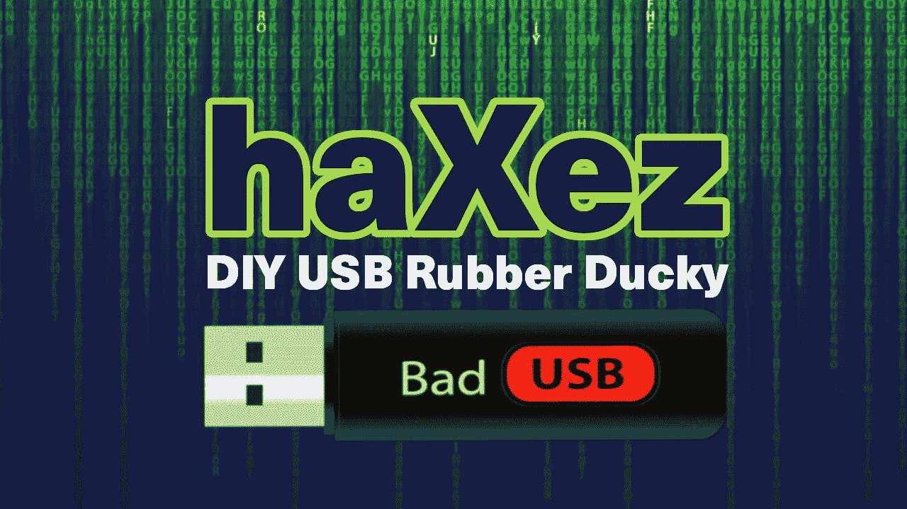

# DIY USB 橡胶鸭子

> 原文：<https://medium.com/geekculture/homemade-usb-rubber-ducky-1d7da1f0744c?source=collection_archive---------13----------------------->

橡胶鸭子是一种 USB 键盘模拟器，由 Darren Kitchen 从 [hak5](https://hak5.org/products/usb-rubber-ducky-deluxe) 开始构思和推广。它赋予该装置的持用者无限的力量，至少在电脑系统上是如此。模拟器以前所未有的速度和精度将击键注入受害者的机器。击键的正确组合将会做伟大但不可描述的事情。

https://shop.hak5.org/products/usb-rubber-ducky-deluxe[的 USB 橡皮鸭](https://shop.hak5.org/products/usb-rubber-ducky-deluxe)目前售价为 49.99 美元，这是一个合理的价格，我强烈建议购买一个来支持 Hak5。然而，如果出于某种原因你不能得到一个，然后拿起一个 CJMCU 虚拟键盘。你还需要一个微型 SD 卡，一个微型 SD 卡读卡器，一个橡皮鸭和一杯咖啡。

**安装 Arduino 集成开发环境**

一旦你有了你的咖啡和你的 CJMCU，你将需要下载并安装 Arduino 集成开发环境。如果您使用的是 Windows，可以从微软商店下载；如果您使用的是 linux，也可以从他们的网站上下载。[https://www.arduino.cc/en/guide/linux](https://www.arduino.cc/en/guide/linux)

接下来，您需要从 Seytonic 的 github 库中获取 Duckduino。

[https://github . com/Seytonic/duck duino-microSD/blob/master/duck duino-microSD/duck duino-microSD . ino](https://github.com/Seytonic/Duckduino-microSD/blob/master/Duckduino-microSD/Duckduino-microSD.ino)

**上传。ino 脚本**

接下来要做的是将 CJMCU 插入 USB 端口并启动 Arduino IDE。在进一步操作之前，您可能需要检查是否选择了正确的板和 COM 端口。这两者都可以从工具菜单中配置。由于 CJMCU 板是莱昂纳多板的克隆，这是我从板菜单中选择的板。

接下来，您需要将 Duckduino-microSD.ino 文件的内容复制到 Arduino 草图中。然后使用上传按钮将新草图推送到 CJMCU 板。这是允许 CJMCU 模拟键盘的功能。这使得它能够像我们都知道和喜欢的 USB 橡胶鸭子一样工作。一段时间后，上传将完成，设备几乎准备就绪。唯一缺少的是有效载荷。

**装载有效载荷**

git hub repository 上有一个巨大的 ducky 有效载荷库[https://github . com/hak 5 Darren/USB-Rubber-Ducky/wiki/Payloads](https://github.com/hak5darren/USB-Rubber-Ducky/wiki/Payloads)。找到你想要的有效载荷，我建议从一些简单的东西开始，比如打开网页，任何平台的有效载荷。将脚本的内容复制到一个文本文件中，并根据你的喜好进行修改(我可以建议 https://www.youtube.com/watch?v=oHg5SJYRHA0)。将其保存为 script.txt 或您设置的任何字符串 DEFAULT _ FILE _ NAME = " script . txt "；上传到 CJMCU 的 ino 文件中的值。最后，使用 microsd 读卡器将 script.txt 文件复制到 microsd 中。你的山寨 USB 橡胶鸭现在准备恶作剧不知情的受害者。

虽然 USB 橡皮鸭主要与黑客攻击和渗透测试有关，但它是一个强大的自动化工具，可用于各种繁琐的任务。例如，想象一下，如果您需要在多个气隙机器上安装软件或进行配置更改。您可以编写一个脚本来自动完成这个过程。

Hihey TF MicroSD Micro SD 卡插槽 Badusb USB 虚拟键盘 ATMEGA32U4 模块 Leonardo R3 Bad USB

[https://www . Amazon . co . uk/gp/product/b 07 S7 vy gdc/ref = ppx _ yo _ dt _ b _ asin _ title _ o01 _ s00？ie=UTF8 & psc=1](https://www.amazon.co.uk/gp/product/B07S7VYGDC/ref=ppx_yo_dt_b_asin_title_o01_s00?ie=UTF8&psc=1)

在 [haXez](https://haxez.org) 阅读更多帖子