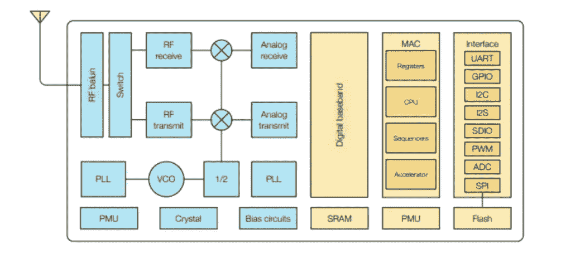
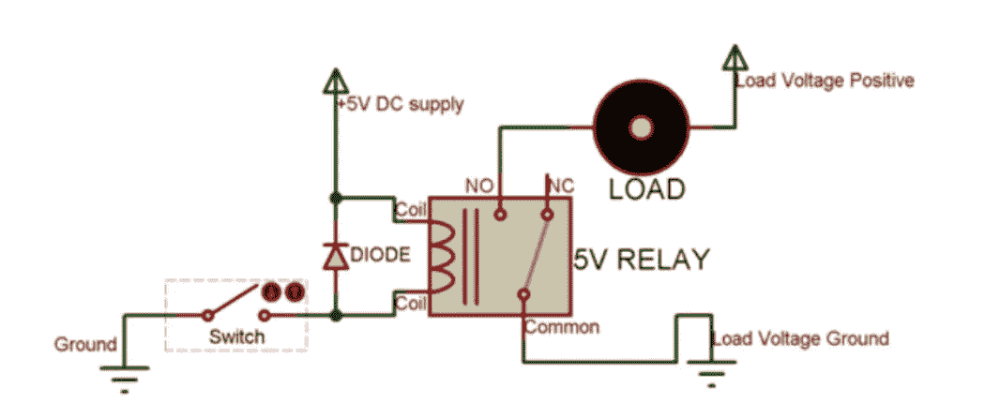
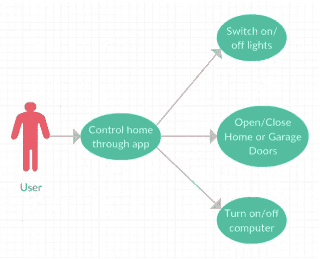
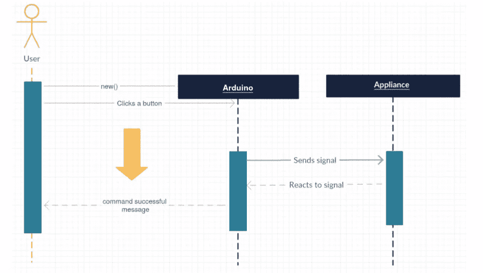
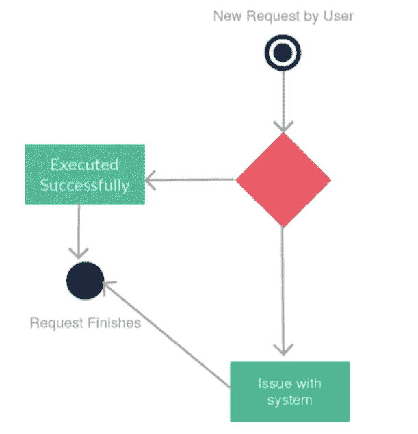
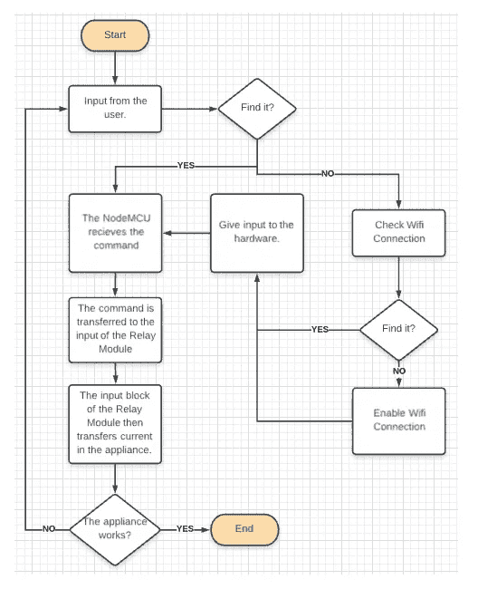

# Homote —您的家庭自动化遥控器

> 原文：<https://medium.com/geekculture/homote-your-home-automation-remote-7d0cfa859ea4?source=collection_archive---------38----------------------->

## 使用 NodeMCU、继电器模块和电池创建您自己的经济高效的家庭自动化系统

Photo by [Ihor Saveliev](https://unsplash.com/@saveli?utm_source=medium&utm_medium=referral) on [Unsplash](https://unsplash.com?utm_source=medium&utm_medium=referral)

预计到 2026 年，印度家庭自动化行业将从 2018 年的 17.909 亿美元增长到 135.741 亿美元。印度仍然是家庭自动化产品服务不足的市场，主要原因是产品成本高，品牌和服务选项有限。

> 直到几年前，家庭自动化仍然局限于社会的富裕阶层。但现在，中产阶级对技术的接受和放松的愿望使它成为一个规模很大的行业，尽管家庭自动化系统的高昂价格和复杂性阻碍了普通人对它的追求。

但是，随着无线技术和无线产品的出现，本文试图提供一种负担得起的解决方案来解决成本指数增长的问题。

我使用了 NodeMCU，这是一个由开源社区制作的板，可以作为一个非常经济的替代物来使用带有 ESP8266 的 Arduino。我还使用了一个 android 应用程序来控制家庭自动化连接的设备，因为 NodeMCU 连接到家庭路由器，从而连接到互联网。

> 因此，这篇文章期望为技术成熟的阶层提供一个负担得起的解决方案，来解决家庭自动化及其高昂的价格这一障碍。

# 什么是家庭自动化？

家庭自动化系统是一种技术解决方案，可以实现家庭内部大部分电子、电气和技术任务的自动化。它混合使用硬件和计算机代码技术，允许控制和管理家中的电器和设备。

> 这是一个不断发展的行业，随着世界的发展，人们越来越倾向于更轻松的生活。这就要求在这个领域中包含技术，而自动化系统倾向于走这条路。2016 年，全球家庭自动化市场价值为 396.07 亿美元，预计到 2023 年将达到 816.45 亿美元，2017 年至 2023 年的 CAGR 增长率为 11.2%。

# 这篇文章的目的是什么？

这种家庭自动化系统的动机是自动化简单而重要的活动，例如在用户房间内的 Android 手机的帮助下开灯。这个系统希望为不同的家庭自动化系统提供一个成本有效的解决方案。

Photo by [Sebastian Scholz (Nuki)](https://unsplash.com/@sebastian_s?utm_source=medium&utm_medium=referral) on [Unsplash](https://unsplash.com?utm_source=medium&utm_medium=referral)

该系统使用 Arduino 为我们基于 Android 的应用程序提供硬件接口。一旦 NodeMCU 连接到互联网，遥控器就可以从不同的地方切换灯光模式。目的是以一种非常经济有效的方式使人们的生活变得简单方便。

> 当今世界的家庭自动化系统要么对于不熟悉该技术的用户来说太难使用，要么对于普通市民来说太贵。因此，通过这个家庭自动化系统，我希望为这个难题提供一个经济有效的解决方案。

# 所需组件

## NodeMCU

NodeMCU 是一个开源的物联网平台，其固件运行在`Espressif’s SoC Wi-Fi ESP8266`上，基于`ESP8266 nonOS SDK`。它的硬件基于`ESP-12`模块。脚本语言是`Lua`，它允许使用许多开源项目，如 lua-cjson 和 spiffs。

ESP8266 是一款微控制器，具有:

*   低功耗、高度集成的 Wi-Fi 解决方案
*   最少 7 个外部组件
*   宽温度范围:-40℃至+125℃
*   ESP8285–8 Mbit 嵌入式闪存

*ESP8266 — Block Diagram |* Image by Ligo George on his [article on electrosome](https://electrosome.com/esp8266/)

## 继电器模块

继电器是电子设备中最常用的开关装置。在讨论驱动继电器的电路之前，我们必须考虑继电器的两个重要参数。

*   一个是触发电压——这是打开继电器所需的电压，即将触点从`Common -> NC`切换到`Common -> NO`。我们的继电器有 5V 的触发电压。
*   另一个参数是您的负载电压和电流，这是继电器的 NC、NO 或公共端子可以承受的电压或电流量，在我们的情况下，DC 的最大值为 30V 和 10A。

5V Relay Switch — Block Diagram | Image from [Components101 Article](https://components101.com/switches/5v-relay-pinout-working-datasheet)

上面的电路显示了继电器运行的最低限度的概念。由于继电器有 5V 的触发电压，我们使用了一个+5V 的 DC 电源到线圈的一端，另一端通过开关接地。这个开关可以是任何可以执行开关操作的东西，从小晶体管到微控制器或微处理器(在我们的例子中是微控制器)。

你还可以注意到连接在继电器线圈两端的二极管，这个二极管叫做**反激二极管**。二极管的作用是保护开关免受继电器线圈产生的高电压尖峰的影响。如图所示，负载的一端可以连接到公共引脚，另一端可以连接到 NO 或 NC。如果连接到 NO，负载在触发前保持断开，如果连接到 NC，负载在触发前保持连接。

*   它通常用于开关电路。
*   也用于家庭自动化项目来切换交流负载
*   用于在预定时间/条件下控制(开/关)重载
*   用于安全电路中，在出现故障时将负载从电源上断开
*   用于汽车电子，控制指示灯，玻璃电机等。

# 产品规格和功能

开发一个产品的第一步是理解产品需要什么。产品的这些特性决定了它们在市场上的成功以及这些目标的实现程度。该系统的产品特性陈述如下—

*   借助这款用于家庭遥控的移动应用，以及一种非常经济高效的家庭自动化问题解决方案，用户只需在手机上轻轻一点，就可以选择执行简单而重要的活动，而不必亲自动手。
*   该系统将能够为用户提供一个接一个地执行某些动作的选项，而没有任何过度的延迟。
*   在 Arduino IDE 应用程序中，我们将代码上传到 NodeMCU，node MCU 获取 wifi SSID 和密码，这已经为只有有权访问家中 wifi 路由器的用户才能获得授权让路。

在开发产品时也有一些可以考虑的限制，下面给出了这些限制——

*   因此，android 应用程序中没有授权页面，但它提供了一个部分来填充只有用户才能知道的 IP 地址，因此只有授权用户才能使用它。
*   要使系统正常运行，必须保持稳定的互联网连接。
*   系统的另一个约束是，这些动作只能在另一个动作完成后执行，即用户不能同时执行两个动作，因为某个 pin 号和其他信息是从应用程序发送到 NodeMCU 的，因此它们必须一个接一个地执行。
*   所有通过 Arduino 控制的设备都需要持续供电。

Use Case of Homote | Image by Author

# 程序

在理解了设计的系统应该做的基本需求和特性之后，我开始绘制一些图表。这是以专业方式开发产品的重要步骤之一。这些图帮助用户和创建者更好地理解系统，并使创建者更容易确保他们在正确的道路上前进。由于我还在学习中，这些图表可能达不到一般的行业标准。

## 程序表

> 序列图简单地描述了对象之间的顺序交互，即这些交互发生的顺序。我们也可以用事件图或事件场景来指代序列图。序列图描述了系统中的对象如何以及以什么样的顺序运行。

Sequence Diagram | Image by Author

上图描述了用户和设备之间通过 arduino (NodeMCU)的交互。它只是显示创建了一个新实例来启动，当用户单击一个按钮时，Arduino 会向设备发送一个信号，设备反过来对信号做出反应。在此序列之后，arduino 将向用户发送命令成功消息。

## 状态转换图

> 状态转换图描述了对象可能具有的所有状态、对象改变状态的事件(转换)、在转换发生之前必须满足的条件(保护)以及在对象生命周期中进行的活动(动作)。

State-Transition Diagram | Image by Author

因为这是一个非常简单的想法，请求将被发送到哪里，将被执行，或者有问题。这个状态转换图描述了这两者。

## 数据流图

> 数据流图(DFD)描绘了任何过程或系统的信息流。它使用定义的符号，如矩形、圆形和箭头，加上简短的文本标签，来显示数据输入、输出、存储点和每个目的地之间的路线。

Data Flow Diagram | Image by Author

上面的数据流程图简单描述了用户如何给系统输入信息，以及系统如何进一步工作。因此，当用户给出输入时，系统将能够找到或理解给定的命令。如果系统不理解它，它将检查 wifi 连接，如果它获得 Wifi 连接，那么它给电器一些输入，如果它没有找到连接，那么它尝试启用相同的连接。

NodeMCU 接收到输入后，命令将被传输到继电器模块，继电器模块的输入模块将在设备中传输命令所指的电流。最后，它检查设备是否正在工作，如果正在工作，则该过程结束，否则该过程将重新启动。

## 电路图

> 电路图是电路的图形表示。图示电路图使用元件的简单图像，而示意图使用标准化的符号表示来显示电路的元件和互连。

所以，开发 Homote 最重要的部分来了，就是创建必要的电路。你只需要复制同样的电路，你就可以拥有一个工作的家庭自动化系统。

Circuit Diagram | Image by Author

上面的电路图描述了所使用的组件以及它们是如何连接的，一些进一步的信息可以帮助你(因为我自己花了相当多的时间来理解它):

*   NodeMCU 通过其数字引脚(比如 D1、D2、D3、D4)连接到继电器，并通过微型 USB 连接到计算机的电源(这可以在以后根据您的需要进行更改)。
*   继电器的输入引脚连接到节点 MCU，GND 引脚和 VCC 引脚分别连接到 GND 和节点 MCU 的 3.3V，电池的正极端子连接到公共端子，负极端子连接到 LED 的负极端子，LED 的正极端子连接到常开端子。

# 用户界面

虽然我可以创建自己的 android 应用程序，但我认为使用其他平台也支持的应用程序会更好。我使用了名为 [Blynk](https://blynk.io) 的应用程序，我建议使用相同的程序，它也很容易连接到 NodeMCU，并且不需要很长的代码。

NodeMCU Code

如上面的代码所示，编写 homote 代码是一个相当简单的过程。您将在 Blynk 应用程序中为您的帐户收到一个唯一的授权令牌，您应在上述代码中替换该令牌。

您的家庭 Wifi 的 SSID(名称)和密码(NodeMCU 必须始终保持连接才能工作)也将替换给定的 SSID 和密码。

上述代码可以用 Arduino IDE 编程到 NodeMCU 中，并且是一个相当简单的过程(你可以参考互联网上的文章，不会遇到任何问题)。

Blynk Application Interface | Image by Author

如上所示，在 Blynk 应用程序中，这是一个相当简单的用户界面。您只需拖动应用程序中的开关，然后根据您在继电器模块上的连接进行配置，即可在您自己的应用程序中获得上图。

完成这整个过程后， ***瞧！你有一个工作的家庭自动化系统，而不必支付过高的价格要求的行业。***

*最后，* *如果你面临任何困难，请随时联系我，或者你可以看看我的 github gist* [***这里***](https://gist.github.com/shashankcic/e1dbde5028cfacf394cb6bd3eb80250f) *(它可能有点更新，但有足够的评论来帮助你通过它)任何疑问。*