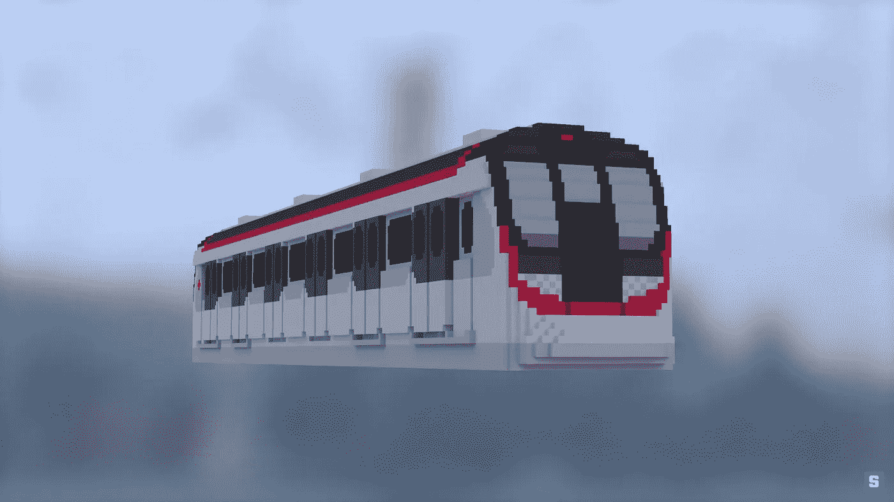

# 香港地铁推出沙盒元宇宙(沙)

> 原文：<https://medium.com/geekculture/hong-kongs-metro-launches-the-sandbox-metaverse-sand-718b4dd1b57c?source=collection_archive---------10----------------------->

香港的地铁系统正在进入沙盒的元宇宙。负责管理铁路网络的公司 MTR Corporation 刚刚收购了一块虚拟土地，用于开发数字地铁站。该公司表示，它希望利用元宇宙与年轻用户交流。

Hong Kong’s metro launches The Sandbox metaverse (SAND)