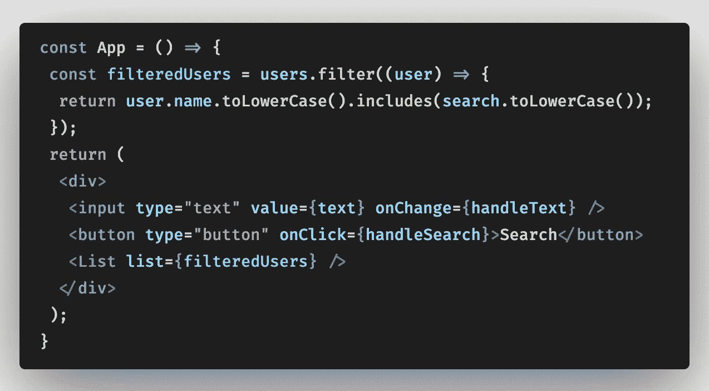
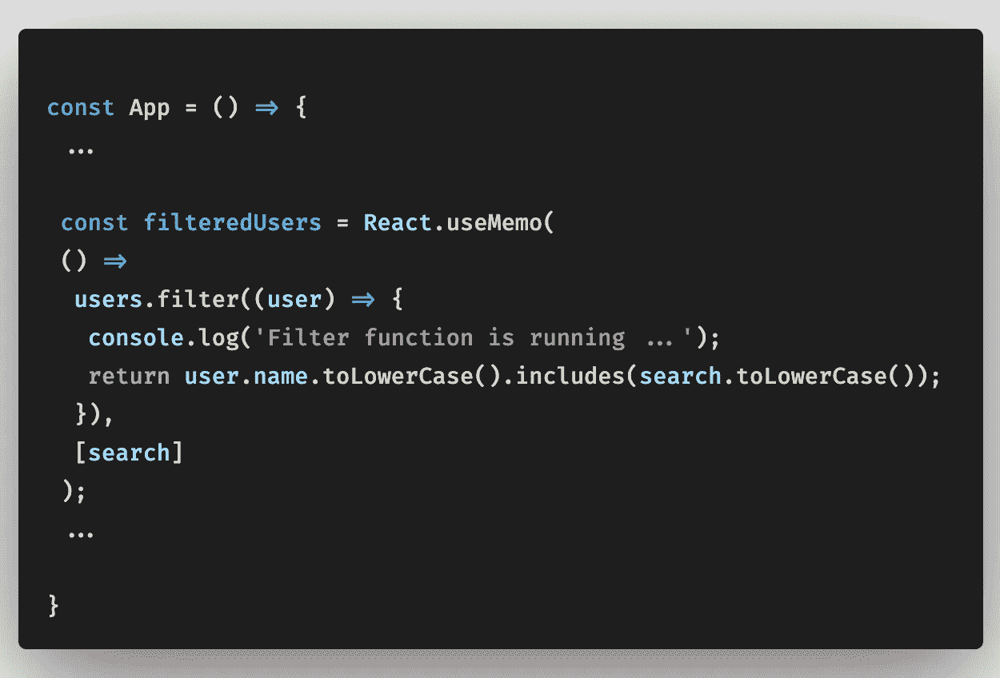
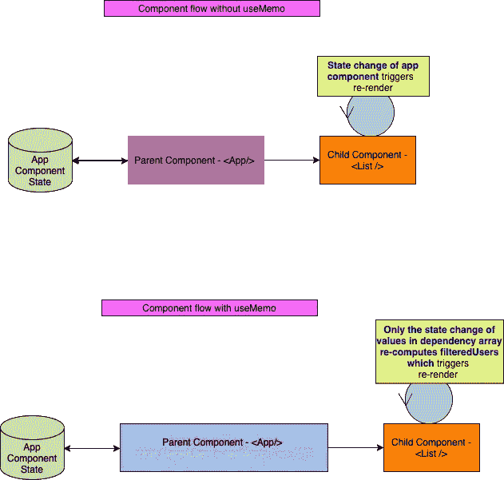
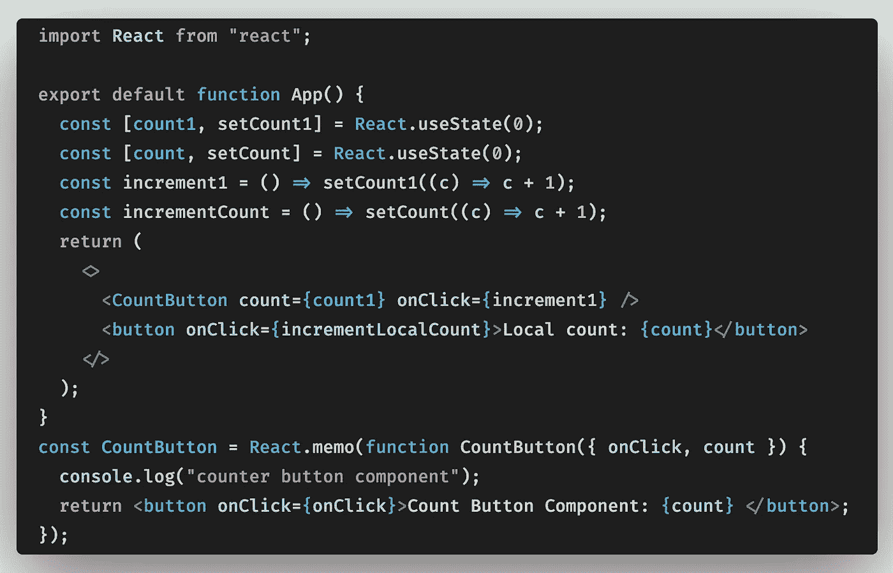
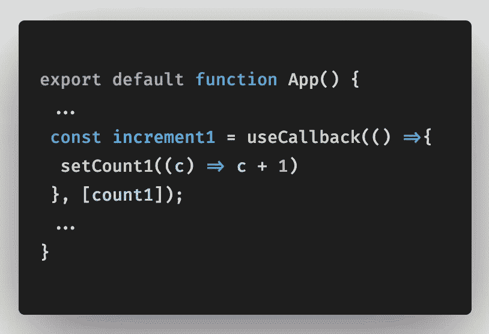
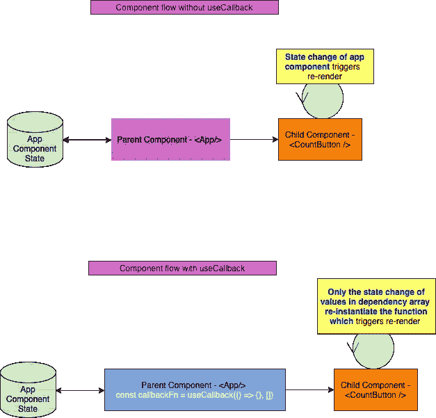
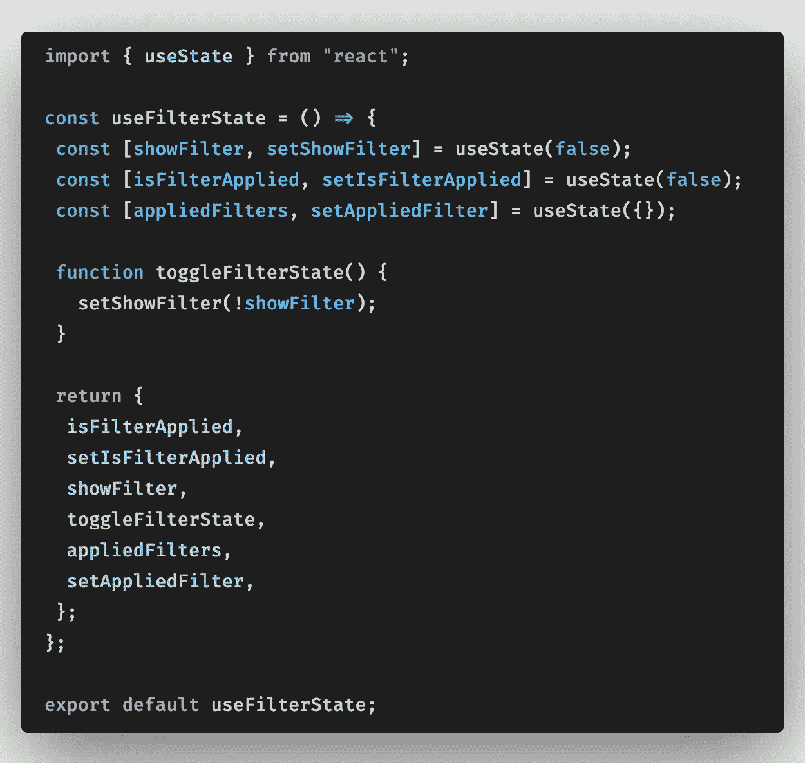
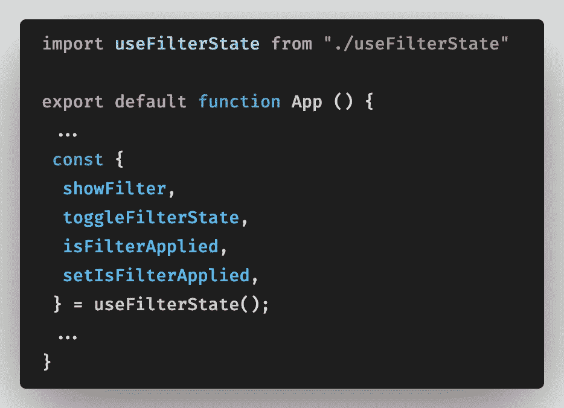

# 挂钩—使用备忘录、使用回调、自定义挂钩

> 原文：<https://medium.com/geekculture/hooks-usememo-usecallback-custom-hooks-828ad6113dfb?source=collection_archive---------0----------------------->

在早期的 react 版本< 16.8 everyone is using class components of react where we can maintain local state of the component. Since there is no possibility of maintaining a state in functional component we used functional component as presentational/dumb component.

Hooks is the new addition in react 16.8\. Using **使用状态**和**使用效果**钩子中，功能组件的状态和生命周期可以被维护。在这篇文章中，让我们详细了解一下**使用备忘录**和**使用回调**钩子。

# 使用备忘录挂钩:

useMemo 用于**记忆数值并优化计算成本**。

即使当有人在输入域中键入时，被过滤的用户不会改变，因为它们只在通过`search`状态单击按钮时改变，但是对于输入域中的每次击键， **filteredUsers** 回调函数会反复运行。

这并没有降低这个小 React 应用程序的速度。然而，如果我们要处理这个数组中的大量数据，并为每次击键运行过滤器的回调函数，我们可能会降低应用程序的速度。因此，您可以使用 React 的 useMemo 钩子来**记忆一个函数的返回值**，并且仅当函数的依赖项(这里是`search`)发生变化时才运行该函数。

通过将 useMemo 包装到 filteredUsers，仅当使用输入的文本更新搜索值以计算 filteredUsers 列表时，才重新呈现列表组件。我们可以通过使用 useMemo 来减少频繁的重新渲染。

您可以通过在 Codepen 上尝试以下示例来检查日志:

useMemo — demo

# 使用回调挂钩:

useCallback 用于**记忆功能。**

这个钩子有助于防止频繁地重新呈现使用回调函数的子组件。

这里，每当计数值发生变化时，increment1 函数被重新实例化，从而 CountButton 组件被重新呈现。现在，在大多数情况下，这不是一个大问题，除非你传递许多不同的函数，都在改变不相关的数据，这被证明是你的应用程序性能的一大成本。

通过向 increment1 函数添加 useCallback，仅当 count1 发生更改时，CountButton 组件才会重新呈现，increment1 函数才会重新实例化。我们可以通过使用 useCallback 来减少频繁的重新渲染。

您可以通过在 Codepen 上尝试以下示例来检查日志:

useCallback — demo

# 自定义挂钩:

我们还可以想出自己的定制钩子来有效地管理状态。在这里，我们设计 filterStateCustomHook 来有效地重用用于过滤模态的状态。

创建 useFilterState.js 并粘贴以下内容:

上面的钩子用于维护 showFilter = >来切换过滤器模式，isFilterApplied = >来指示过滤器状态，appliedFilters = >来维护所有应用的过滤器值。通过在需要添加过滤器模式的组件中使用上面的钩子，我们可以重用状态值，而不是专门为组件创建和维护状态。通过这种方式，我们可以减少维护的状态变量，从而从内部提高应用程序的性能。

上面的钩子在我们的组件中使用如下:

# 结论:

使用钩子帮助我们改进了代码的设计模式和应用程序的性能，我鼓励你也在你的项目中使用它。

感谢您的时间和关注。我希望你能从我写的东西中得到价值。