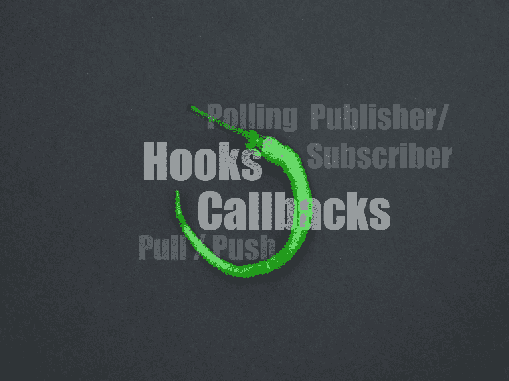

# 钩子 vs 回调 vs 网页钩子

> 原文：<https://medium.com/geekculture/hooks-vs-callbacks-vs-webhooks-f2f1fa6bdbcd?source=collection_archive---------5----------------------->

## 我如何使用它们，区别在哪里？

Photo by [Dan-Cristian Pădureț](https://unsplash.com/@dancristianp?utm_source=medium&utm_medium=referral) on [Unsplash](https://unsplash.com?utm_source=medium&utm_medium=referral)

Unix 编程哲学是做(仅仅)一件事，但要做好。专注于一个核心任务是很难的，因为开发人员看到并感受到他们的用户的痛点和愿望。为了能够专注于核心产品，但允许我们无法顾及的附加功能，我们开发了插件系统。一种方法是给钩子。