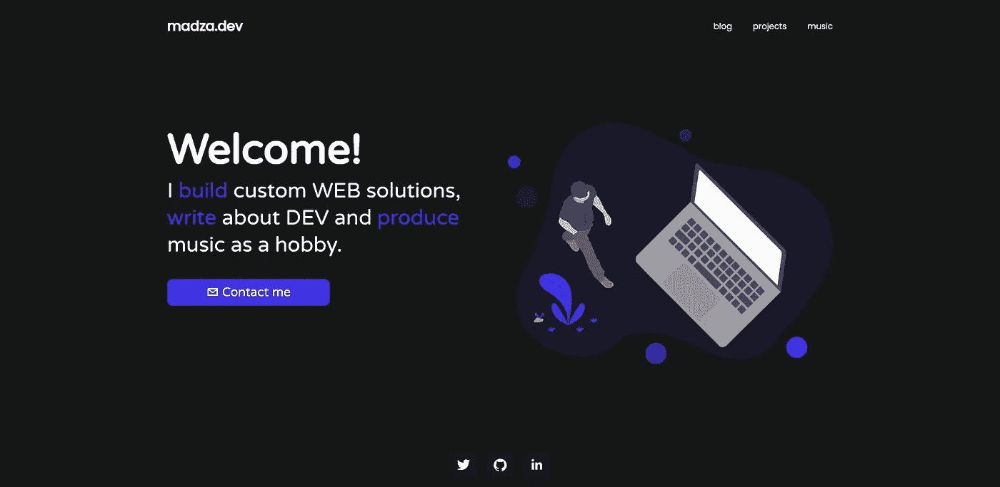

# 万岁！我创作了我的第一个作品集📂🎉

> 原文：<https://medium.com/geekculture/hooray-i-created-my-first-portfolio-66918dabe0c3?source=collection_archive---------21----------------------->

在过去的几个月里，我一直在做一个个人投资组合。我一直认为，一个独立的投资组合对任何开发者都很重要，因为它将你与未来的机会联系起来，并帮助你扩大你的网络。

今天我把它部署在了 madza.dev 上。仍然有一些东西需要改进，比如测试浏览器兼容性，调整一些 UX，等等，所以它仍然是一个 WIP，当然。但是嘿…