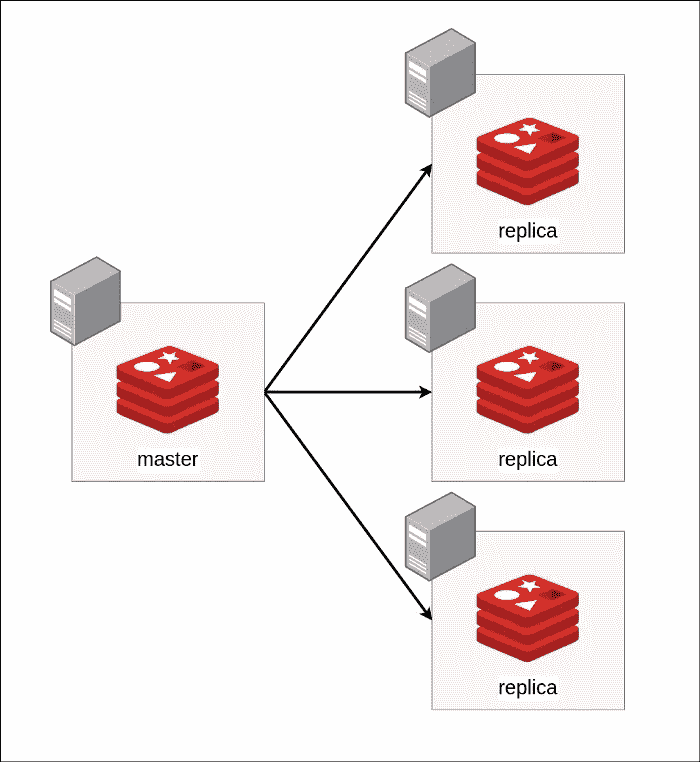
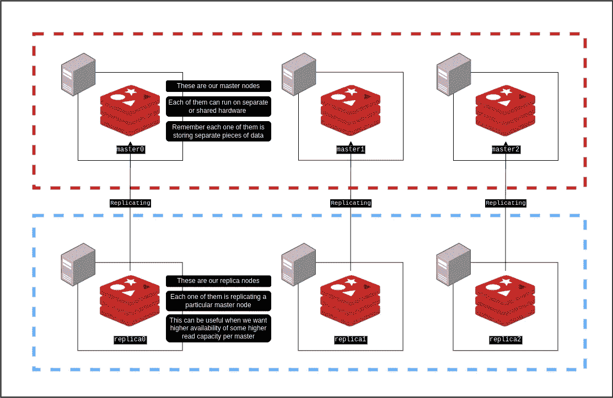
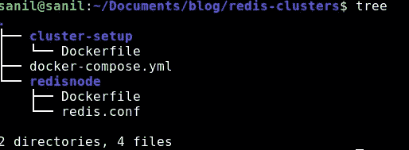
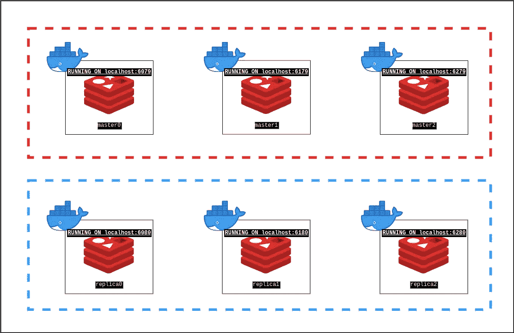
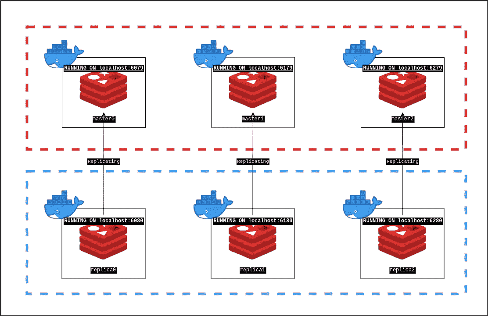

# 使用 Redis 集群水平扩展写入

> 原文：<https://medium.com/geekculture/horizontally-scaling-writes-with-redis-clusters-a77cdcdf6de2?source=collection_archive---------1----------------------->


# 快速回顾一下

好的，在过去的一篇文章中，我谈到了如何水平扩展 Redis 以获得更高的读取性能和更好的可用性。如果你还没有读它，不要担心，我会给你一个快速的回顾(虽然我真的很喜欢你读它:)。对于已经读过的读者，请跳到下一节。

因此，我们的想法是添加更多的 Redis 节点(这些节点的运行方式类似于独立的 Redis 实例)，并在这些新的*从/副本*节点之间实现复制，这样它们就可以复制*主*节点中的所有数据。



Redis 将自动确保主(主要)节点的数据在副本节点中被复制或拷贝。这有几个好处。首先，我们将运行的任何 Redis 节点在它可以处理的数据量和流量上都有限制(例如，由于有限的硬件)，因此如果我们可以运行多个节点，我们可以处理更多的流量和数据。第二个优点是，如果其中一个 Redis 节点崩溃，我们已经有其他副本节点在运行，它们可以分担负载，因此我们的用户不会收到错误消息。

这里有更多的细节和细微差别，所以如果这是你想了解更多的东西，[在这里阅读完整的博客文章](/geekculture/replication-in-databases-with-redis-architecture-for-horizontally-scaling-databases-b19fc6c5d149)。

# 我们为什么需要它？

正如我们讨论的所有事情一样，我们当前的架构存在缺陷。我们一直在谈论提高读性能，但是写性能呢？在我之前的文章中，我证明了这一点，说大多数应用程序都是读负载大于写负载，这是真的。但是对于*大部分*app 是这样，对于*所有*app 不是这样。

例如，想象一个实时消息应用程序，如 Whatsapp 或 Slack。在这个应用程序中，用户可以向其他用户发送消息，并阅读旧消息(暂时忽略频道和群组)。您可能会认为读写流量大致相同。大多数消息将被阅读一次(除非有人滚动到顶部找到某个消息，这实际上并不经常发生)，也将被写入一次。让体系结构处理更多的读取流量，却不处理更多的写入流量，这实际上没有意义。

在这里添加更多副本可能没有用，因为我们还需要扩大写入流量，而不仅仅是读取流量。因此，我们需要想一些其他的方法来增加我们的写吞吐量。

# 大师级的建筑

这里直观的想法是允许副本也能够写入数据库。因此，为了澄清术语，让我们也称这些主节点(因为它们现在是可写的)。在旧的主副本体系结构中，我们有一个可以读写的节点(主节点)和多个只能读的节点(副本节点)，而在我们的新体系结构中，我们将有多个主节点，或者多个可以读写的节点。

乍一想，这确实有道理，但多花些时间想想，你很快就会意识到它会多快坏掉。

例如，假设一个服务想要在我们的数据库中存储一条新消息，它随机选择了一个主节点来编写这条新消息。假设它决定在节点 *master1 上写入这个新消息。*几个小时后，用户决定编辑他们的消息。如果我们的服务想要从它写入的节点编辑这条消息，我们的系统需要记住这条消息保存在哪个节点。因此，作为聪明的开发人员，我们决定只存储每个消息 ID 和节点之间的映射(例如，消息 ID *1423* 转到*主机 1* ，消息 ID *5431* 转到*主机 3* )。这应该行得通，对不对？

不完全是。如果我们想添加一个新节点，也许是为了处理更多的流量，会发生什么情况？新的主节点将完全空着启动，这是没有效率的，更糟糕的是，如果我们想要删除存储一些消息并映射到这些消息的节点，会发生什么情况？我们要更新所有的映射吗？

我们如何管理这些新的映射数据呢？由于我们要为每条消息添加一个新的映射，它最终可能会变得相当大，那么我们要为这个映射数据创建一个新的 Redis 节点吗？我们有这个新节点的副本吗？

好吧，事情变得很复杂，很快。所以，让我们退一步，试着真正理解这个问题。

我们之前的主副本架构的好处在于，任何数据都有一个单一的*明显的*真实来源。这里我很想强调一下*这个词明显的*。我们*总是*知道在哪里更新/删除任何键，因为只有一个节点写入了键！

这种新的主-主架构的问题是，如果你需要多个可写数据库，你需要做一些工作来找出每一段数据应该写到哪里，或者任何特定的数据存在于哪里。为了解决这个问题，我们需要一种方法来快速找到任何特定消息存在的节点，并且随着我们的规模和系统中存储的消息数量的增长，找到这个节点应该不会变得困难。

因此，如果我们的系统收到任何消息，它应该能够快速判断该消息存在/应该存在于何处。一旦我们的系统中有了大量的消息，这种查找节点的方法应该仍然有效(这是我们早期的映射方法失败的地方。当我们已经有很多消息时，事情变得非常复杂)。

让我提出一个解决方案。如果我们对消息进行哈希处理呢？如果我们获取消息的一些唯一标识(如 ID)并对其进行哈希运算，然后用我们拥有的节点数对其取模，会怎么样呢？因此，如果我们有 10 个节点，消息 ID 6009 可以转到 6009 % 10，或者第 9 个节点和 ID 为 3414 的消息可以转到第 4 个节点，依此类推。

这将告诉我们在哪里存储任何新消息，并为每条消息提供一个特定的 Redis 节点。每当服务想要找出具有特定 ID 的消息存储在哪里时，它可以将该 ID 传递给哈希函数，然后用节点总数对响应取模。这样我们就不需要存储特定消息 ID 的位置，因为我们可以很快地计算出来！

# 更详细的架构

好的，在我们开始实现之前，让我们先弄清楚我们想要做什么的更多细节。



稍微解释一下这个图，我们有多个主 Redis 节点。这些节点中的每一个都处理我们整个数据集的一部分。因此，一些消息存储在主机 0 中，一些存储在主机 1 中，一些存储在主机 2 中。我们还有一个方法(稍后将详细介绍这个方法)来计算我们需要在哪里存储每条消息。我们还设置了一些副本，这样我们就可以获得高可用性和每个主机更高的读取性能。

主节点和副本节点的组合称为集群。因此，我们实际上实施的是 Redis 节点的单个群集。我们集群中的一些节点是主节点，其他节点是副本节点。

# 实施！

最后，让我们进入实现。和往常一样，对于那些没有耐心的人来说，所有的源代码都可以在 Github 上找到。

我使用 docker compose 在我的本地机器上建立了这个架构。这是我的目录结构的样子-



让我们来看看它是如何工作的。

我首先编写一个 docker 文件，描述每个 Redis 节点应该是什么样子。

其工作方式是，我从 docker 构建阶段获得一个参数，该参数描述了在哪个端口上运行 Redis(这在后面会很有用)。然后我安装一些操作系统库并下载默认的 Redis 配置文件。这个配置文件很重要，因为当我编写自己的定制文件时，我可以包含这个默认配置，只覆盖我需要的属性(否则我也必须编写所有的默认配置)。

然后是这一组特殊的线条

```
ENV REDIS_PORT $REDIS_PORTRUN envsubst < redis.conf > updated_redis.confRUN mv updated_redis.conf redis.conf
```

这实际上是使用 Linux 工具`envsubst`将 REDIS_PORT 环境变量(我们在构建步骤中获得的)设置到配置文件中。如果您想了解更多信息，请查看此。

这是我的`redis.conf`的样子

这个配置只是导入我们之前下载的默认配置，为保护模式设置一些设置(不应该用于生产环境，但是应该适合我们的本地调试)，并启用集群模式。它还设置了一个集群配置文件。这个文件不是我们创建或读取的，而是 Redis 内部管理的。

你们中的一些人可能会注意到，除了我们想要一个集群(因为我们启用了集群模式)之外，我们没有做任何工作来告诉 Redis 设置集群，或者我们想要每个主服务器有多少个副本，或者关于集群的任何细节。别担心，我们很快就会谈到这一点。

现在，让我们快速浏览一下我们的 docker-compose.yml

这看起来真的很长(我们还没有讨论`cluster-setup`服务),但是不要担心，它实际上相当简单。

我们刚刚设置了六个 Redis 节点，给每个节点一个构建时间变量`REDIS_PORT`，这是我们的配置在内部使用的。我们也使用主机网络模式。这是因为使用主机网络模式运行 Redis 集群要容易得多，尽管您可以使用桥接网络模式运行它

因此，上面的 docker-compose 将建立类似这样的东西



请注意，我们还没有设置任何复制或集群。让我们现在就做吧！

为了设置集群，我创建了另一个 Docker 映像，它在所有 Redis 节点启动后启动。这个容器一旦运行就会设置集群并退出。这是我们 docker-compose.yml 中的`cluster-setup`服务

这是它的 docker 文件的样子

它首先等待 10 秒钟，等待其他 Redis 节点变得可用。之后，它设置主节点，指定不为主节点创建副本。然后，它将副本节点分别添加到每个主节点。三个主服务器运行在端口 6079、6179 和 6279 上。每个主节点都有一个副本，它们运行在端口 6080、6180 和 6280 上。查看上图中的端口，了解哪个节点正在复制哪个节点。

这个容器将通过在其中设置集群和复制来完成我们的架构。



而且，就是这样！让我们运行它，对系统进行一些试验。

# 运行它！

因为我们正在使用 docker-compose，所以您需要做的就是运行`docker-compose up`，它会自动为您设置集群。一旦它开始运行。我们可以使用 redis-cli(记住使用 redis-cli 的-c 选项使用集群模式)连接到这些节点中的任何一个，并获取和设置一些键。我们还可以运行 CLUSTER NODES 命令来获取关于我们的主节点和从节点的详细信息，并确认是否一切正常。

这是它看起来的样子

正如您所看到的，我们可以连接和写入这些节点中的任何一个，但是在 Redis 内部，每个键只写入某个特定的节点。根据这个键，Redis 自动决定哪个主节点应该包含这个键。它还知道当它想要获取某个键时使用哪个节点。我们还可以看到，我们存储的数据也在被复制。

运行`CLUSTER NODES`也给了我们一个关于我们连接的所有主节点和副本节点的很好的输出。一切似乎都很顺利！

# 我撒谎了

好吧，我要坦白一件事。当我说我们可以使用散列法将数据分布或分片到不同的节点时，我撒谎了。嗯……我没有撒谎，只是误导了你一点，让事情变得更简单。但是现在，一旦你掌握了我们讨论的内容，让我们更深入地讨论散列步骤。

我们*可以*使用我之前描述的简单散列方法，但是它有很多缺陷。讨论这些会占用另一个帖子，所以[如果你想了解我们的简单方法会有哪些缺陷以及我们如何改进它，请查看这个](https://www.youtube.com/watch?v=zaRkONvyGr8)。Redis 使用类似的东西，叫做 hashslots。我真的很想在这篇文章中介绍它们，但是它已经很长了，所以我现在不能谈论它。但是如果你真的感兴趣，我认为这个视频比我能解释得更好。别担心，其余的东西都是一样的，只是哈希方面比我描述的要微妙得多。

# 结论

探索如何在 Redis 上建立集群真的很有趣，但这感觉有点概念化。我确实建立了一个简单的集群，但我可能会写更多关于这个主题的文章，用更多实际的语气。我还花了一些时间了解像 Box 这样的公司如何使用 Redis，这也可能是未来有趣的文章。另一个有趣的方法可能是找到一个足够简单的用例，构建一个 web 应用程序，并在其上执行一些基本的负载测试。这将更有助于理解 Redis 提供的真正优势。但那都是以后的事了！

