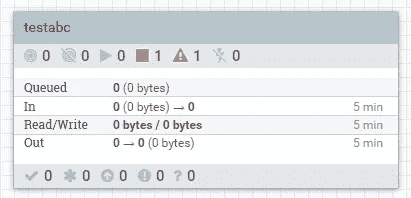
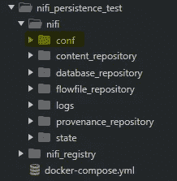
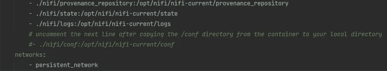
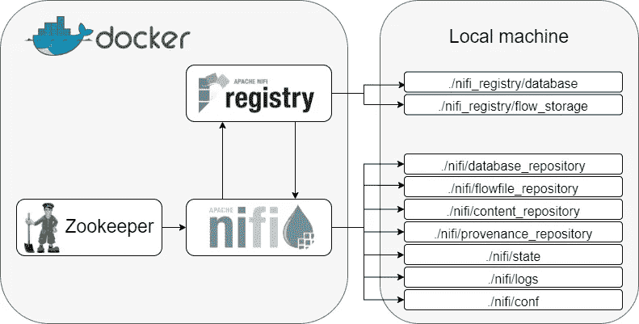

# 用 docker 托管完全持久化的 Apache NiFi 服务

> 原文：<https://medium.com/geekculture/host-a-fully-persisted-apache-nifi-service-with-docker-ffaa6a5f54a3?source=collection_archive---------0----------------------->

## 在更改配置和重新启动服务时，保持数据管道和数据流的安全。

玩一个 docker 托管的 Apache NiFi，测试它的许多功能和 [288 个不同的处理器](https://www.nifi.rocks/apache-nifi-processors/)(从版本`1.14`开始)是很有趣的，只要你不必重启你的 docker 容器，或者——最坏的情况——丢掉你创建的进程组。也许你足够聪明，创建并下载模板作为安全副本。也许您甚至将进程组保存到了 NiFi 的注册表中——但是您的注册表是完全持久的吗？就数据管道而言，有时需要很长时间才能完全正确，这意味着最糟糕的事情是松脱，然后不得不费力地重建它们。

每次 docker 重启后，不必重新构建处理器、重新连接注册表或重新配置整个进程组，有一种简单的方法再也不用担心这个问题了。

接下来的两章将使你能够**设置持久化容器，然后忘掉它**。您唯一需要重新阅读这篇文章的时间是当您创建一个新的设置时。

Containers — Photo by [Frank Mckenna](https://unsplash.com/@frankiefoto) on [Unsplash](https://unsplash.com/).

也许您来到这里也是因为您想了解 Apache NiFi，并从一开始就这样做，在这种情况下:不要担心。所有步骤都有详细解释，不需要任何先验知识。

创建一个完全持久化的 [NiFi](https://nifi.apache.org/) 服务，包括持久化[Apache NiFi registry](https://nifi.apache.org/registry.html)——NiFi 自己的版本控制系统，用于版本化过程组。我们将从 NiFi 注册表开始，因为它是一个快速的设置，然后转移到 NiFi 本身，这有点复杂，但即使作为 docker 容器托管，也不是不可能持久。

我们将使用以下 docker 图片，因为它们是撰写本文时的最新图片——您可以随意使用不同/更新的图片，但请注意这些图片之后的任何变化:

*   动物园管理员:`bitnami/zookeeper:3.7.0`
*   NiFi 登记处:`apache/nifi-registry:1.15.0`
*   尼菲:`apache/nifi:1.14.0`

虽然我们的核心应用程序是 NiFi，但是我们将包含 NiFi 注册中心，以便对我们的流进行详细的版本控制。此外，从 1.x 开始，Zookeeper 就是 NiFi 集群的基础部分——在我们的集群中实现分布式协调和通信，以防我们以后想要扩展和运行 NiFi 的多个节点。

注意:docker 图像由其确切版本指定，如果您使用提供的`docker-compose.yml`文件，将自动下载。整个文件可以在[这里](https://gist.github.com/CribberSix/260f130f2936e97ed2d0fef0df08874d)或者本文末尾找到。

# 准备

本文面向 windows 用户，但如果您使用的是另一个系统，这篇文章仍然有效——但您的收获可能会因地而异。

1.  从[这里](https://hub.docker.com/editions/community/docker-ce-desktop-windows)下载并安装 docker。
2.  打开您最喜欢的命令行工具，导航到一个合适的地方。
3.  创建一个空目录。
4.  手动或使用 curl 复制 [docker-compose.yml](https://gist.github.com/CribberSix/260f130f2936e97ed2d0fef0df08874d) 文件，如下所示。
5.  要启动 docker 服务，运行`docker-compose up`。
6.  要停止 docker 服务，您可以按下`CTRL+C`退出进程。

类似下面的文字墙将会出现并继续运行，直到您按下`CTRL+C`停止服务。

Docker services running in the console — Image created by the author.

NiFi WebUI 上线可能需要一分钟左右的时间。

服务运行后，您可以在浏览器中访问位于[http://localhost:18080/nifi-registry/](http://localhost:18080/nifi-registry/)的 NiFi 注册表和位于[http://localhost:8091/NiFi/](http://localhost:8091/nifi/)的 NiFi。

设置好应用程序后，让我们开始工作吧！

# 持久化 NiFi 注册表

在 NiFi registry 中，我们希望持久化我们创建的存储桶以及它们包含的任何流。

这可以通过在本地机器上安装两个卷来实现— `flow_storage`和`database`。

`flow_storage`包括桶和装在桶内的水流。桶和流由 uuid 标识，这是通用的唯一标识符，就像 NiFi 使用 uuid 标识处理器、处理器组和控制器服务以及其他元素一样。内部包含存储桶的目录结构如下所示:

`database`目录由一个文件组成:

这是一份我们*真的不应该丢掉的文件。没有数据库文件，我们将无法从`flow_storage`目录中加载任何桶和流。*

如果您使用提供的 [docker-compose.yml](https://gist.github.com/CribberSix/260f130f2936e97ed2d0fef0df08874d) 文件，您将看到注册表服务的两个卷已经挂载到本地机器上的目录中:

这意味着，docker 容器在这些目录中创建的任何文件最终都将从您的本地机器中读取和写入——无论 docker 容器是重新启动还是完全重新创建，这些文件都将在其影响范围之外持久存储。

就这样——我们已经完成了注册！每当我们重新启动 docker 容器时，对流或新创建的 buckets 的任何更改都会重新出现。

您可以通过点击浏览器窗口右上角的设置按钮(一个`wrench`符号)，然后点击`new bucket`，在注册表中创建一个存储桶。输入任何你想要的名字，然后点击`create`。

New bucket creation — Image created by the author.

现在，您应该能够在本地目录`/nifi_registry/flow_storage/...`中看到与本章前面所示类似的文件结构。

# 持续的 NiFi

为了持久化 NiFi 的进程组、进程、连接和控制器服务，我们需要使用一个**一次性技巧**，在此之后——无论我们重启 docker 多少次，即使使用`--force-recreate`——NiFi 总是会带着我们所有的元素完好无损地回来。**该步骤需要您的输入**，并且从一开始就不是自动的。

nifi 在`conf`目录中存储信息(我们需要持久化流元素)——但是当我们在 docker 容器第一次启动之前挂载该目录时，我们很快就会意识到 NiFi 容器不会启动。相反，它会反复抱怨并试图解决问题，但毫无结果:

下面是为那些迫不及待的人总结的窍门，详情如下:

1.  启动 NiFi 的 docker 容器，不挂载`conf`目录。
2.  将正在运行的容器中的`conf`目录**复制到本地的`conf`目录中。**
3.  停止码头集装箱。
4.  挂载本地`conf`目录并重启 docker 容器。

现在说说有趣的细节…

## 第一步

提醒:如果您想跟进，可以从这里或本文末尾获取 [docker-compose.yml 文件。](https://gist.github.com/CribberSix/260f130f2936e97ed2d0fef0df08874d)

让我们通过在新创建的目录中执行`docker-compose up`来启动 docker 容器。我们将等待一段时间，直到 NiFi 完全启动——这可能需要一分钟左右的时间，直到选举周期完成，然后我们才能访问[http://localhost:8091/NiFi/](http://localhost:8091/nifi/)下的 WebUI。

为了进行测试，让我们创建一些示例处理器、一个注册客户机、一个控制器服务或任何我们可能想要持久化的东西。单个处理器或处理器组就足以看到想要的结果。您可以从浏览器窗口顶部的栏中拖放元素。

Process group for test purposes — Image created by the author.

## 第二步

启动 docker 容器后，当它还在运行时，我们用下面两个命令将`conf`目录从容器复制到我们的本地机器。

从**一个新的终端窗口**中执行它们(这样我们的 docker 就不会被中断)，但是在保存`docker-compose.yml`文件的同一个目录中，以保证该目录被复制到正确的位置。

您可以从`docker ps`的输出行中获得容器 ID(在我的例子中是`7554d9c68c8f`)。

不要忘记用您自己的 id 替换`docker cp`-命令中的容器 id！

之后，我们可以检查本地机器上是否有包含必要文件的`/nifi_persistence_test/nifi/conf/`目录。

File structure — Image by the author.

## 第三步

我们现在可以通过在命令行窗口中按下`CTRL+C`来停止 docker 容器，在命令行窗口中我们用`docker-compose up`启动了它们。

## 第四步

在`docker-compose.yml`中查找卷被挂载的*注释*行(`- ./nifi/conf:/opt/nifi/nifi-current/conf`)并*取消注释*。注意:注意要和上面的线保持同样的缩进。

The commented line — Image by the author.

取消对该行的注释会将 docker 容器的目录`conf`挂载到我们的本地目录。

现在让我们用`docker-compose up --force-recreate`再次启动我们的 NiFi 服务。

我们使用标志`--force-recreate`来确保我们的容器获取我们对`docker-compose.yml`文件的最新更改。它不会以任何方式影响存储在我们安装的卷中的数据。这也将启动我们的服务——我们的所有元素、控制器服务、注册表桶和连接都保持不变。

Mounted directories — Image created by the author. Logos from Wikipedia.

注意:如果在将`conf`目录复制到本地机器之前还没有创建示例处理器，不要担心。您现在可以在 NiFi 中创建它们，然后重启 docker 容器来测试持久性是否有效。

基本上，我们从现在开始创建的任何东西在重启 docker 容器后仍然会存在。

# 关闭思想

让 Apache NiFi 应用程序作为完全持久化的 docker 服务运行带来了许多好处，其中最重要的是能够在重新创建或重新启动 docker 服务后继续工作。这也是比以前更好地了解 NiFi、NiFi 注册表和任何其他连接服务的理想设置。即使您决定更改设置或添加新服务并以不同方式连接它们，您也不必重新创建这些数据管道！

一如既往，我们永远学不完。了解有关…的更多信息

*   [阿帕奇·尼菲的目的](https://nifi.apache.org/)
*   [Apache NiFi 注册中心的目的](https://nifi.apache.org/registry.html)
*   [docker 撰写入门](https://docs.docker.com/compose/gettingstarted/)
*   [uuid 以及你能否给地球上的每一粒沙子分配一个 UUIDs】](https://pddivine.medium.com/what-is-a-uuid-or-guid-16d0ead25008)
*   [如何在 Python 中创建 uuid](https://docs.python.org/3/library/uuid.html#module-uuid)

在 [Medium](/@cribbersix) 上关注我，获取更多关于数据工程工具以及软件和个人发展的文章！

正如所承诺的，这里是 docker-compose 文件: