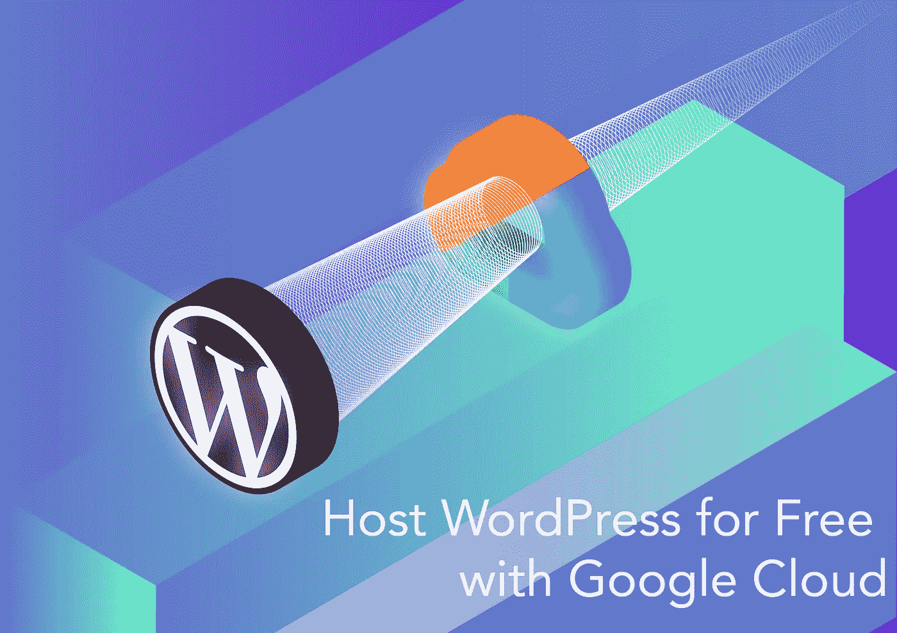

# 用谷歌云免费托管 WordPress

> 原文：<https://medium.com/geekculture/host-wordpress-for-free-with-google-cloud-20ccda226c5f?source=collection_archive---------1----------------------->

## 无广告|灵活|可扩展—使用谷歌云免费层和一键安装程序。

**Host WordPress for Free With Google Cloud** (Image by Author — Courtesy of [Chaeyun Kim](https://www.chaeyun.com/))

互联网上的大多数网站都是用 WordPress 建立的。是最好的 CMS 之一。作为一个初学者，你可以试着和 Wordpress.com 一起创建一个网站，并用 WordPress 托管它。然而，来自 Wordpress.com 的免费网站总是伴随着恼人的…