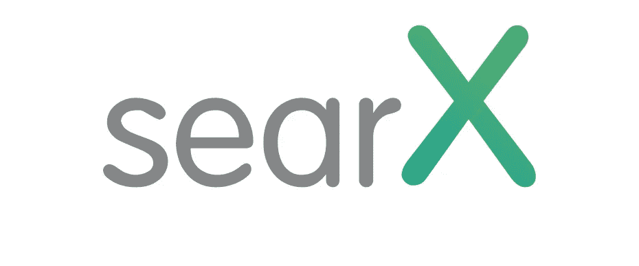

# 拥有你自己的私人搜索引擎——searX

> 原文：<https://medium.com/geekculture/host-your-own-private-search-engine-searx-66549a7b1f7f?source=collection_archive---------4----------------------->

我们越来越依赖谷歌，但了解谷歌现在处理多少数据很有意思。Alphabet 又名谷歌在其隐私政策中描述了其广泛的数据收集做法。该公司存储了数量惊人的数据。据估计，你的数据中有 15eb 是由谷歌存储的。谷歌正在跟踪你的一举一动。

# searX 是什么？