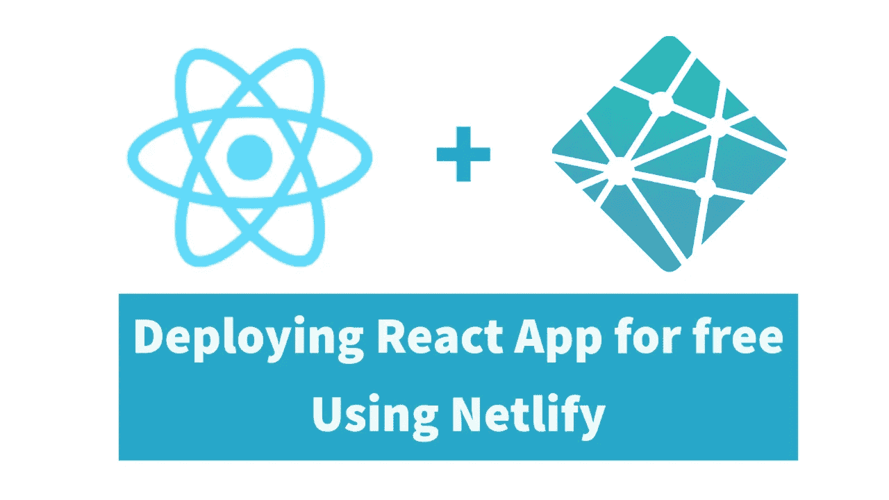

# 在 Netlify 上免费托管 React 应用(2022 年)

> 原文：<https://medium.com/geekculture/host-your-react-app-on-netlify-for-free-2022-cc2165dbda65?source=collection_archive---------10----------------------->

## 包含环境变量设置和网络路由的完整指南

在本教程中，我将与您分享如何在 Netlify 中托管生产级别的 react 应用程序。

您将了解到
#使用 Github 向 Netlify 添加 react 项目
#避免 Netlify 内部常见的构建问题
#避免常见的 Netlify 路由…