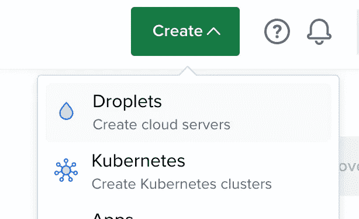
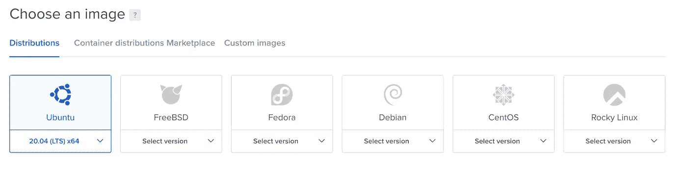
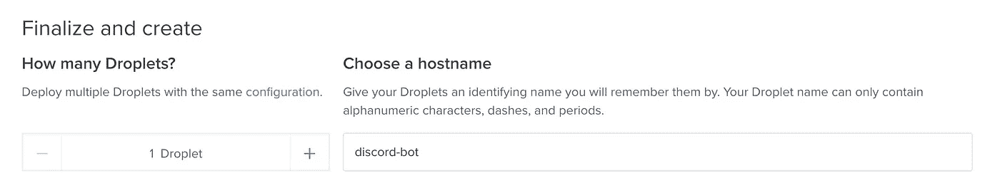
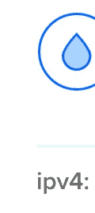
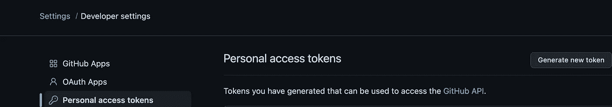
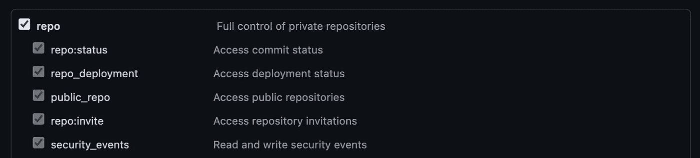
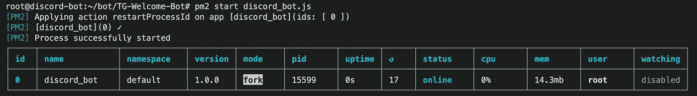

# 为 Linux 或 Mac OS 用户托管带有数字海洋的 Node.js 项目

> 原文：<https://medium.com/geekculture/hosting-node-js-projects-with-digital-ocean-for-linux-or-mac-os-users-3190187dcd1c?source=collection_archive---------6----------------------->

## 通过 Digital Ocean 为 Linux 和 Mac OS 用户托管来自 GitHub Repo 的 Node.js Discord Bot


Image from [Pixabay](https://pixabay.com/photos/waves-sea-ocean-beach-blue-water-3473335/)

# 概观

## 介绍

通常，任何项目的最后一步都是托管它。一个流行的托管选项是[数字海洋](https://www.digitalocean.com/)，在本教程中，我将一步一步地指导您如何使用数字海洋托管您的项目——在本例中，是来自 GitHub 资源库的 Discord.js Bot。

## 工具

对于这个项目，您需要:

*   数字海洋账户
*   Linux 或 Mac 电脑——您可以在 Windows 上运行主机，但本教程将主要关注运行 Linux 或 Mac OS 的主机。
*   一个 [Node.js](https://nodejs.org/en/) 项目(本教程将关注 [Discord.js](https://discord.js.org/#/) 项目，但是任何项目都将遵循类似的步骤)
*   可选:一个 [GitHub](https://github.com/) 帐户和您计划托管的代码库

# 第一部分:创建一个新的水滴



根据需要配置设置页面。对于图片，我选择了 Ubuntu。



接下来，为你的意图和目的选择你喜欢的计划。在下面，选择离您最近的数据中心。

最后，在身份验证下，您可以选择密码或 SSH 密钥。对于本教程，我将使用密码，因为它更简单。但是，如果您想使用 SSH 密钥，请在您的机器上打开一个终端，键入命令`ssh-keygen -t ed25519`，然后按照 Digital Ocean 的提示设置一个密钥。

在“完成并创建”部分，将主机名更新为一些容易记住的名称，然后创建 droplet。



Change the hostname then create!

设置完成后，您就可以开始通过“终端”设置项目了。

# 第二部分:通过终端设置项目

## 第一步:登录终端

首先，在您的 Linux 或 Mac 机器上打开终端。要托管您的项目，您需要登录您在数字海洋上创建的 Linux Ubuntu 机器。首先，使用下面的 ssh 命令。你可以在顶部找到你的 droplet 的 IP 地址，跟在`ipv4`后面。

```
ssh root@IPV4_OF_DROPLET
```



Use ipv4 right under your droplet

> 注意:如果你和我一样，不用输入“是”来加入，你可以直接按下输入键。这并不默认为 yes，所以一定要在提示符下输入完整的单词！

如果您使用密码而不是 SSH 密钥创建了 droplet，系统会提示您输入密码。现在你将在`root@IPV4_OF_DROPLET`。

## 第二步:检索代码/克隆 GitHub Repo

首先，你需要把你的代码放到 Ubuntu 机器上。这样做的常见方法包括使用`wget`获取代码，但是如果您的代码已经在 git 上，您可以简单地用 git 克隆存储库。

```
git clone REPO_URL
```

如果存储库是私有的，系统会提示您登录。这样做时，输入您的用户名，但是对于密码，您需要使用 GitHub 的个人访问令牌。要创建一个，打开 GitHub 标签，然后转到`Settings > Developer Settings > Personal Access Tokens`(或者直接转到页面[这里](https://github.com/settings/tokens))。生成新令牌。



Create a Personal Access Token

为令牌命名，然后授予它访问私有存储库的权限。(我选择给它私人回购的完全访问权，以防我不得不做出任何改变。)



Grant access to private repos

创建并复制令牌，然后在登录终端时将其粘贴为密码。一旦您被授予访问权限，存储库将被克隆。

## 第三步:下载必要的软件包

几乎什么都做好了！现在你需要下载必要的软件包，从 Node.js 开始。如果你只是通过`apt-get nodejs`安装 Node，它不会安装最新的更新。相反，使用以下命令安装最新版本。

```
curl -fsSL https://deb.nodesource.com/setup_current.x | sudo -E bash sudo apt-get install -y nodejs
```

这将安装节点和 NPM。接下来，输入目录(它将与您的 GitHub 存储库同名)。

```
cd NAME_OF_GITHUB_REPOSITORY
```

接下来，用 npm 安装您的 repo 的所有包。

```
npm install
```

## 第四步:编辑文件

完美！尝试运行`node index.js`(或`node NAME_OF_MAIN_FILE.js`)以确保一切正常运行。您可能需要调整一些参数或添加一个令牌。要快速编辑文件，我推荐 [vim](https://www.vim.org/) 。

```
vim index.js
```

要编辑，按`i`然后进行适当的更改。完成后，按下 escape 键，然后输入`:wq!`(写入更改，然后退出)。此外，如果您需要使用令牌创建另一个文件，您可以使用`echo`来创建单行文件，如下所示。

```
echo const DISCORD_BOT_TOKEN = \"INSERT_BOT_TOKEN_HERE\" > token.js
```

一旦`node index.js`或`node MAIN_FILE.js`起作用，你就准备好继续前进了！

# 第三步:主持节目

目前，通过运行程序，如果我们关闭终端，程序将终止。为了减少这个错误，我们将使用 [PM2](https://pm2.keymetrics.io/) ，一个 NPM 包来保持应用程序在线。首先，全球安装 PM2。

```
npm install pm2 -g
```

接下来，使用以下命令启动 bot:

```
pm2 start index.js
```

(如果您的主文件不是 index.js，请用主文件的名称替换它。)



完美！这样，机器人就启动并运行了！应该会显示如上图所示的图表。注意 id 值，因为您可以使用它来检查 bot 并启动/停止它。例如，如果您想查看 bot 的日志，您可以使用:

```
pm2 log ID
```

在上面的例子中，应该是:

```
pm2 log 0
```

这将显示文件的控制台输出，以及可能引发的任何错误。

## 一些方便的 PM2 表达

除了`pm2 log ID`，pm2 还附带了一些其他方便的命令。

如果您对代码进行了调整，您可以随时重新启动程序。

```
pm2 restart ID
```

如果代码中有任何错误，您可以停止并最终启动程序。

```
pm2 stop IDpm2 start ID
```

要查看 pm2 命令的完整列表，请查看它的[文档](https://pm2.keymetrics.io/docs/usage/pm2-doc-single-page/)。

# 结论

恭喜你。您已经正式主持了您的第一个数字海洋项目！你现在可以关闭你的终端，你的不和谐机器人或项目将继续运行，现在托管在数字海洋。