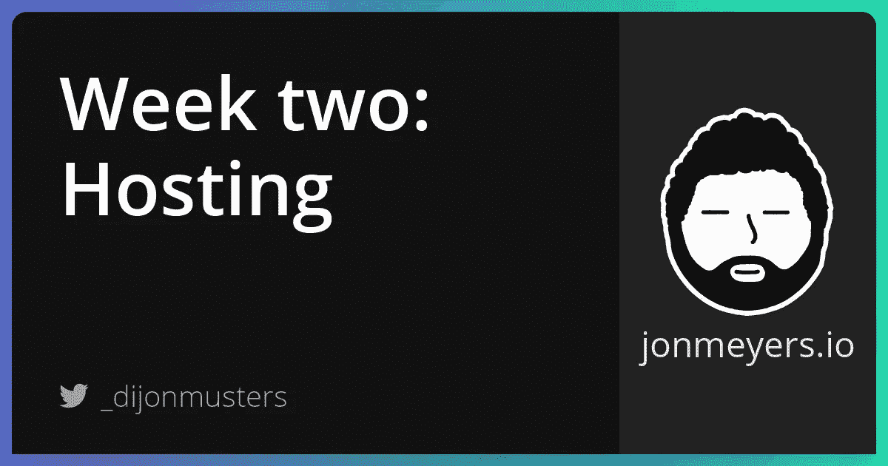
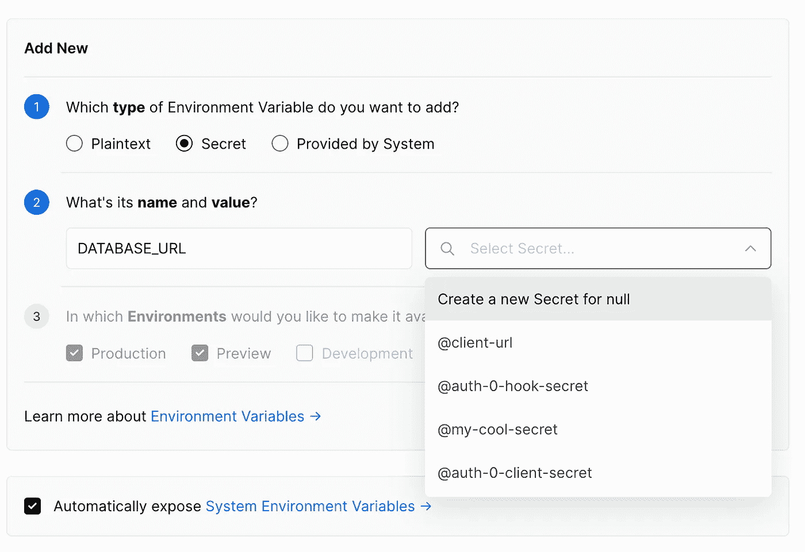
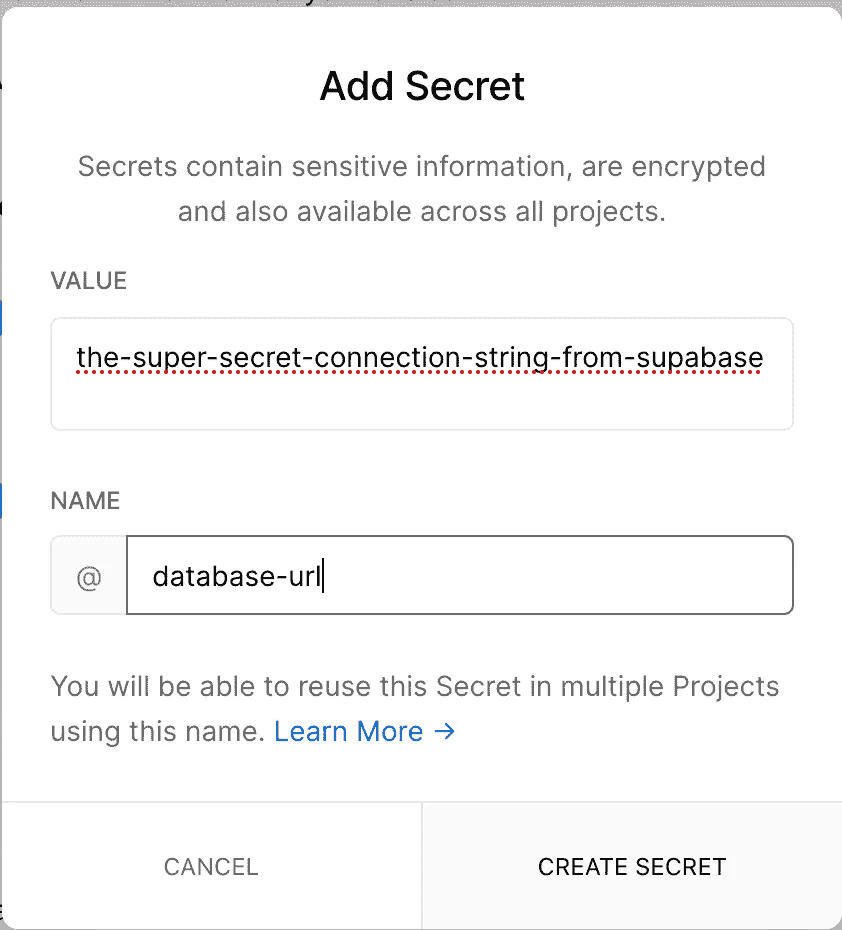
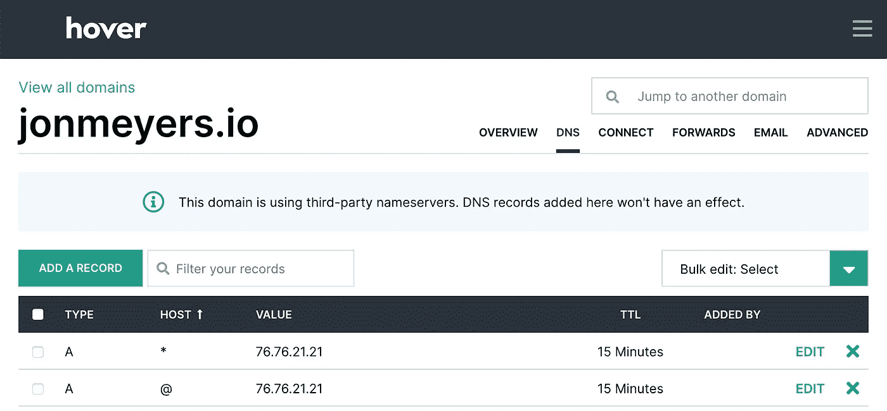
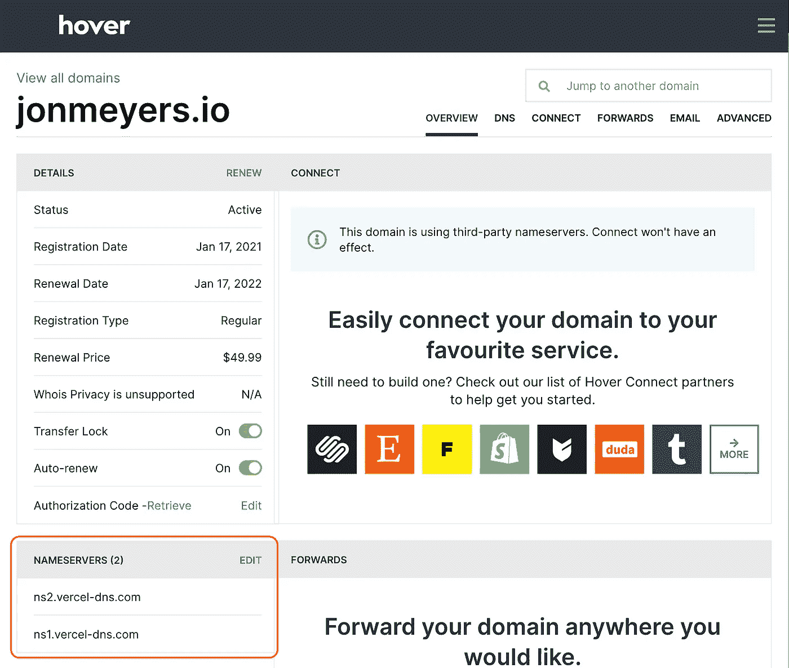
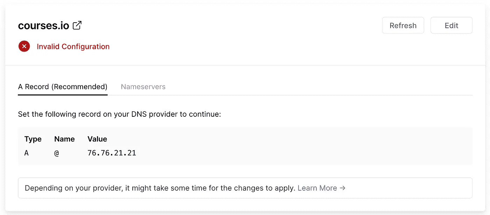

# 构建 SaaS 项目第二周:在 Vercel 上托管，使用 GitHub 自动部署并配置自定义域

> 原文：<https://medium.com/geekculture/hosting-on-vercel-automatic-deploys-with-github-and-configuring-custom-domains-b58d30ca6738?source=collection_archive---------14----------------------->

## 这一周，我们将重点放在所有的东西托管！我们将逐步在 Vercel 上托管我们的 next.js 应用程序，当我们在 GitHub 中进行代码更改时自动触发新的部署，并配置一个定制域来适应我们的品牌！



[项目回购](https://github.com/dijonmusters/courses)

这一周我们关注所有的主机:让我们的 next.js 应用程序在万维网上可用；当我们改变代码时设置自动部署；和配置自定义域！

## 构建应用程序

我们可以通过运行构建脚本来构建应用程序的生产版本——这也是我们的托管平台将要使用的！

```
npm run build
```

## 错误！

这给了我们下面的错误。

```
Error: connect ECONNREFUSED 127.0.0.1:80
```

那是因为我在第一周犯了一个小错误！我们试图从一个无服务器函数加载数据，但是当我们构建一个新版本的应用程序时，这个无服务器函数也会被构建。如果“构建无服务器功能”步骤在“构建我们的下一个应用程序”步骤之前，这没什么问题，但不幸的是，事实并非如此！

> 这在本地工作，因为 next 做了一些性能魔术，并在我们请求时通过刷新浏览器来重建页面。

看起来我们不能从我们的无服务器函数中读取预渲染/静态生成页面的数据，但是没关系！我们的每一个 getStaticProps 函数实际上都是一小块服务器端逻辑，所以我们可以在那里构建我们的 Prisma 查询！

让我们在项目的根目录下创建一个新的 utils 文件夹，并添加一个包含以下内容的 db.js 文件。

```
// utils/db.js

import { PrismaClient } from '@prisma/client'
const prisma = new PrismaClient()

const getCourses = () =>
  prisma.course.findMany({
    include: {
      lessons: true,
    },
  })

export { getCourses }
```

现在我们可以导入 getCourses 函数，并在 getStaticProps 函数中调用它。

```
// pages/index.js

import CourseList from 'components/CourseList'
import { getCourses } from '../utils/db'

const Index = ({ courses }) => {
  return (
    <div>
      <h1>Courses</h1>
      <pre>
        {JSON.stringify(courses, null, 2)}
      </pre>
    </div>
  )
}

export const getStaticProps = async () => {
  const data = await getCourses()

  return {
    props: {
      courses: data,
    },
  }
}

export default Index
```

让我们再检查一遍那栋大楼！

```
npm run build
```

## 更多错误！

```
Error: Error serializing `.courses[0].createdAt` returned from `getStaticProps` in "/".
Reason: `object` ("[object Date]") cannot be serialized as JSON. Please only return JSON serializable data types.
```

好吧，这是一个奇怪的问题，但基本上当 createdAt 日期从 Prisma 返回时，Next.js 试图将其转换为字符串(序列化)并且不高兴。

这里我们可以使用的一个小技巧是手动创建从 Prisma 返回的课程的字符串，然后将它们解析回 json。

```
// pages/index.js

import { getCourses } from '../utils/db'

// other component stuff

export const getStaticProps = async () => {
  const data = await getCourses()

  return {
    props: {
      courses: JSON.parse(JSON.stringify(data)),
    },
  }
}
```

我们的整个组件应该是这样的。

```
// pages/index.js

import { getCourses } from '../utils/db'

const Index = ({ courses }) => {
  return (
    <div>
      <h1>Courses</h1>
      <pre>
        {JSON.stringify(courses, null, 2)}
      </pre>
    </div>
  )
}

export const getStaticProps = async () => {
  const data = await getCourses()

  return {
    props: {
      courses: JSON.parse(JSON.stringify(data)),
    },
  }
}

export default Index
```

最后一次运行该构建！

```
npm run build
```

## 没有错误！

耶！我们的应用程序正在正确构建！我们可以运行“npm start”在本地运行生产版本，并确保它在浏览器中看起来不错。

这是可托管的！但是在哪里举办呢？！？

## 韦尔塞尔

我们需要实际托管我们的应用程序，以获得一个公共 URL，我们可以给与互联网连接的人，所以他们可以看到我们的超级涂料网站！

有许多无服务器主机提供商可供选择。我最喜欢的两个是 Netlify 和 Vercel。他们都非常注重开发人员的体验，并有特殊的免费层！完全免费开始，你需要有一个非常成功的应用程序来达到你需要付费的地步！Next.js 可以在这两个平台上运行，但是，我发现 Vercel 倾向于在 Netlify 之前实现新的 Next.js 特性(可能是因为他们也是 Next.js 的创造者！)，所以我将在这个 SaaS 项目中使用它们。

您需要使用 [Vercel](https://vercel.com) 创建一个帐户，并使用以下命令安装 CLI 工具。

```
npm i -g vercel
```

现在你可以登录了。

```
vercel login
```

并部署您的应用程序。

```
vercel --prod
```

这将引导你回答几个关于这个项目的问题。您可以接受所有的默认选项，因为 Vercel 对托管 Next.js 应用程序进行了大量优化！

就是这样！超级简单！

## 在 Vercel 中添加一个秘密

在本地运行时，我们已经指定了一个环境变量(或密码)来连接到我们的 Supabase DB 实例。我们需要告诉 Vercel 这一点，这样我们的应用程序就可以连接到 prod 中的数据库。

[这是一篇关于不同类型的环境变量以及如何在 Vercel 中配置它们的好文章](https://vercel.com/docs/environment-variables)。

前往你的应用程序的 Vercel 仪表板，进入设置>环境变量。选择“secret”作为变量类型，输入“DATABASE_URL”作为名称，然后下拉输入值“Create a new Secret for null”。



现在输入来自 Supabase 的连接字符串作为值，并将其命名为“@database-url”。在 Vercel 中，秘密总是以“@”开头。



现在，我们可以从下拉列表中选择这个秘密，将其链接到我们的 DATABASE_URL 环境变量。


> 这种将环境变量与秘密分开的区别允许您在不同的项目中共享环境变量。

## 从 GitHub 自动部署

接下来，我们希望告诉 Vercel 在我们做出更改时自动部署应用程序。为此，我们将使用 GitHub。将回购初始化为 git 项目。

```
git init
```

现在创建一个新的 GitHub repo。你可以通过 [GitHub UI](https://github.com/) 做到这一点，但是，gh CLI 允许你呆在你的终端里！

```
brew install ghgh repo create courses
```

现在我们需要创建一个. gitignore 文件，这样我们就不会把一大堆不必要的东西推给 GitHub——node _ modules、容易生成的文件等等。

```
// .gitignore

node_modules/
.next/
.DS_Store
out/
```

现在我们可以添加、提交和推送到 GitHub。

```
git add .
git commit -m 'create initial project'
git push origin master
```

现在我们在 GitHub 中有了一些代码，我们把它告诉 Vercel 吧。

登录到 [Vercel](https://vercel.com) 并导航到您的项目仪表板。

现在导航到设置> git 并点击连接 Git 库。

这将要求您通过 GitHub 认证，并允许 Vercel 访问您的回购。

选择您的项目回购和您的生产分支——我的是主分支。

现在，每当您将更改推送到该分支时，Vercel 都会自动部署应用程序的新版本。试一试！

对你的主页做一个小改动，提交并推送到 GitHub。您应该看到这在您的 Vercel 仪表板中启动了一个新的部署。一旦完成，您的更改应该在您的部署站点上生效！

## 自定义域

最后一件事，我要设置这个星期是一个自定义域。这是这个系列中唯一要花钱的部分，但它完全是可选的！Vercel 将为我们提供一个公共 URL，我们可以用它与全世界分享我们的应用程序。自定义域只是允许我们定制更多的东西，这可能对你的品牌很重要。

Vercel 提供了一个超级简单的方法来通过他们的仪表板购买域名，然而，我发现其他服务往往有相同的域名稍微便宜一点。我在 hover.com 注册了几个域名，到目前为止，我有一个非常好的体验，但是任何域名注册服务都可以。他们都应该让你添加 DNS 记录和更改名称服务器，这是我们需要做的。

现在您已经购买了令人惊讶的自定义域名，您需要添加两个 DNS 记录。应该有一个 DNS 的菜单项，它应该包含类型，主机名和 IP 地址字段。

使用以下信息创建一个:

```
Type: A
Hostname: @
IP Address: 76.76.21.21
```

另一个是这样的信息:

```
Type: A
Hostname: *
IP Address: 76.76.21.21
```

@表示查找该域名的任何内容，发送到 Vercel 的 IP 地址，而*对子域也是如此——比如 www。

这就是悬停时的样子。



最后，我们需要将域名服务器指向 Vercel。悬停时，它位于概览页面上。

将这些值更新为以下值。

```
ns1.vercel-dns.com
ns2.vercel-dns.com
```

这是它在悬停时的样子。



现在我们需要告诉 Vercel，这是我们希望在项目中使用的域名。前往您的项目的 Vercel 仪表板，导航到 Settings > Domains，在 Domains 输入框中输入您的新自定义域，然后单击 Add。

这将向您的域发送一个请求，并确保其配置正确。如果一切顺利，它看起来会像这样。


如果有问题，它看起来会像这样。



有时传播 DNS 更改需要一点时间，所以不要马上惊慌！或许喝杯咖啡或者小睡一会儿。如果它仍然不工作，仔细检查上面的配置。

如果一切都是绿色的，你的应用程序现在可以在你的自定义域中使用了！干得好！

## 包扎

厉害！我们的应用程序是托管的，我们有自动部署设置，可以在任何时候向 GitHub 推送更改，并且我们(可能)已经配置了我们自己的定制品牌域名！

## 有用的资源

*   [Vercel 部署文档](https://vercel.com/docs/platform/deployments)
*   [React 2025 设置视频](https://www.youtube.com/watch?v=MxR5I5_hOKk&list=PL6bwFJ82M6FXgctyoWXqj7H0GK8_YIeF1&index=3&t=155s)
*   [Vercel 自定义域名文档](https://vercel.com/docs/custom-domains)

## 跟我来

[网站](https://jonmeyers.io/)

[推特](https://twitter.com/_dijonmusters)

[YouTube](https://www.youtube.com/channel/UCPitAIwktfCfcMR4kDWebDQ)

## 下星期

[使用 Auth0 和 Next.js 进行认证](https://jonmeyers.io/blog/build-a-saas-platform-with-stripe/authentication-with-auth0-and-nextjs)