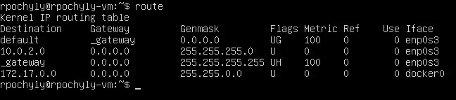

# 在没有公共 IP 地址的情况下托管自己的《我的世界》服务器。

> 原文：<https://medium.com/geekculture/hosting-your-own-minecraft-server-without-a-public-ip-adress-437560287a75?source=collection_archive---------9----------------------->

**免责声明**:本教程要求在您托管服务器的 PC 上安装 Linux(及其基础知识)。

大约一年前，我和我的几个朋友决定创建一个小《我的世界》，在隔离期间玩。我们把钱凑在一起，从主机上买了一台服务器。随着服务器的增长，很明显我们需要更多的 RAM 和 CPU 内核，但是托管已经有点贵了。我可以把我们的服务器转移到另一个主机上，或者支付更贵的费用，但是我决定尝试自己托管服务器。这样，我可以分配我的计算机可以提供的任何数量的 RAM，并使用我想要的任何数量的内核。同样在几周前，我了解到我们的 ISP 已经将我们的上传速度提高了一倍，达到了 10Mbps，这对于一台《我的世界》服务器来说应该足够了，但是因为我们没有公共 IP，并且在 CGNAT 之后，我不能仅仅从我们的路由器进行端口转发。另外，在我的 ISP 处，一个公共 IP 是每月 25 美元。当我发现我们的上传速度提高了一倍时，我就开始研究如何让它发挥作用。

我们需要什么？
首先，我们需要一台电脑或者一台服务器来托管《我的世界》的服务器。它必须有相当不错的规格。我不会推荐内存小于 8GB 或内核小于 2 的电脑。规格越高，服务器就越平滑。

其次，稳定的网络连接。你可以用 5Mbps 的上传速度做到这一点，但我建议至少 10Mbps。

最后，一台有公共 IP 地址的计算机。它可以是一个 VPS 服务器，这可能是最简单的解决方案。

如果你没有 VPS，但想在这个项目中使用，你可以通过使用我的[推荐链接](https://www.vultr.com/?ref=8798861)来帮助我。对于每个注册并添加至少 10 美元的用户，我将获得 10 美元的信用。

我假设我们已经设置好了 Ubuntu VPS。

# 设置《我的世界》服务器

我将为我们的《我的世界》服务器使用一个 Docker 容器。它为你创造和设置一切。所有这些事情都将发生在我们的电脑上，它将托管服务器，现在还不需要 VPS。
先从安装 Docker 开始。

更新包索引并安装一些先决条件:
`sudo apt update
sudo apt install apt-transport-https ca-certificates curl gnupg-agent software-properties-common`
导入库的 GPG 键:
`curl -fsSL [https://download.docker.com/linux/ubuntu/gpg](https://download.docker.com/linux/ubuntu/gpg) | sudo apt-key add -` 将 repo 添加到 apt:
`sudo add-apt-repository “deb [arch=amd64] [https://download.docker.com/linux/ubuntu](https://download.docker.com/linux/ubuntu) $(lsb_release -cs) stable”` 最后安装包:
`sudo apt install docker-ce docker-ce-cli`

接下来，我们将创建一个容器并使用来自 itzg 的[图像，它已经为我们设置好了一切:](https://hub.docker.com/r/itzg/minecraft-server)

```
sudo docker run -d -it --restart unless-stopped -p 25565:25565 -e MEMORY=4G -e EULA=TRUE -e TYPE=AIRPLANE -e AIRPLANE_BUILD=lastSuccessfulBuild -e USE_AIKAR_FLAGS=true -v /your/data/folder:/data --name minecraft itzg/minecraft-server
```

您可以更改的一些变量:
`MEMORY`:指定您想为服务器使用的 RAM 数量。
`-v /your/data/folder:data`:将`/your/data/folder`改为您希望服务器所在的文件夹。例如/home/user/minecraft-server

一些解释:
`-e TYPE=AIRPLANE`:我们将使用一个非常优化的纸叉子，它本身就是一个优化的龙头叉子。
`-e USE_AIKAR_FLAGS=true`:启用一些 JVM 标志，当更多用户连接时，这些标志会有所帮助

指挥部会为你做好一切准备。
使用`sudo docker ps`可以看到更多关于集装箱的信息。
现在如果我想去控制台，我可以只做`sudo docker attach minecraft` *。这将使我能够直接在控制台上打字。要离开控制台，不要使用 CTRL+C。这将停止服务器。不如使用转义序列。先按 CTRL+P，再按 CTRL+Q。*

为了让它对用户更友好，我将安装 portainer-ce。这是一个用于通过网站管理 docker 的 UI。
要安装 portainer，请使用以下命令:

```
sudo docker run -d -p 9000:9000 --name=portainer --restart=always -v /var/run/docker.sock:/var/run/docker.sock -v /your/data/folder:/data portainer/portainer-ce
```

您需要将`/your/data/folder`更改为一个文件夹，其中将存储与 portainer 相关的数据。
然后去 *localhost:9000* ，创建账号，登录。我们将改变我们的《我的世界》服务器的网络工作方式，因此点击“本地”，然后“容器”，然后“Minecraft”。点击顶部的复制/编辑按钮。向下滚动到高级容器设置，并点击网络。现在将网络从网桥改为主机。这将禁用网络上的容器隔离，并使我们的 LAN 外部的连接可以访问它。现在点击“部署容器”。如果您想从图形界面查看控制台，只需单击日志即可查看控制台输出，并向控制台输入命令。

我们已经设置好了《我的世界》服务器。如果你使用 localhost:25565 作为 IP，你可以从多人游戏菜单连接到它。您局域网中的其他人可以使用您的本地 IP(使用命令 *ip a* 并找到您正在使用的接口)连接到同一个端口 25565。下一步是设置我们的 VPS 并创建一个 Wireguard VPN。

# 设置 VPS、Wireguard 和路由

我希望你能自己买 VPS。最低层也可以，因为运行 VPN 和路由几个数据包不需要那么多资源。你也应该选择一个离你近的服务器，因为如果任何人想连接到服务器，他们将被连接到 VPS，然后 VPS 将连接到你的 PC。当你买了 VPS 之后。

首先，我们将启用数据包路由。如果没有安装 nano，使用`sudo apt install nano` *安装。*然后运行以下命令:`sudo nano /etc/sysctl.conf` ，用`net.ipv4.ip_forward = 1` *取消注释该行。*使用 CTRL+X 退出，然后 Y，最后回车。这将启用来自 VPS 的 ip 转发。使用此命令使更改生效而无需重启:`sudo sysctl -p`。

让我们用`sudo apt install ufw` *安装代表简单防火墙的 ufw。然后让我们允许 ssh，wireguard 和我们的 minecraft 端口。*

```
sudo ufw allow ssh
sudo ufw allow 51820/udp
sudo ufw allow 25565
sudo ufw enable
```

如果您注意到重启后 ufw 不工作，请尝试使用`sudo systemctl enable ufw` *。*

我们已经准备好设置铁丝网了。首先，让我们通过 *sudo 来安装 wireguard。把它也安装到你的电脑上。完成后，我们需要创建我们的密钥。在 VPS 和 PC 上运行这两个命令，并将公钥保存在某个地方。*

```
(umask 077 && printf "[Interface]\nPrivateKey = " | sudo tee /etc/wireguard/wg0.conf > /dev/null)
wg genkey | sudo tee -a /etc/wireguard/wg0.conf | wg pubkey | sudo tee /etc/wireguard/publickey
```

现在我们需要更改 VPS 上的 Wireguards 配置。先用`sudo nano /etc/wireguard/wg0.conf` *。然后像这样更改您的配置:*

```
[Interface]
PrivateKey = ***(this will be filled in by the previous command, do not share this with anyone)***PostUp = iptables -t nat -A PREROUTING -p tcp --dport 25565 -j DNAT --to-destination 10.20.4.2:25565
PostUp = iptables -t nat -A POSTROUTING -o ***if*** -j MASQUERADEPostDown = iptables -t nat -D PREROUTING -p tcp --dport 25565 -j DNAT --to-destination 10.20.4.2:25565
PostDown = iptables -t nat -D POSTROUTING -o ***if*** -j MASQUERADEListenPort = 51820
Address = 10.20.4.1/24[Peer]
PublicKey = ***(put here the public key from your PC that the previous command generated)***
AllowedIPs = 10.20.4.2/24
```

现在你要把 ***if*** 换成连接你上网的接口。您可以使用`route`命令检查哪个接口。你要的界面是 ***默认目的地*** 。



Output of the ***route*** command.

如你所见，在我的例子中，接口是 *enp0s3* 。

PostUp 和 PostDown 命令设置路由，以便将所有到达端口 25565 的传入流量重定向到我们的 PC(在我们的 VPN 中为 10.20.4.2)。正如您在地址条目中看到的，VPS 的 IP 地址将是 10.20.4.1。

**提示**:如果您需要进行端口映射或打开另一个端口，只需复制原始的 iptables 命令并更改 ips 即可。`--dport`是 VPS 上的端口，PC 的端口在命令的`--*to-destination*` 部分。不要忘记使用 ufw 来启用端口。例如，如果我想在我的电脑上打开 ssh 端口，我会添加`PostUp = iptables -t nat -A PREROUTING -p tcp --dport 555 -j DNAT --to-destination 10.20.4.2:22` 和 PostDown 命令，用-D 代替-A，然后用`sudo ufw allow 555`启用端口。现在，您可以使用`ssh -p 555 (VPS’ public IP)@username`连接到家中的电脑。

接下来，我们将设置 PC 的 Wireguard。让我们打开配置，稍微修改一下。我们可以再用`sudo nano /etc/wireguard/wg0.conf` 来改变它。配置应该如下所示:

```
[Interface]
PrivateKey = ***(this will be filled, do not share this with anyone)***
Address = 10.20.4.2/24
Table = 1PostUp = ip rule add pref 500 from 10.20.4.2 lookup 1
PostDown = ip rule del pref 500[Peer]
PublicKey = ***(put here the public key from the VPS)***
AllowedIPs = 0.0.0.0/0
Endpoint = ***(VPS' public IP - the one used for ssh for example)***:51820
PersistentKeepalive = 25
```

几乎是一样的，但是我们已经设置了路由来使用特定的表。当您设置 AllowedIPs 时，Wireguard 将设置您的 PC 在向该 IP 发送流量时不应使用 WAN，而是使用我们的 VPN 隧道 *wg0* 接口。我们将 AllowedIPs 设置为 0.0.0.0/0，以允许来自所有 IP 的连接通过我们的 VPN。如果我们不这样做，并将其设置为 VPS 的 IP，我们将在日志中获得 VPS 的 IP，而不是玩家的 IP(我们还必须改变 VPS 的配置一点)。然而，当我们将其设置为 0.0.0.0/0 时，我们告诉 Wireguard 所有的 IP 应该通过 *wg0* 接口路由。这使得所有流量都将通过您的 VPN 路由到 VPS，并从那里路由到互联网。如果你的 VPS 每月带宽有限(大多数 VPS 都是这样)，这可能不是你想要的。大多数 VPS 提供商的最低层提供至少 1 TB 的月带宽。因此，如果您想通过 VPN 路由所有流量，请删除`Table = 1`以及 PostUp 和 PostDown。`ip rule add pref 500 from 10.20.4.2 lookup 1` 确保来自 10.20.4.2(您电脑的 VPN 地址)的所有流量将使用表“1”来路由所有流量。我们使用 PC 的 VPN IP，因为我们想要路由我们的 PC 创建的数据包。这意味着从 VPN 出来的数据通过 VPN 而不是 WAN 返回。

现在我们需要做的就是用我们的配置启用 Wireguard，一切 ***应该*** 都可以工作了。

要启用 Wireguard，请使用以下命令通过 systemctl 在 VPS 和 PC 上启用它:`sudo systemctl enable wg-quick@wg0`如果您需要快速重启 VPN，请使用`sudo systemctl restart wg-quick@wg0`您应该首先重启 VPS 的连接，然后重启 PC 的连接。
你也可以使用`sudo wg` *来检查连接是否正常。如果你在握手，你是通过 VPN 连接的。*

如果这对你不起作用，我会试着在评论中帮你。