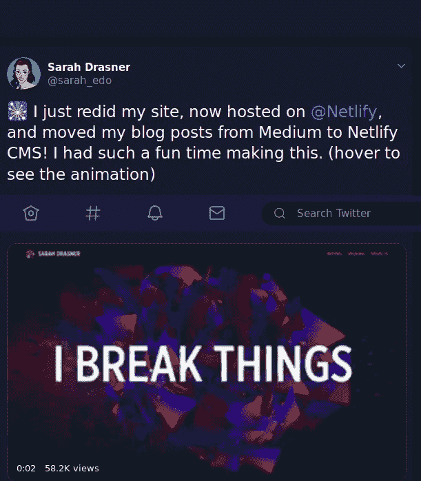
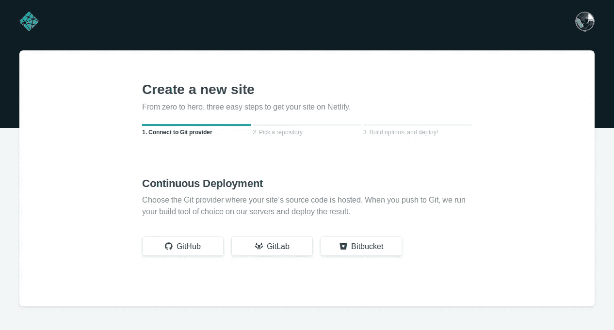
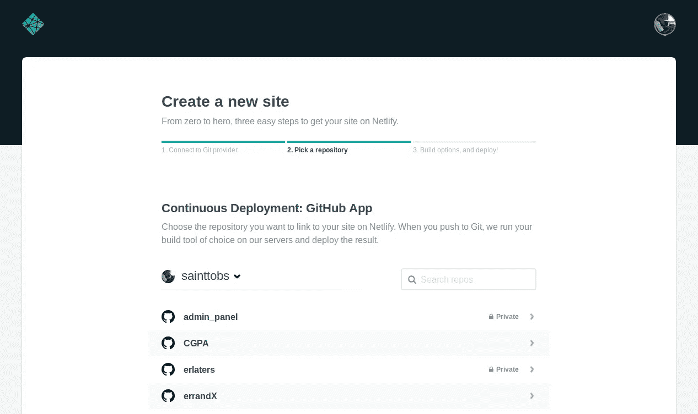
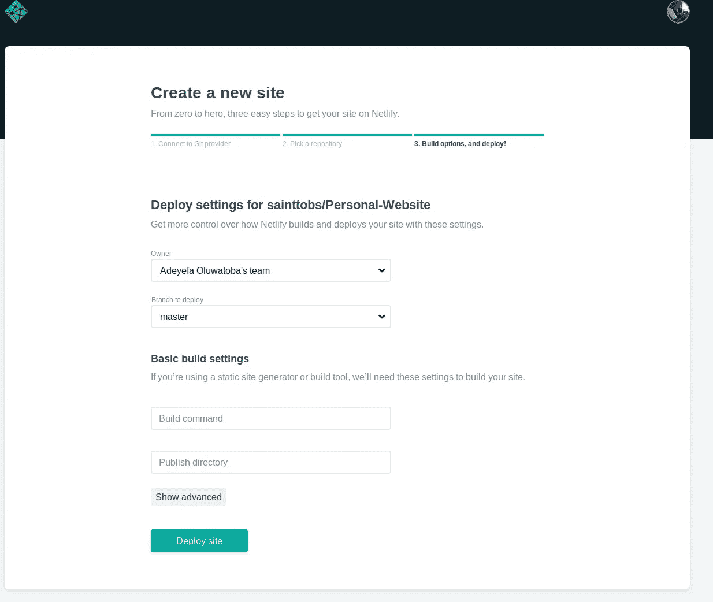

# 如何在 Netlify 上托管你的静态网站

> 原文：<https://medium.com/geekculture/hosting-your-static-website-on-netlify-94651ad1c249?source=collection_archive---------1----------------------->

adeyefa toba — portfolio

选择一个平台来托管你的网站是你在建立网站时必须做出的最重要的决定之一。托管你的网站有很多选择，比如共享托管、VPS 和云托管。一个好的托管平台可以让你轻松地部署你的网络应用程序，确保最大的正常运行时间，并让你管理你的网站没有压力。

我已经推迟重做我的作品集网站有一段时间了，部分原因是我不知道该把它放在哪里。然后我看到莎拉·德拉斯纳在推特上说要重新装修她的网站，我找到了一个存放我的作品集的好地方。Netlify 是一家云计算公司，为 web 应用程序和静态网站提供托管和无服务器后端服务。

sarah drasner website

我立即去查看了[网上生活，](https://www.netlify.com/)这正是我所需要的。Netlify 非常适合托管你的个人网站，它非常容易使用，有很多很棒的功能。使用 Netlify，您可以在几秒钟内从 Github、Gitlab 或 BitBucket 轻松部署静态网站。您还可以从“让我们为您的网站加密”网站获得免费的 SSL 证书，并可以添加自定义域。

这篇文章将概述我在 Netlify 上部署的经验，也可以作为那些想在 Netlify 上部署静态网站的人的教程。

**第一步**:在[https://www.netlify.com/](https://www.netlify.com/)访问 Netlify 网站

netlify home page

**第二步**:如果你已经有账户，请登录，或者注册你的电子邮件/社交媒体账户(GitHub、Twitter 等)。您将被重定向到您的仪表板，在那里您可以添加一个新站点。

**第三步**:你可以从 GitHub、BitBucket 或者 Gitlab 部署你的网站。就像点击一个按钮一样简单。

netlify — create a site

**步骤 4** :授权 Netlify API 访问您的存储库。

**步骤 5** :选择您想要部署的存储库和分支。

netlify — pick a repository

**第六步**:点击**部署站点**按钮，几秒钟后你的网站就部署好了。您还可以从一个网络子域访问您的网站。您也可以将自定义域添加到您的网站。

netlify — deploy

就这么简单，你的网站已经部署到 Netlify 了。添加自定义域很简单。Netlify 为您提供了一个 CNAME 记录，您可以将其添加到自定义域的 DNS 管理器中。一旦它被传播，一个来自 Let's Encrypt 的 SSL 证书将被自动添加到您的站点以确保其安全。

将你的网站部署到 Netlify 上是一个非常非常简单的过程，只需要点击按钮，Netlify 会为你做最困难的工作。你也可以使用 Netlify CMS 来托管你的博客。

请随意分享你对这篇文章的评论，我将很高兴收到你的来信。