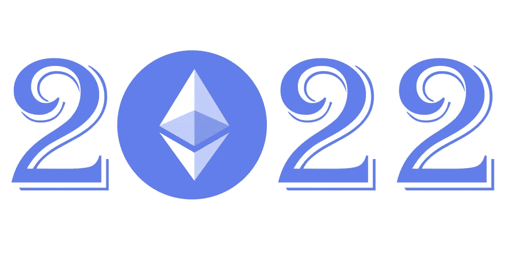

# 加密 2022 的热门话题

> 原文：<https://medium.com/geekculture/hot-topics-in-crypto-2022-a08c5ae65f6a?source=collection_archive---------5----------------------->

NFTs、DeFi、Web 3.0 等的主要主题和发展。

回顾过去，2021 年将被视为加密采用的关键年份之一，因为许多人都认为加密和分散协议不是短暂的泡沫，而是会留下来改变世界。监管机构开始了解加密并创建新的法律和框架，金融玩家创建加密柜台以探索产品，越来越多的人开始使用应用程序而不是单一的投机性投资。我们将在 2022 年看到这些趋势的延续，甚至更多。

继续我的加密预测传统，我很高兴与你分享我对加密和区块链空间 2022 年的预测。正如我去年的预测非常准确一样，2022 年的门槛也很高。让我们在 365 天内检查。

我希望你喜欢这个加密预测，它帮助你为 2022 年设定正确的焦点！

# 调节 DeFi

我们已经看到从 2021 年开始的一个主题，我希望在 2022 年继续下去，这就是 RDeFi 的出现，它代表受监管的 DeFi。例如，Aave Arc 和 Compound Treasury 为符合 KYC 和 AML 要求的机构投资者提供 Aave 和 Compound 的监管版本。随着监管重点的进一步加强，我希望在市场上看到更多这样的产品和服务。一方面，我们将看到加密玩家提供其应用程序的监管版本，如 Aave、Compound 和 1inch。另一方面，从一开始就符合监管要求的产品，如德国 DeFi 平台 Swarm Markets。这将吸引机构投资者，他们之前因监管合规缺失而避免 DeFi。

# 社交标志

根据 [Linda Xie 的精彩介绍](https://linda.mirror.xyz/4PDBWBMpFFPVEsP5EGgg5to2AyEpEHEXasq_K0b-yYk)社交代币“是由个体创造者或社区发行的代币，使社区成员能够合作并分享共同创造的价值的所有权。”我预计去中心化的社交媒体应用将成为 2022 年密码领域的新趋势之一，以及它们各自的标志。已经有一些项目出来，如朋友与利益或集会，但更多的是未来。例如，DeFi 巨头 Aave 正在开发他们的社交媒体平台，这应该是以太坊上的某种去中心化 Twitter。此外，我们还将看到更多的传统社交媒体播放器提供加密功能，如 2022 年的 Twitter。这与 2021 年兴起的 Web 3.0 叙事携手并进。

# 复杂的游戏

2021 年也是 Axie Infinity 等区块链游戏的一年。以一种或另一种形式利用区块链技术为开发者工作室和游戏玩家带来许多好处。由于这个领域还很年轻，2021 年大多数基于区块链的游戏都是简单的纸牌游戏，不是很复杂。到 2022 年，我预计将有更多游戏推出，提供更好的游戏体验，传统游戏工作室将推出利用区块链技术的游戏，如提供游戏内物品作为 NFT 或创建游戏内货币的代币。

# 以太坊 2.0

2022 年将是以太坊年。一方面，期待已久的以太坊 2.0 更新将改变以太坊的共识机制，从 PoW 到 PoS，此外还有其他可扩展性的改进。另一方面，我预计 2021 年很多以比特币起家的投资者会在 2022 年投资以太坊。传统上，投资者从比特币开始他们的加密之旅，一段时间后进入以太，我预计这将在 2022 年发生在机构投资者身上。我相信以太坊将在 2022 年成为大多数现有和未来第二层应用的结算层。虽然我通常不做价格预测，但我预计乙醚会超过 10，000 美元。-今年的价格。

# 可用和非映像 NFTs

2021 年是 NFTs 年，而一般市场在 5 月份有所突破，经过修正的 NFTs 在受欢迎程度和使用量方面不断增长。虽然我预计这种情况会继续，但随着这个领域的成熟，我们将会看到更多的 NFTs 的可用性。我预计 2022 年 NFT 空间会有两项发展。首先，它们将变得更加有用。2021 年，NFT 主要是看起来很酷的艺术，人们可以在社交媒体或某个社区中使用它作为个人资料图片。在 2022 年，我希望看到更多的例子，NFT 可以用作游戏中的化身，在 DeFi 中，因为已经有许多应用程序推出，提供大量的 NFT 服务，如借贷。第二，我希望看到非图像 NFT(如音频文件)作为 NFT 的普及程度有所提高。NFT 的美妙之处在于它们可以证明任何类型的数字文件的所有权，我相信许多人会意识到这不仅仅局限于图像。

# Web 3.0

在 2017/2018 年，许多公司使用了代表分布式账本技术的术语 DLT，而不是区块链，以防止因 cryptos 当时的“坏名声”而产生负面联想。我预计 2022 年的 Web 3.0 也会出现同样的情况，但这是出于另一个原因。Web 3.0 这个术语非常直观，因为人们将它与互联网联系在一起。2022 年，许多新旧应用将被命名为 Web 3.0 并投入市场。我非常喜欢 Web 3.0 这个术语。这意味着分散协议在金融应用之外的广泛使用，以及它使我们当前的网络更加民主、透明和高效的承诺。谁知道也许明年我会把这篇文章叫做“2023 年 Web 3.0 的热门话题”😉

# 还没有元宇宙

在脸书宣布将其公司名称改为 Meta 并专注于建造元宇宙后，元宇宙成为 2021 年下半年 crypto 的流行语之一。我们将在 2022 年看到元宇宙空间的许多发展，例如探索它的更传统和隐秘的项目。不过，大多数可用的应用程序将是基于区块链的游戏，这些游戏具有某种元宇宙特色，比如《开放世界》。要体验完整的元宇宙，我相信我们还需要再等 5-10 年。像 Oculus 的 VR 眼镜这样的产品对于零售来说仍然太贵了，尽管我预计价格在未来会下降，从而使元宇宙能够大规模使用。此外，除了其他关键的基础设施之外，允许在同一个空间内进行大规模扫描和数百万用户的技术仍在建设之中。

# 更多稳定的硬币

在去年的预测中，我预测 stablecoins 的使用将会增加，并预计这一趋势将在 2022 年继续。稳定币领域将会有很多发展，尤其是没有美元或黄金等资产支持的算法稳定币。Stablecoins 非常有用，是 DeFi 应用的必备工具。集中式 stablecoins 会产生依赖性和较低的透明度，如 USDT，这一问题已经通过分散的算法 stablecoins 得到了解决。我希望在这个领域能看到许多集中和分散的项目。就在撰写本文的时候，有消息称 PayPal 有可能推出他们自己的 stablecoin。

# **机构加密产品**

我预计，到 2022 年，传统金融机构提供的加密产品数量将大幅增加。在 2021 年，几乎没有主要的金融支付者没有建立加密台，我预计在 2022 年将推出许多在 2021 年建立的产品。加密产品的范围将从简单的加密货币经纪和托管到被列入白名单并符合监管标准的复杂的 DeFi 产品和服务。这与 RDeFi 的第一次预测是一致的。2022 年将会是我们看到机构加密产品大受欢迎的一年。

# M&A 活动增加

2021 年，我们在加密领域看到了很多 M&A 活动，我预计这种情况将在 2022 年继续。特别是那些想要进入加密领域的传统玩家，他们必须决定是否要在内部建立自己的能力，或者收购一家加密初创公司。我相信，虽然从长期来看，大公司将建立自己的加密团队，但从短期来看，我们将看到大量的收购。收购一家本土加密公司会带来多种好处，比如上市速度更快，还能接触到稀有的人才。我也期待在 2022 年看到 M&A 在本土加密公司之间的活动。

我希望你喜欢阅读今年的天气预报。我相信，2022 年将会是采用 crypto &区块链的又一个伟大的一年，我们越来越多的梦想将会成为现实，尽管它的开始并不平坦。

旅程才刚刚开始！