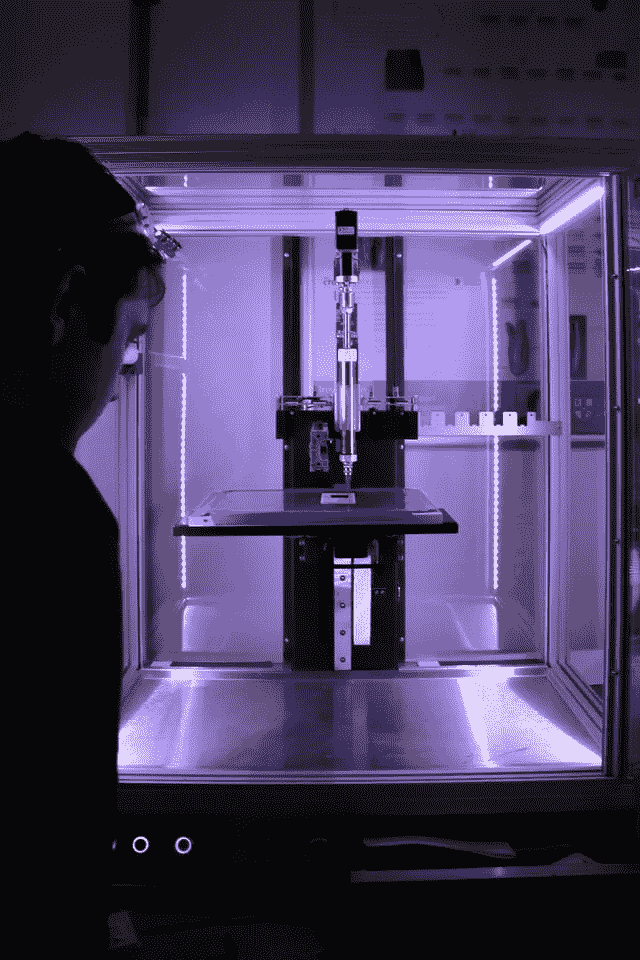

# 3D 打印如何改变世界

> 原文：<https://medium.com/geekculture/how-3d-printing-is-changing-the-world-c79c31241243?source=collection_archive---------4----------------------->

## 从帮助宇航员到建造超级汽车

Photo by [Rob Wingate](https://unsplash.com/@robwingate?utm_source=unsplash&utm_medium=referral&utm_content=creditCopyText) on [Unsplash](https://unsplash.com/s/photos/3d-printing?utm_source=unsplash&utm_medium=referral&utm_content=creditCopyText)

从制作原本要花费数千美元的原型，到用于有限的生产运行，3D 打印赋予了“将你的想法变为现实”这一理念全新的含义。

由于这项革命性的技术，我们能想到的任何东西都可以由…