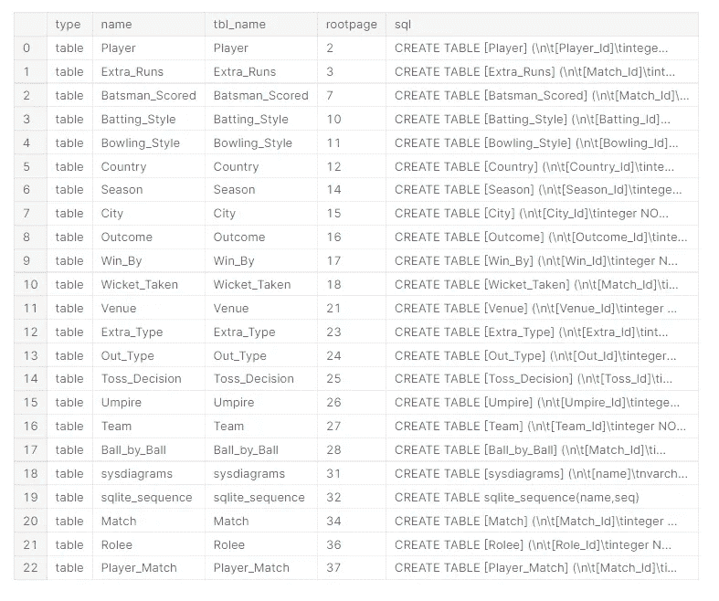
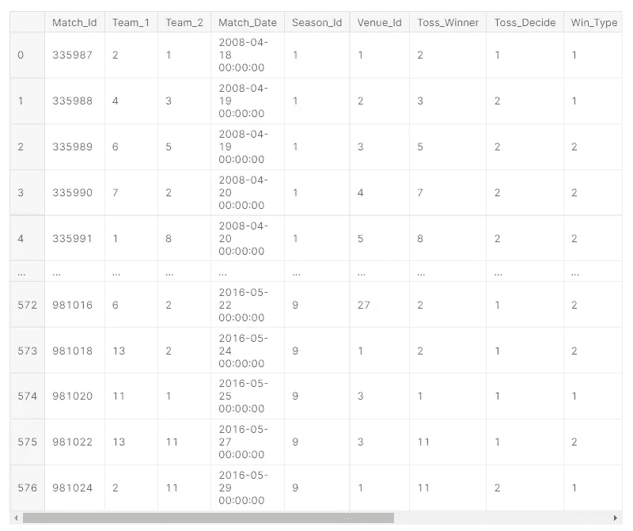
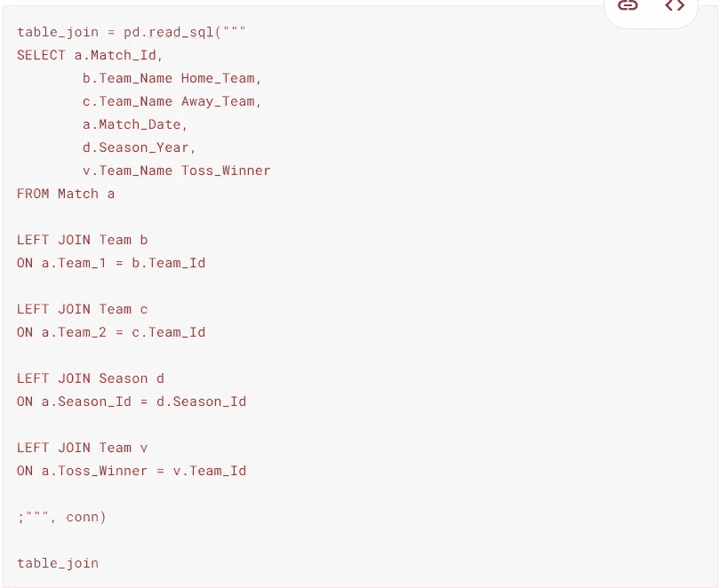
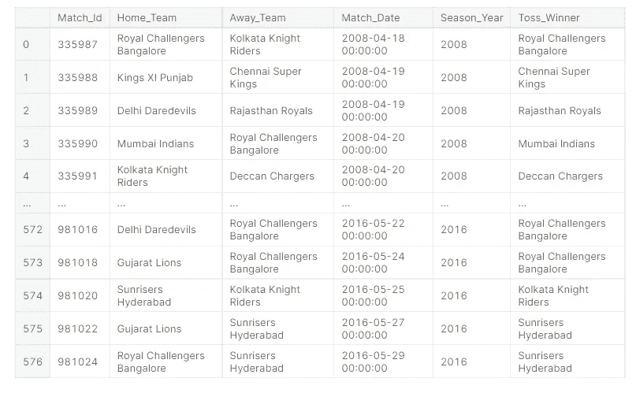
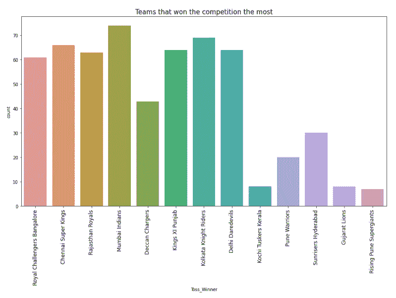

# 大公司会如何存储数据？

> 原文：<https://medium.com/geekculture/how-a-big-company-would-store-its-data-3cca5009562e?source=collection_archive---------42----------------------->

起初，当我了解到大公司会以一种类型存储他们自己的数据时，我感到很有趣，这让我很吃惊:“为什么我要了解不同的数据类型？”

例如，您可以想象一个标题为“营养”的表，它有许多列，每一列代表一个营养事实，表示为浮点值，如(列:蘑菇的蛋白质值为 0.34)。我们可以很好地理解，根据表示的性质，表中的每一列都包含浮点值，所以不用多说，这是公平的，也是可以接受的。

但是，如果它是一个以 Automotive 命名的表格，描述汽车零件和颜色以及汽车模型的定性特征，那会怎么样呢？您能想象这样的表可以用一种数据类型(如整数)来表示吗？

是的，你最好想象并相信。

我们举个例子。

这是一个足球印度联盟的数据集——都是整数，并附有其他支持表。

您可以看到一个很长的表列表，其中大多数是参考表，或者我们提到的其他支持表。

但是名为“Matches”的主表看起来是这样的，请看:

作为一个爱开玩笑的人，一个喜欢开玩笑的人，不能只为自己保留这一张。当我第一次接触到这个数据集的时候，我无法停止想象一个新闻主播报道这个赛季的惊喜，他会说:

> 真是惊喜！今天，29 队在比赛号码上击败了 22 队..哦，顺便说一下，是 6 位数..这个赛季在 6 号体育场举行的，是吗..在四号..？还是哪个？无论如何，这场比赛的最佳球员是显而易见的，除非裁判 4 在庆祝的最后时刻之前出示了卡 2 终止了他的比赛，而奖金却落到了输队的 34 号球员手中。

爆笑！..不是吗？！

回到数据。

那么，我们为什么要以这种毫无意义的方式存储数据呢？这背后有什么逻辑吗？

没错。当听到辩解时，这变成了逻辑:

1.  存储一种类型比存储多种类型更容易处理。
2.  很明显它对计算机是可读的。
3.  它将机器学习模型(如果有的话)保存为变量，保持它们唯一的形式而不变。
4.  你可以建立模型，不管数据是从哪个行业收集的。
5.  它可以在机器上翻译成有意义的内容，这就是使用 SQL 进行数据库查询的优势。

我从引用表中查询信息以填充主表，用一个使用 JOINs 子句有意义的表替换类似 math-class 的表。

像这样:

变成那样:

万岁！！

随着数据变得对我们有用和可读，我们可以回到过去，成为喜欢彩色粉笔的孩子，根据有史以来最高的获胜团队绘制彩色的可视化图像。

今天就到这里，感谢阅读，希望有用哪怕一点点。

在下面，你会找到我的内核的链接，这样你就可以检查代码或者你是否会玩数据集。尽情享受吧！

 [## SQL 片段表格数据|联接，值映射

### 使用 Kaggle 笔记本探索和运行机器学习代码|使用来自印度超级联赛 SQLite 数据库的数据

www.kaggle.com](https://www.kaggle.com/taricov/sql-snippets-tabular-data-joining-value-mapping)