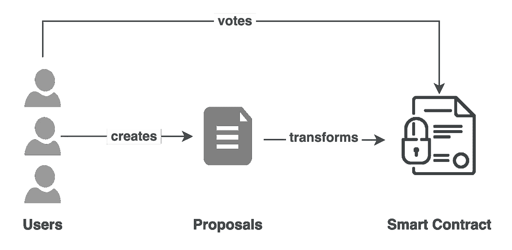
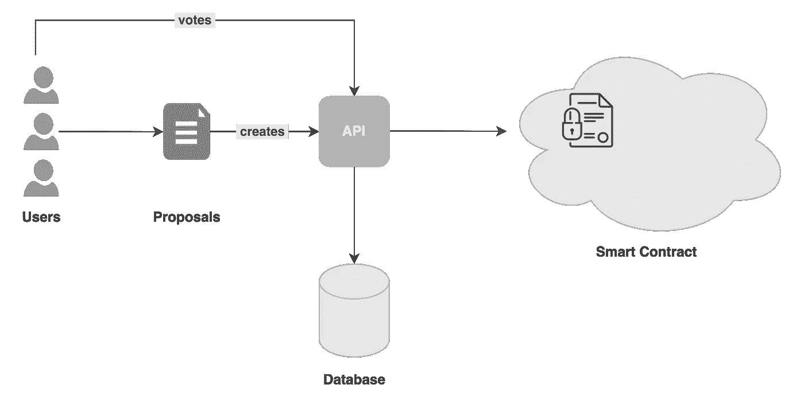

# 基于区块链的系统如何帮助决定社区提案

> 原文：<https://medium.com/geekculture/how-a-blockchain-based-system-can-help-decide-on-community-proposals-c4c4cc890744?source=collection_archive---------13----------------------->

本文介绍了一种使用区块链进行文档验证和投票的解决方案。即使世界在快速发展，验证过程也常常是缓慢的和手动的。智能合约和区块链的使用非常适合这种手动且不可靠的场景。我们的分散式系统在没有中心故障点的网络上存储 as *集合和事务的历史。区块链更能抵御恶意攻击，允许安全和数字化地接受和投票文件。*


Retrive from [The Gateway Digital](https://www.thegatewaydigital.com/smart-contracts/)

# 介绍

你对一个项目有一个绝妙的想法。你对它研究得越多，你就越觉得它值得投入资金和资源。这是一个潜在的游戏规则改变者，如果事情按照你预测的方式发展，最终的产品将是社区的胜利。但是你如何让决策者接受你的想法呢？简而言之:准备一份令人信服的项目建议书。但是如果不止一个人有好主意呢？怎样才能安全透明的选择最好的？

[区块链](https://en.wikipedia.org/wiki/Blockchain)可以在缺乏信任或中央验证器的场景中提供很大帮助。区块链是一个网络，它通过一个哈希来连接各个区块，从而保证信息的安全性和不变性。

我们的目标是展示一个安全和透明的解决方案的在线投票系统的建议。基于区块链的系统可以帮助决定社区提案。人们可以发送建议，稍后其他人可以决定最好的。

# 建议

通过使用此服务，您将能够对以文件形式发送的提案进行投票。这里我们指的是一个计划或建议，特别是正式的或书面的，供他人考虑或讨论的。为了保持数据的不变性，我们将文件存储在 WORM(一写多读)系统中。WORM 描述了一种数据存储设备，其中的信息一旦写入就无法修改。这种写入保护可确保数据一旦写入设备就不会被篡改。该系统应保证最大程度的平等和透明。正因为如此，我们知道创建这些系统的最佳方式是通过[分散应用](https://en.wikipedia.org/wiki/Decentralized_application) (DApps)。这是一个可以自主运行的应用程序，通常通过使用智能合同，运行在去中心化计算(一个区块链系统)上。像传统应用程序一样，DApps 为用户提供一些功能或实用程序。

实现使用区块链技术的提案系统的最佳方式是开发一个与[智能合同](https://corpgov.law.harvard.edu/2018/05/26/an-introduction-to-smart-contracts-and-their-potential-and-inherent-limitations/)交互的 API。这些是自动执行的数字合同，使用技术来确保签署的协议得以实现。契约规则的验证是通过区块链完成的。这确保了契约不能被更改，并且没有中央验证器。对于这个项目，资产是文档，事务是用户对其中一个提议进行投票的行为。



我们认为使用完全开放访问的公共区块链网络会更好。这意味着每个人都可以接收和发送来自世界上任何人的交易。在一个旨在验证文档的系统中，被任何人审核的可能性是很有价值的。在这些网络中，我们知道[以太坊](https://ethereum.org/pt-br/)是最好的选择。这是允许使用智能合约的最大网络。在一个交易被认为是有效的之前，它必须通过链共识过程被它的每个组成节点授权。这保证了系统中最大程度的平等和透明。

# 履行

我们的目标是展示一个以透明和不可侵犯的方式验证和投票的解决方案。我们将创建一个 API 来与提议和以太坊网络进行交互。这项服务非常简单。仅使用 [web3js](https://web3js.readthedocs.io/en/v1.7.0/) 包，我们就能够与智能合同进行交互。因此，我们在这里只展示如何实现一个智能契约来验证以太坊的文档。为此，我们需要在 [Solidity](https://www.google.com/url?sa=t&rct=j&q=&esrc=s&source=web&cd=&cad=rja&uact=8&ved=2ahUKEwiY4aDWkODsAhVBIbkGHSPHAikQFjAAegQIARAC&url=https%3A%2F%2Fsolidity.readthedocs.io%2F&usg=AOvVaw2v8oU3MMOq4ZFNgz1P_ZiU) 中编写代码。这是一种用于编写智能合约的面向对象编程语言。它用于在各种区块链平台上实现智能合约，最著名的是以太坊。让我们首先定义代表我们投票契约的每个提案的`struct`。

```
// Data related with defining the winner proposal 
struct Proposal {        
        string file_name;
        string file_id;
        address sender;
} 
```

`file_name`表示便于识别提案的可见名称。`address`属性表示每个网络用户拥有的唯一 id。这个想法是在`file_id`中存储一个提案文件的散列，该文件被发送并存储在一个 WORM 数据库中。这样，我们可以保证对数据库的任何后续更改都是无效的。哈希将只与第一次存储的文件相同。



我们需要在合同中加入一个功能，让人们投票支持一个特定的提议。为此，我们有一个根据提案的`file_id`存储每张投票的地图。为了确保没有人可以对同一个提案投票超过一次，我们有另一个布尔映射来定义它。

```
// Voting for a file 
function voteFile(string memory file_id) public payable {
 if ( voteTransaction[msg.sender] == true )
   return; string memory transaction_sender = toString(msg.sender);// Set the transaction id and mark as voted string memory

 transaction_id = string(abi.encodePacked(transaction_sender,file_id));voteTransaction[msg.sender] = true; vote[file_id] = vote[file_id] + 1 + winValue[msg.sender]; 
}
```

我们还需要一个函数来定义投票最多的文件。不幸的是，我们没有找到一种没有 for 循环的方法来检查这一点。对于依靠[气体](https://ethereum.org/en/developers/docs/gas/)运行的系统来说，这些类型的交互是相当昂贵的。这是计算工作的记账单位，用于将每笔交易的成本传递给用户。更多的工作意味着更多的汽油，执行起来成本更高。想象一下，你的 CPU 给你发送了一份每一次操作的账单。在智能合约上执行此功能的成本最高。

```
// Defining most voted file 
function winningProposal() public payable returns (string memory _winningProposal, address _winningAddress) {
 uint256 winningVoteCount = 0;
 address winningAdd;
 for (uint8 prop = 0; prop < proposals.length; prop++){
   string memory fn = proposals[prop].file_id;
   if (vote[fn] > winningVoteCount) {
     winningVoteCount = vote[fn]; winningAdd = proposals[prop].sender;
     _winningProposal = fn; _winningAddress = winningAdd;
   }
 }
 winValue[winningAdd] += 2;
 return (_winningProposal, _winningAddress);
}
```

关于整个实现，请访问我们的 [Github 库](https://github.com/matheusroleal/PropChain)。在那里，您将能够找到我们是如何实现对提案的搜索的，以及是否有人以前投过票。

# 结论

你对一个项目有一个很好的想法，这是一个潜在的游戏规则改变者，如果事情按照你预想的方式发展，最终的产品将是组织的巨大胜利，甚至是整个行业的胜利。但是如果不止一个人有好主意呢？怎样才能安全透明的选择最好的？本文旨在提出一个使用区块链进行文档验证和投票的提案。我们将创建一个 API 来与提议和以太坊网络进行交互。我们的智能合同代表了每一项提议。资产是文档，事务是用户对这些提议之一进行投票的行为。关于整个实现，请访问我们的[库](https://github.com/matheusroleal/PropChain)。