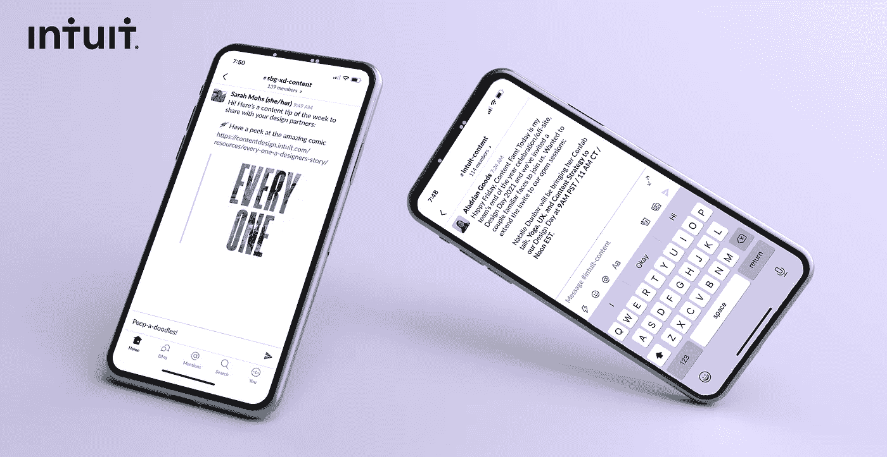
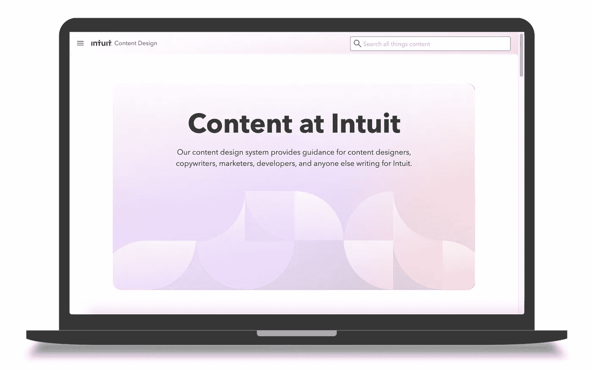
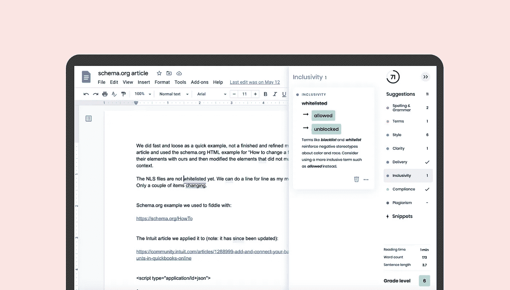
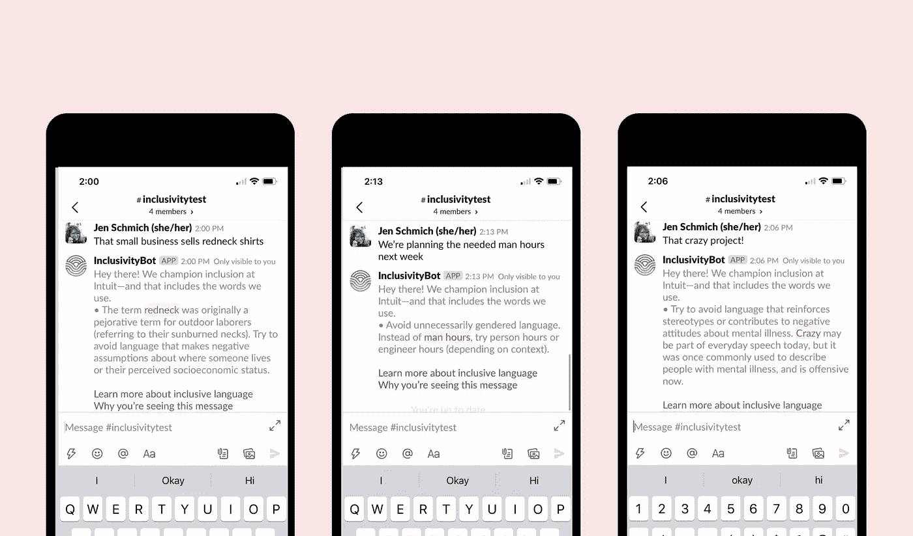
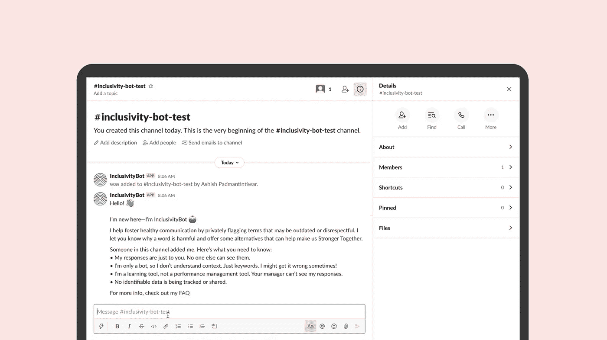
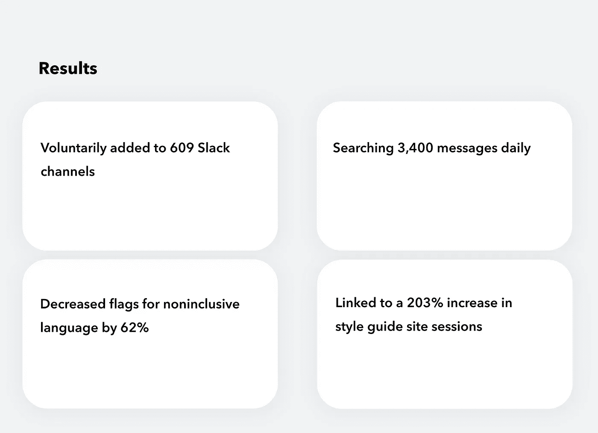
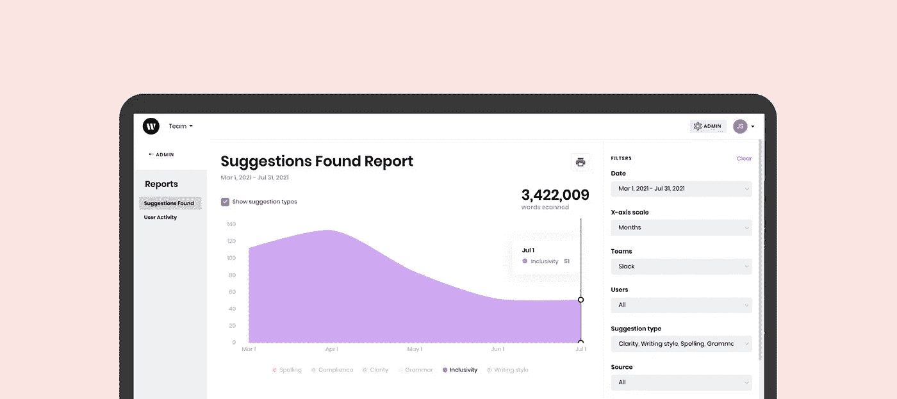
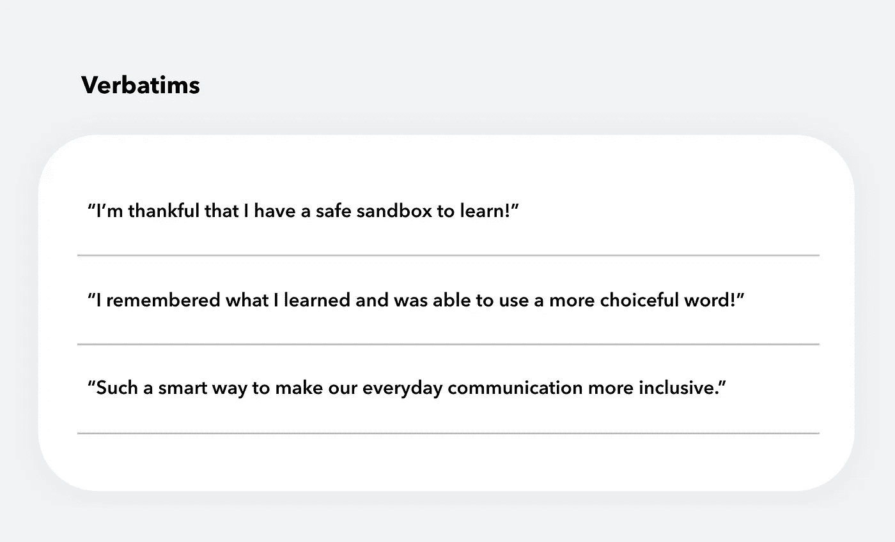

# 一个机器人如何改变我们相互交流的方式

> 原文：<https://medium.com/geekculture/how-a-bot-changed-the-way-we-talk-with-each-other-aea92064da2e?source=collection_archive---------25----------------------->

Intuit 的高级内容设计师 Sarah Mohs 合著

工程师要求你的内容团队构建一些东西的频率有多高？当我们收到 DevOps 的会议邀请时，我们很困惑。

Ashish 和 Wendi 为 Intuit 的工程日黑客马拉松带来了一个项目。多元化和包容性是我们 Intuit 的一部分。优质内容具有包容性，是我们[内容指南](https://contentdesign.intuit.com/)的一部分。

Ashish 和 Wendi 不想意外使用有害语言，但他们并不总是记得包含的术语，也不想一直查看风格指南。

At Intuit, inclusion has equal emphasis with accuracy, voice or clarity

我们如何从我们的风格指南[contentdesign.intuit.com](https://contentdesign.intuit.com/)中引入语言指南？如果我们创造了一个机器人，我们能帮助团队在日常对话中使用更具包容性的语言吗？

评估我们的差距，我们需要一个具有快速 API 的结构化数据源。我们还需要一套广泛的术语和短语，并提供足够的指导，作为邮件回复或内容本身。用于发布我们风格指南的 WordPress 并不是答案。

# **伙伴关系的力量**

相反，我们求助于另一个 Intuit 内容团队使用的平台 [Writer](https://writer.com/) 。除了许多令人惊叹的功能，Writer 还标记了不兼容的语言。该产品带有经过研究、策划的[标准，用于数千种包容性术语检查](https://writer.com/inclusion-glossary/)。另一个强大的功能:Writer 还允许我们从自己的单词列表中添加 Intuit 特有的语言。

Writer consistently delivers language suggestions to our teams

集成 Writer 的 API 是显而易见的决定。我们可以为 Intuit 员工创造一种体验，以支持我们的公司价值观，共同壮大。距离黑客马拉松还有一周，Writer 的团队加入了我们的合作。

# **机器人如何工作**

如果你用不兼容的语言在 Slack 频道发送消息，机器人会私下回复并提供相关建议:

*   年龄和家庭状况
*   能力
*   性别同一性
*   性取向
*   种族、族裔和国籍
*   药物滥用
*   消极攻击性

Intuit 在我们的产品和我们对它们的描述中使用了需要改变的语言，比如“主管理员”、“白手套”、“白名单/黑名单”但是也有一些语言在任何企业环境中无处不在，比如“powwow”，“circle the coughts”，以及无处不在的“guys”问候。

Bot replies are private to the message sender. No one else sees or tracks what it says.

# **练习开放和移情**

我们尊重人们在意识和意愿上的不同。我们的团队知道对改进的反馈持开放态度，可能还有一些防御性的反应。但是，重要的是要以对每个人的同理心为主导，包括那些在包容性语言道路上处于不同位置的人。最终，机器人会提供员工选择考虑或忽略的信息。这是我们唯一的期望。

很快，我们意识到我们必须为每个人创造更多的安全。为此，我们创建了一份反馈表，与人力资源部门合作处理[常见问题](https://contentdesign.intuit.com/inclusivitybot-faq/)，并链接我们的[可访问性和包容性](https://contentdesign.intuit.com/accessibility-and-inclusion/)指南，这些指南由内容团队、DEI 团队和员工资源团队的人员制定。

反馈表是从社区获得建设性反馈的有用工具。例如，该机器人最初标记了“聋人”等术语，并建议使用第一人称语言，如“聋人”我们得到反馈，建议用大写的 D 代表聋人，因为这个人对自己的身份感到自豪。能够在 Writer 中管理术语使我们能够轻松编辑，以确保机器人的建议包括人们更喜欢描述自己的不同方式。

# **沟通并设定期望**

当我们推出时，有些人担心机器人会被用作绩效管理工具。(不是，也没有可识别的数据被追踪。)一些属于大型闲置频道的人——或者不经常访问它们的人——不知道它在那里。当它回应时，他们很惊讶。

更多的交流几乎总是更好——尤其是包容性的语言，以及它如何缺乏共同理解的基础。现在，当机器人被添加到频道时，它会在公共消息中向每个人介绍自己。很清楚它做什么，不做什么，有什么局限性。当新的渠道成员加入时，该机器人还会自动用类似的消息问候他们。

Hello message

下一步是什么？我们将继续保持开放和同情，提供各种选择。Ashish 和 Wendi 计划增加一个让个人关闭回复的方法，并整合 Writer 的一个功能，捕捉对每个建议的反馈。

# **对内容和文化的影响**

这个机器人在 Intuit 很受欢迎。只有一个关于其可用性的通知发出，但人们在 Slack 上添加了它——迄今为止有 609 个频道。这个项目引起了我们主管的注意。在他们看来，机器人可以提升对话水平，有助于健康的工作环境。这也可能是更大的文化建设努力的一部分。

The number of suggestions went down as folks learned

Intuit 的员工已经收到了作为学习工具的机器人。我们看到旗帜的数量在几个月内下降了 60%以上。我们正在单独使用它来检查我们出于习惯使用的单词和短语，并改变它们。

> 单词有我不知道的意义或历史吗？或者对其他人的影响我看不到？我能通过选择一个不同的词来创造更多的归属感吗？

人们开始思考他们使用的词语——不仅是对我们的顾客，也包括对同事。这个机器人背后的想法是让你思考在 Slack 上发生的日常对话中使用的单词，并最终波及到任何地方发生的对话。

久而久之，新的习惯就形成了。你过去使用的词语将会被其他词语取代。语言总是在进化。想一想仅仅在一二十年前使用的种族主义、麻木不仁、不包容的词语，它们在今天已不再被接受。语言和文化的转变能够也将会发生。

*特别感谢我的黑客马拉松团队，他们建造了这个机器人:Wendi Cui，Sarah Mohs，Ashish Padmantintiwar 和 Vivek Saigal。感谢作家梅·哈比卜和麻衣子·库克给予的大力支持。*