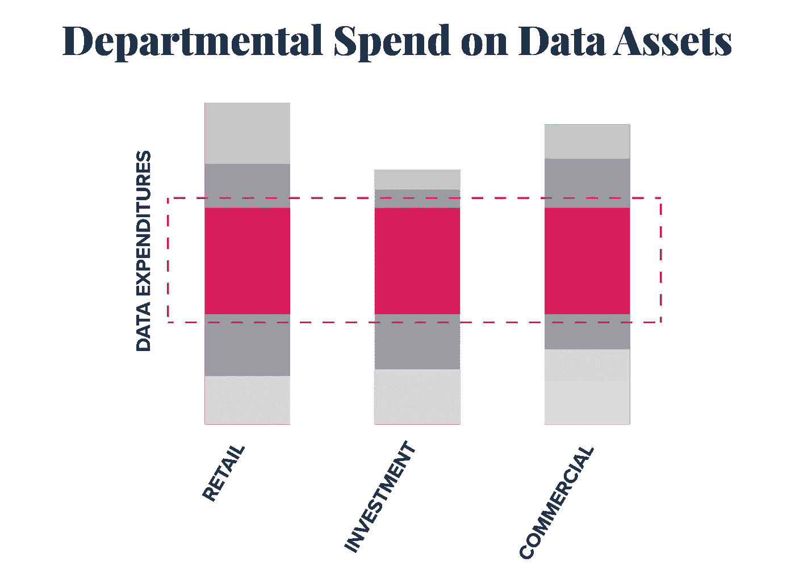
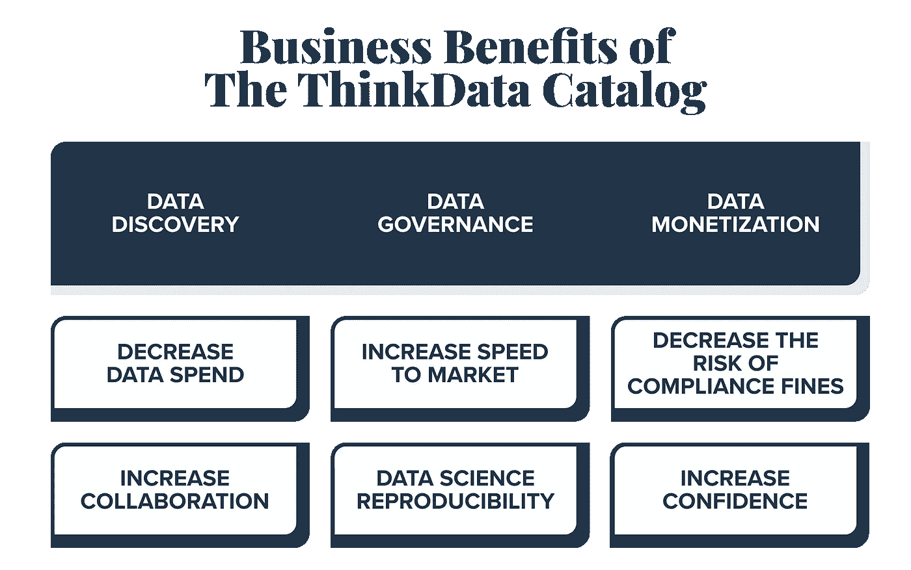

# 数据目录如何实现数据民主化

> 原文：<https://medium.com/geekculture/how-a-data-catalog-enables-data-democratization-54968ceffe9?source=collection_archive---------29----------------------->

对于许多组织来说，数据是 IT 部门拥有的业务资产。基于这种“数据所有权”模型，整个组织对数据的访问是有限的，而且内部可用的数据也不透明。

现在，越来越多的组织争相制定组织范围的数据策略。但是，有了隔离数据所有权模型，组织如何确保每个需要数据的人都能找到并使用它呢？

尽管数据科学家和分析师是最接近数据的人，但所有业务部门现在都需要数据(和数据知识)来实现数字化转型目标。这意味着数据访问和共享需要优先考虑。

2021 年新 Vantage Partners 大数据和人工智能高管调查报告显示， [**超过四分之三的这些高管**](https://c6abb8db-514c-4f5b-b5a1-fc710f1e464e.filesusr.com/ugd/e5361a_76709448ddc6490981f0cbea42d51508.pdf) 表示他们还没有创建数据文化。此外，只有约 40%的受访者表示，他们将数据视为企业资产，他们的企业在数据和分析方面展开竞争。

很明显，数据是大多数公司的首要考虑，但它仍然是一个独立的想法，而不是每个决策的基础。在业务部门之间，甚至在单个部门内部，仍然存在阻碍进展的障碍、孤岛和孤立的工作流。为了推动数据第一的文化，数据必须成为每个部门和决策的中心点，这可以通过数据民主化来实现。

## 什么是数据民主化？

数据民主化使数据在您的组织内可访问，这样每个人，不仅仅是您的 IT 部门，都可以访问数据。 [**畅销书《实践中的大数据》的作者 Bernard Marr**](https://www.bernardmarr.com/default.asp?contentID=1159) 明确指出:“这意味着每个人都可以访问数据，并且没有在数据网关处制造瓶颈的看门人。我们的目标是让任何人在任何时候使用数据做出决策，没有访问或理解的障碍。”

数据民主化为人们在其组织内查找、理解和使用数据以做出数据驱动的决策铺平了道路。

## 数据共享的内在阻力

数据是一种可以开启新机遇的商品，因此更好的访问意味着更好的结果是有道理的。然而，有许多数据包含敏感信息，这意味着更容易访问数据会滋生安全风险。这种威胁导致所有数据都被以或多或少相同的方式对待——默认关闭，根据具体情况和需要授予访问权限。

这确实有道理；数据隐私应该是重中之重。但通常，本应更容易获得的有用数据会与敏感信息混在一起。事实上，Forrester 报告称，在企业公司中， [**73%的数据仍未使用**](https://go.forrester.com/blogs/hadoop-is-datas-darling-for-a-reason/) 。在您的企业中，还有哪些地方可以以 27%的容量运行？

数据民主道路上的另一个障碍是假设数据没有以同样的方式使用，因此它不能被共享。每个部门出于不同的目的使用数据，因此假设数据不能在业务部门之间共享是有道理的。这导致在几个不同的地方购买相同的数据，或者在构建连接器和数据准备&清理方面的重复工作。不管怎样，你可能不止一次在同一个问题上花钱。

例如，我们可以假设一家银行的每个部门都跟踪经济指标。但是，如果没有更广泛的数据资产可见性，每个部门都会单独管理这些数据。这意味着多次购买相同的数据、重复的工作、较低的效率以及对您的底线的侵蚀。

有许多工具可以转换、存储、接收或呈现数据，所有这些都是您需要做的，对吗？但是无论工具集如何，如果数据计划之间没有文化一致性，就没有机会获得全部回报。当数据被视为设计和流程的一部分，而不是一个单独的黑盒附加物时，成本节约、新收入和改进的决策才能真正实现。

## 数据目录如何实现数据民主化

数据民主化的第一步是打破数据孤岛。这听起来很难，但是合适的工具会有所帮助。

[**数据目录**](https://blog.thinkdataworks.com/what-is-a-data-catalog-value-benefits-and-features) 是一种流行的解决方案，因为它允许组织集中其数据，然后从单一访问点查找、管理和监控数据资产。Gartner 报告称，拥有内部和外部准备数据的精选目录的组织今年将实现来自分析投资的 [**双倍商业价值**](https://www.gartner.com/smarterwithgartner/data-sharing-is-a-business-necessity-to-accelerate-digital-business/) 。

数据目录的主要优势在于，它们允许用户发现您的组织可以访问的所有数据，无论这些数据是由哪个来源或哪个部门获取的，但都要遵守严格的治理规则。此外，他们还可以提供数据虚拟化功能，以便用户可以检索数据，而无需将其从现有仓库中移走。这是数据隐私和驻留需求的一个主要优势。

市场上有多种数据目录解决方案。确保您选择的解决方案为 [**数据治理**](https://blog.thinkdataworks.com/data-governance-the-next-big-thing-in-business-strategy) 和数据共享提供基础。到 2023 年， [**推动数据共享的组织将在大多数商业价值指标上超越他们的同行**](https://www.gartner.com/smarterwithgartner/data-sharing-is-a-business-necessity-to-accelerate-digital-business/) 。

## ThinkData 如何实现数据民主化

ThinkData 的目录解决方案提供了来自任何来源的任何数据资产的可见性和治理。一旦可以从一个集中的位置访问数据，您就需要考虑您的组织如何能够完整地共享和连接数据。

自 2018 年 GDPR 启动以来，€已收到超过 2 . 74 亿英镑(超过 3 . 5 亿美元)的罚款——其中 92%的罚款是由于数据处理和安全的法律基础不足造成的。ThinkData 目录旨在帮助您遵守 GPDR、CCPA 和其他法规要求。更重要的是，该平台足够灵活，能够适应不断变化的市场条件。

我们在 ThinkData 2021 年数据状态中调查了数据科学专家。我们发现，86%的数据科学家认为基于角色的访问控制是管理数据集时的一项重要或非常重要的功能。ThinkData 目录通过基于角色的访问控制和数据取证活动实现了有效的数据管理。使用 Namara，用户可以授权或限制数据访问；跨更新跟踪数据集；以及审计数据访问、数据集健康等。

我们还在我们的 [**数据市场**](https://marketplace.namara.io/) 上提供了与全球最大的开放、公共和合作伙伴数据库的无缝连接。这提供了对可信的、产品就绪的数据集的访问，提高了发现速度，缩短了洞察时间，并增强了数据信心(注意:如果您想在我们的市场上提供数据， [**请给我们发送消息**](https://www.thinkdataworks.com/contact) )。

打造数据文化并不容易。正确的培训和执行支持需要贯穿您的业务职能，而不仅仅是您的技术团队。这一共同目标和框架将促进围绕数据目录开展业务的文化一致性。

数据应该被越来越多的人使用，而不仅仅是数据科学家，大多数公司都在朝着这个目标努力。但是，如果工具和培训之间存在文化上的不匹配，那么实现你的目标将会是一场艰苦的战斗。我们提供介绍性的数据治理评估，帮助您发现当前策略中的盲点。

内部数据民主化改善了数据访问，降低了管理成本，并增强了信心和一致性。在难以预测的环境中，组织竞相实施数据优先的方法来保护和优化其运营也就不足为奇了。提高组织内部的透明度将丰富你的公司的理解、能力和应变能力，这从未像现在这样重要。

您是否认为您的企业需要一个数据目录来查找、理解和使用可信数据[**来推动业务成果？请**](https://marketplace.namara.io/) **[**伸出**](https://www.thinkdataworks.com/contact) 。**

*最初发表于*[*https://blog.thinkdataworks.com*](https://blog.thinkdataworks.com/how-a-data-catalog-enables-data-democratization?utm_content=161281644&utm_medium=social&utm_source=linkedin&hss_channel=lcp-9217518)*。*