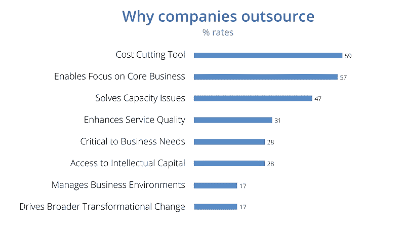

# 一个专门的软件开发团队如何帮助你的 SAAS 公司成长

> 原文：<https://medium.com/geekculture/how-a-dedicated-software-development-team-can-help-your-saas-startup-grow-a18762013d39?source=collection_archive---------7----------------------->

[来源](https://www.simform.com/hire/dedicated-development-team/)

你是最近进入软件即服务(SAAS)领域并努力让你的业务起步的众多创业公司创始人之一吗？你可能不像你的竞争对手那样和一个专门的软件开发团队一起工作。

你可能想知道雇佣这样的专业人士是否有助于推动你的业务，使其更具竞争力。然而，软件即服务(SaaS)初创公司有很多理由受益于专门的软件开发团队。

以下是其中的一些:效率、生产率的提高、24/7 的支持、与客户更好的关系等等。

甚至一份[报告](https://www.grandviewresearch.com/industry-analysis/it-services-outsourcing-market)也表明，IT 外包市场正在增长，2027 年将达到 9376.7 亿美元，CAGR 为 7.7%。

为了帮助您决定是否雇佣您的开发团队，我们提供了一些福利，您的 SaaS 初创公司将享受专门的软件开发团队。

所以，我们进去吧！

***也读:*** [***新兴软件开发外包趋势指南***](https://www.valuecoders.com/blog/technology-and-apps/latest-software-development-outsourcing-trends/)

# 专门的软件开发团队给 SAAS 初创公司带来的好处

[来源](https://www.n-ix.com/hire-dedicated-development-team/)

为你的 SAAS 创业公司雇佣一个专门的软件开发团队有很多好处。看一看:

## **1。高团队参与度成为可能**

作为一家软件初创公司，你需要快速有效地‌move，才能在竞争中保持领先。一个专门的软件开发团队可以帮助你做到这一点。

为你的项目组建一个专门的团队，并随时准备好参与其中，这对于确保快速高效地完成任务至关重要。对于 SAAS 创业公司来说更是如此，他们经常要很快搬家，浪费不起时间。

一个专门的团队可以确保总有人在你的项目上工作，并快速完成任务。这种高参与度带来了更好的结果和更成功的产品。

此外，让一个团队专注于你的项目也能让你和 them‌.建立更好的关系它可以导致更好的工作关系，甚至在未来取得更大的成功。

所以，如果你想让你的 SAAS 创业成功，联系一家定制软件开发公司是一个不错的选择。

## **2。提高效率和节约成本**

对于任何企业，尤其是初创公司，效率和成本节约至关重要。一个专门的软件开发团队可以帮助你的创业公司实现这两个目标。通过拥有一个专注于开发软件的团队，他们可以快速高效地工作。

[来源](https://belitsoft.com/hire-dedicated-developers/how-to-hire-dedicated-development-team-guide-for-ceos-and-business-owners)

这意味着您将节省开发成本和‌to 将您的产品推向市场的时间。此外，一个专门的团队也可以帮助您更有效地‌scale 您的业务。

随着公司的发展，你可以向团队中添加更多的成员，而不是去寻找和培训新员工。这可以帮助您避免工作流程中断，保持业务平稳运行。

这样，一个专门的软件开发团队可以从任何创业中受益匪浅。你也可以寻找 [**离岸软件开发**](https://www.valuecoders.com/offshore-software-development-services-company#utm_source=Offshore&utm_campaign=Guest_Blog&utm_id=NKY) 选项来壮大你的 SaaS 创业公司。

## **3。由您支配的灵活性和可扩展性**

要取得成功，软件即服务(SAAS)初创公司必须快速高效地前进。他们需要能够快速开发和部署他们的软件，同时仍然提供高水平的质量和客户服务。

一个专门的软件开发团队可以提供这些初创公司所需的灵活性和可伸缩性。

有了专门的团队，创业公司可以在需要的时候获得所需的资源。他们不需要等待某人变得有空，也不需要担心某个项目因为某人正在做其他事情而被搁置。

这种灵活性使他们能够快速行动，专注于核心业务。

一个专门的团队也可以根据需要扩大或缩小规模。初创公司可以在准备扩大软件产品时增加更多资源，或者在需要削减成本时减少资源。

这种可扩展性意味着初创公司总能拥有满足其需求的正确数量的资源。

一个专门的软件开发团队可以提供 SAAS 初创公司成功所需的灵活性和可伸缩性。

有了所需的合适资源，初创公司可以专注于核心业务，快速实现目标。

***也读作:*** [***成立一个专门的海上开发中心:基本原则***](https://www.valuecoders.com/blog/technology-and-apps/setting-up-a-dedicated-offshore-development-center/)

## **4。提高关注度和工作效率**

专门的软件开发团队的一个重要好处是，它可以帮助提高专注度和生产力。当你将开发外包给外部公司时，他们会管理项目并确保在预算内按时完成。

它让你专注于经营业务的其他方面，如营销和销售。一个专门的团队还可以改善组织内不同部门之间的沟通和协作。

它可以简化工作流程，最终为您的企业带来更好的结果。此外，拥有一个专门的团队可以让您安心，因为您知道您的项目有专门致力于交付最佳成果的专家。

## **5。更快的周转时间**

SAAS 初创公司的软件开发团队设计、编码、测试和维护软件，使公司的产品和服务成为可能。他们对企业的成功起着至关重要的作用。

专门的软件开发团队的主要好处之一是，它可以帮助提高产品开发速度。当所有的‌skills 都在内部可用时，从初始阶段概念到最终产品的周转时间会更快。

在科技初创公司的快节奏世界中，率先上市往往是成功的关键，这一点至关重要。

除了更快的开发时间，一个专门的软件开发团队还可以提供其他的好处，比如改进的质量控制和增加的灵活性。你也可以 [**雇佣开发者**](https://www.valuecoders.com/hire-developers#utm_source=It_staff&utm_campaign=Guest_Blog&utm_id=NKY) 来帮助你有效地成长你的 SaaS 创业公司。

## **6。在没有任何干预的情况下处理项目**

致力于 SAAS 创业的软件开发团队是一笔巨大的财富。他们可以在没有你干预的情况下从头到尾处理这个项目。

您可以专注于业务的其他方面，将软件开发留给他们。专门的团队也能更好地理解您的业务目标，并能帮助确保软件满足您的需求。

此外，他们可以在开发过程中提供有价值的反馈和输入。因此，专门的软件开发团队可能是 SAAS 创业成功的关键因素。

## 7.提高项目质量

对于软件开发来说，质量至关重要。毕竟，即使是一个小 bug 也会对用户体验产生重大影响。这就是为什么许多创业公司选择与专门的软件开发团队合作。

通过拥有一个专注于您的项目的经验丰富的开发人员团队，您可以确保产品符合您的标准。此外，专门的开发人员可以在整个开发过程中提供有价值的见解，帮助确保他们实现您的愿景。

因此，与专门的软件开发团队合作有助于提高项目质量。

## 8.获得专门技能和专业知识

随着软件即服务(SaaS)行业的持续增长，越来越多的初创公司希望分得一杯羹。然而，开发一款 SaaS 产品绝非易事。

您不仅需要创建一个健壮的、可扩展的软件平台，还需要确保它不断地更新新的功能和集成。许多创业公司选择与专门的软件开发团队合作。

与专门的开发团队一起工作的最重要的优势之一是获得专门的技能和专业知识。这些团队通常在构建 SaaS 产品方面拥有丰富的经验，他们可以就如何克服常见挑战提供宝贵的见解。

你也可以寻找一个 [**IT 员工增强服务**](https://www.valuecoders.com/it-staff-augmentation-services#utm_source=It_staff&utm_campaign=Guest_Blog&utm_id=NKY) 选项，让你的创业成功。他们将‌identify 并快速修复开发过程中出现的任何问题。因此，与一家 **IT 人员扩充公司**合作可以帮助确保您的 SaaS 产品是最高质量的。

## 9.对开发过程的更大控制

在初始阶段，控制软件开发过程是至关重要的。它有助于确保产品是根据公司的愿景开发的，并在需要进行更改时允许更大的灵活性。

一个专门的软件开发团队给予创业公司这种程度的控制。该团队与初创公司的创始人密切合作，了解他们的目标，并创造出满足他们需求的产品。

随着产品的发展，团队可以做出改变和调整。这种程度的控制和灵活性对于想要创造成功结果的创业公司来说至关重要。

## 10.竞争优势

一个运作良好的软件开发团队对于任何软件即服务(SAAS)创业的成功都是至关重要的。软件开发团队可以在几个方面给你的创业公司带来竞争优势。

*   首先，一个开发团队可以帮助你创建一个最小可行的产品(MVP ),它在技术上是合理的，并且用户友好的。
*   其次，开发团队可以帮助您生成验证和负载测试脚本，以确保您的 MVP 能够处理高流量负载。
*   第三，开发团队可以帮助您将 MVP 与第三方服务(如支付处理器和客户关系管理系统)集成。
*   最后，开发团队可以在你的 MVP 发布后为其提供持续的维护和支持。这些因素让你的创业更成功，更能抵御竞争对手。

***也读作:***[***2022 年聘请顶级专门开发团队进行 Web 项目***](https://www.valuecoders.com/blog/technology-and-apps/top-dedicated-development-team-to-hire-for-web-projects/)

# 最后的想法

软件开发团队对于任何软件即服务(SAAS)创业的成功都是至关重要的。

如前所述，与专门的软件开发团队合作为初创公司提供了许多优势。这些团队可以帮助提高您的项目质量，提供有价值的见解，提供专业技能和专业知识，并为您提供竞争优势。

因此，如果你想创建一个成功的软件 product‌.，与外包软件产品开发公司合作是必不可少的