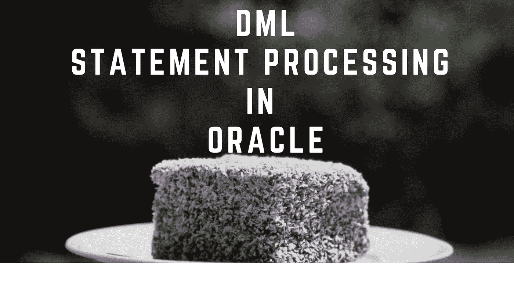
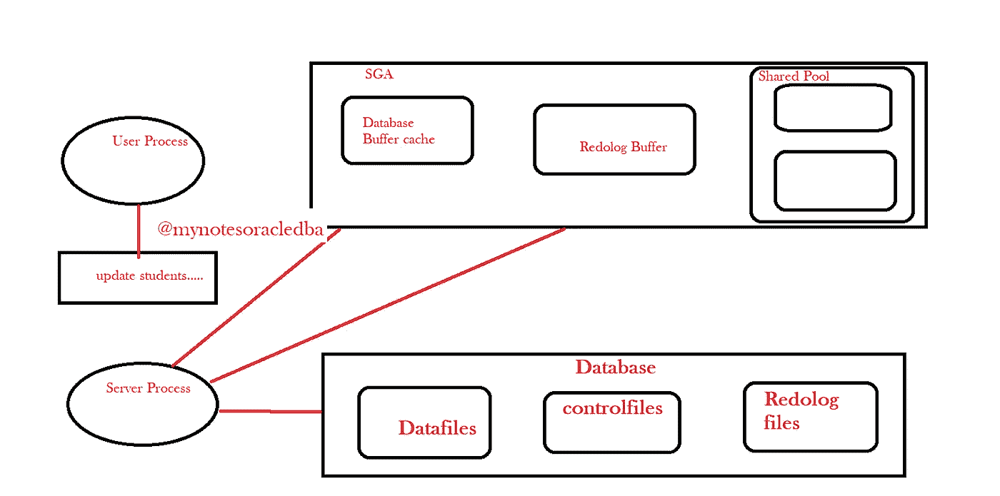

# 如何在 Oracle 中处理和提交 DML 语句？

> 原文：<https://medium.com/geekculture/how-a-dml-statements-is-processed-and-committed-in-oracle-653829c0ce77?source=collection_archive---------8----------------------->

这里我们将详细了解 DML 查询处理和提交

*   当用户执行 DML 语句时，服务器检查库缓存中的共享 SQL 区域，以确定查询是否已经存在。
*   在查询可用的情况下，不需要解析相同的查询，然后检查数据字典缓存。无论相关表信息是否存在，都不需要获取相关表的特权或定义
*   如果这些数据不在从盘返回并写入这些区域的库高速缓存和数据字典高速缓存中。
*   一旦这些数据准备好了，它首先检查查询是否为真，因为如果它是一个有效的查询，那么它检查相关数据的缓冲区缓存并撤消段。

Oracle DML statement processing

*   众所周知，如果您执行 DML 操作，相关数据会首先写入缓冲区缓存。这对于查询和运行 DML 操作都有效。

**脏块:**

*   如果需要修改的数据不在缓冲区高速缓存中，服务器会从光盘中取出这些数据，并将其写入缓冲区高速缓存。
*   在确保相关数据在缓冲区高速缓存中之后，它为其他用户锁定相关块，直到事务完成，即它应该是提交或回滚，其他任何人都不能更改这些块。
*   我们所有的更改都被写入缓冲区缓存中的相关块，这些块被称为“**脏块”**。

**提前写日志:**

*   同时，在缓冲区高速缓存中完成更改之前，所有相关的重做日志数据都被写入重做日志缓冲区。称为“**提前写日志**”。
*   这里，重做日志数据是在数据一致性修改之前创建的，因为实际数据比数据更改更重要。用户受影响的行数。但是用户可以继续修改其事务中的数据。
*   如果新的修改在相同的块上，它们在缓冲区高速缓存中完成。
*   如果需要新的数据，也可以从光盘中取出，对新的数据进行同样的处理。

**系统变更号(SCN):**

*   一旦用户提交了更改，将分别执行以下步骤。正如我们所记得的，在将更改写入重做日志文件时，重做日志缓冲区会为这些更改分配一个**系统更改号(SCN)** 。
*   系统变更编号是一个唯一的编号，包括该日期的时间戳。因此，服务器使用重做日志缓冲区中的当前系统更改号创建一个提交记录。
*   现在，日志写入器进程开始将到目前为止创建的关于相关操作的所有重做日志缓冲区条目(包括刚刚创建的提交记录)写入重做日志文件，然后将它们从重做日志缓冲区中删除。
*   然后，数据库写入进程将脏块写入磁盘，服务器为其他用户解锁相关块。

**结论:**

*   在这篇博客中，我们了解了 oracle 数据库是如何处理更新查询的。
*   完成所有这些之后，服务器向用户返回关于交易完成的反馈。因此，当提交成功时，您的事务完成，您开始另一个事务