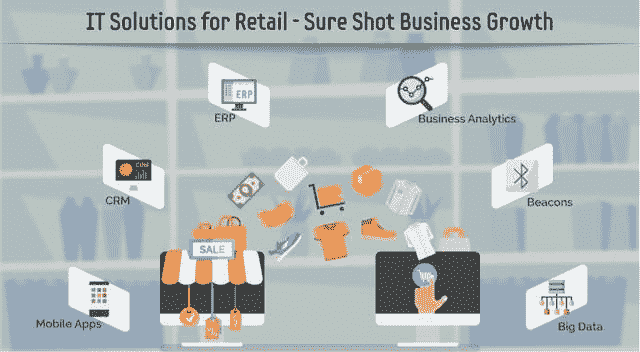
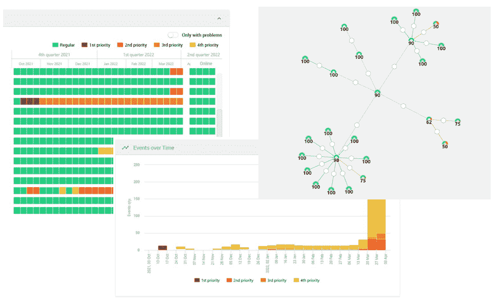
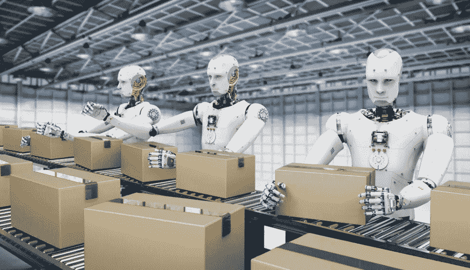

# 一个简单的 AIOps 平台如何将零售公司的 IT 工作效率提高了 250%

> 原文：<https://medium.com/geekculture/how-a-simple-aiops-platform-increased-labor-productivity-of-it-in-a-retail-company-by-250-f835f78ca3cf?source=collection_archive---------18----------------------->

在现代社会，没有它的零售业是不可想象的。激烈的竞争迫使最大的零售连锁店投资于技术——他们可以提供其他人没有的优势。技术的快速发展要求企业时刻保持警惕，以便快速适应这些变化。这种无休无止的 IT 增长通常伴随着与之相关的问题的增加，而这些问题往往是公司自己无法解决的。系统碎片化、缺乏单一控制中心、大量信息噪音、事件处理速度降低，现在 IT 部门不仅不能解决任务，还会创造新的任务。在这种情况下，一家公司如何保持竞争力，不损失金钱和员工，并确保 IT 专家能够成为超级明星？AIOps 是如何考虑的？我将用一个我的创意实现的真实例子来告诉你 Acure 平台。

我叫 Nick，是 Acure.io 的首席执行官，这是一款具有强大低代码自动化功能的 AIOps 数据监控和可观察性工具。这是我们一个客户的故事。

# **真实故事**

一天，一家大型零售公司找到我，要求提高 IT 生产率。尽管流程自动化和现代软件广泛应用，但并没有产生预期的结果。由于分支机构的规模和数量，该组织的 IT 结构是分散的和多层的，包括网络、数据中心、云服务、应用程序支持、商店自动化、仓库等等。在每个分支机构中，技术组件的开发各不相同，在商店中，他们通常使用第三方提供的网络。所有这些因素使得控制已经复杂的多层次信息技术变得困难。

长期以来，由于碎片化，主要的 IT 资源都花在了支持上，无论是物流系统、在线收银还是视频监控。与此同时，信息技术综合体可分为两个部分:变革(创建信息技术资源，实施新的和现代的系统支持，如财务或后勤)和运行或操作(维护硬件、服务器、遗留系统和其他系统)。反过来，运营部有自己的 NOC，负责监控整个 IT 系统的状态，包括 IT 设备。

从技术角度来看，该公司的 IT 复合体可以简单描述如下:许多不同的 IT 系统由不同的监控平台控制，并由不同的工作组管理，但一切都由一个情景中心提供服务(不幸的是，对老板来说也是如此)。

现在，我的文章不会因为情节的不可预测性而让你惊讶，因为我假设你已经猜到了我的客户在遇到的**问题。**

*   首先，存在 30 多个不同的监控系统(Zabbix、Oracle、SAP、Instana、用于分析日志的 Elasticsearch 等。)产生了海量的信息。因为负责某些系统的产品团队不愿意共享，所以它经常被复制或者有时不可用。只有对每个事件的调查花了半个多小时——这些宝贵的时间本可以用来消除这些事件。

*   其次，每天超过 100 个警报和大量的手动例行工作导致负责监控的员工精疲力竭，结果导致员工流动率很高。这些雇员呆的时间不超过一年。又一次，宝贵的时间被浪费了，但现在是为了寻找和培训新员工。

然后商家就拉响了警报，请求帮助。我们帮了忙。

# **治愈它的方法**

Acure 是现有系统的一种附件，允许您在一个窗口中收集数据，并在一个屏幕上显示整个 IT 系统的状态。即使它像我们的情况一样复杂。同时，自动发现功能会自动添加有关新配置项的信息，然后还会使用自动化机制配置某些操作的算法。但首先要做的是。

*   将企业版部署到客户端后，我们使用自动发现和依赖关系映射从所有本地监控系统接收事件数据，建立连接并从 30，000 多台设备获取信息。基于这些数据，构建了一个单一的资源服务模型，实时显示整个组合系统的所有组件的运行状况。

*Acure interface*

***——数据碎片和重复问题***

***+所有 IT 组件的透明性和可访问性***

*   组件和业务服务之间的链接减少了查找问题根源和故障类型的时间 **60%** 。因此，这为专家解决事件腾出了额外的时间，而不是花费时间寻找问题的根源。对相同类型的警报和相应的任务进行了分类，创建了用于解决问题的单一知识库。

***-找到问题根源的时间***

***+修复时间***

*   对于相同类型的类似任务，Acure 允许设置自动操作——从通知到脚本**。**在我们的例子中，超过 30%的任务是自动化的。在不招聘新员工和保留相同员工的情况下，这显著减少了任务的人工处理，并将劳动生产率提高了 250%。

***- 30%手工作业***

***×2.5 劳动生产率***

# **结论**

在本文中，我分享了 Acure 历史上的一个案例，它清楚地展示了一个简单的 AIOps 平台如何成功处理复杂的业务挑战。随着时间的推移，我将分享更多的故事，但同时，我期待您的反馈，并邀请您访问 [Acure 网站](https://acure.io/)，在那里您可以了解更多关于该平台的信息以及提到的所有好处。