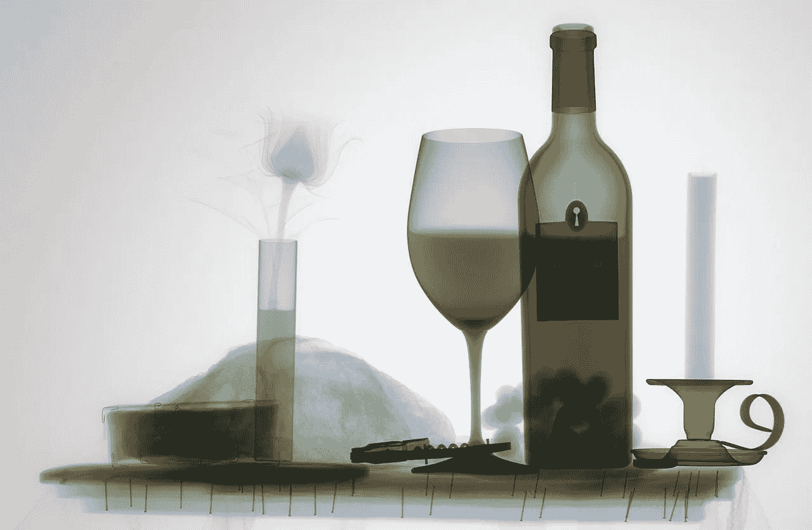
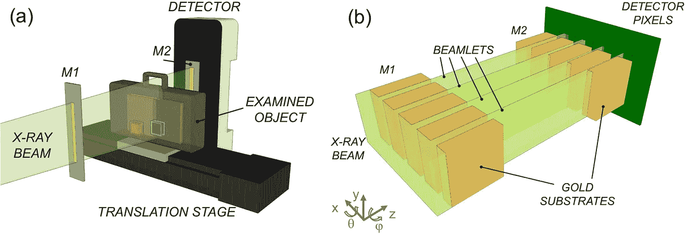
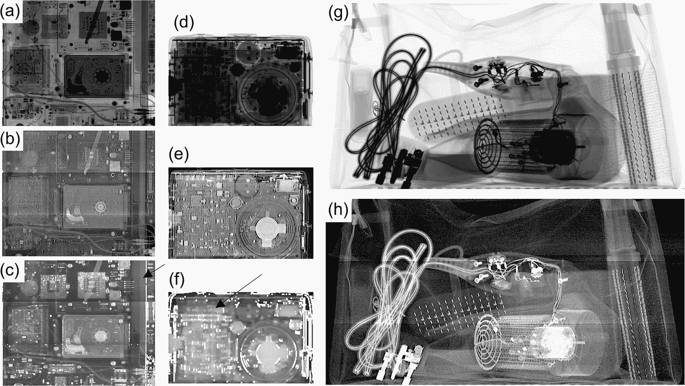
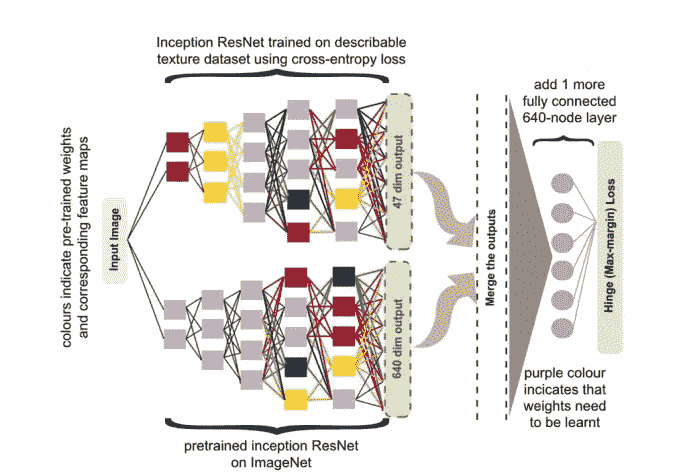

# 人工智能和 X 射线如何检测爆炸物也能识别癌症

> 原文：<https://medium.com/geekculture/how-ai-and-x-rays-to-detect-explosives-could-also-identify-cancers-63dbd4c44fa3?source=collection_archive---------12----------------------->

人工智能如何增强 X 射线以检测隐藏爆炸物和潜在的肿瘤，通过它们的纹理破坏墙壁

image source: [Mathew Schwartz](https://unsplash.com/@cadop) at unsplash.com

伦敦大学学院(UCL) 的研究人员最近在[自然通讯](https://www.nature.com/articles/s41467-022-32402-0)上发表了一篇论文，他们展示了一种新的 [X 射线](https://www.nibib.nih.gov/science-education/science-topics/x-rays)方法结合人工智能如何能够识别隐藏在电子物品中的少量爆炸物。作者表示，该算法在测试条件下实现了 100%的准确性。这项技术也有可能应用于其他领域，如发现肿瘤、结构裂缝等

**未知射线**

x 射线是高能电磁辐射(波长在 10 皮米到 10 纳米之间)。虽然 x 射线是由其他实验产生的，但这一发现归功于伦琴(以至于在一些国家，如德国、匈牙利、丹麦、瑞典等)。，他们称之为伦琴射线)。

发现后两个月，伦琴发表了一篇论文(1995)。它立即获得了成功:1996 年发表了 49 篇论文和 1044 篇文章(仅著名的《科学》杂志 1996 年就有 23 篇文章涉及这一主题)。伦琴也因为他的发现获得了第一个诺贝尔奖。此外，他是第一个意识到它的医学用途的人，以至于历史上的第一张 x 光照片是他妻子的手的图像(事实上，他的妻子在看到图像时并不那么热情，说:“我看到了死亡。”)

first medical radiography

x 射线立即被用于医疗领域，首先是引入了[射线照相术](https://www.etsu.edu/crhs/allied-health/radiologic/whatis.php)，然后是[放射疗法](https://www.cancer.gov/about-cancer/treatment/types/radiation-therapy)的治疗领域。如今，x 射线的应用已经超出了医学范畴，以至于现在还被用于:

*   [X 射线晶体学](https://en.wikipedia.org/wiki/X-ray_crystallography):用于蛋白质和其他生物分子
*   [X 射线天文学](https://en.wikipedia.org/wiki/X-ray_astronomy)
*   [工业射线照相术](https://en.wikipedia.org/wiki/Industrial_radiography)
*   [机场安检](https://en.wikipedia.org/wiki/Airport_security)和[边境管制](https://en.wikipedia.org/wiki/Border_control)用于调查行李和卡车中的潜在威胁。

近年来，我们已经习惯了排队接受安全检查，我们的行李要通过 x 光机。任何坐过飞机的人都知道，他们必须从行李中取出电脑和其他电子小发明。事实上，很难识别藏在笔记本电脑或其他物品中的爆炸物。

**如何发现隐藏的爆炸物。**

X-rays detector. image from the original [paper](https://www.nature.com/articles/s41467-022-32402-0)

UCL 研究人员将少量炸药(塞姆汀塑胶炸药，C4)藏在各种物体(吹风机、手机和笔记本电脑)中。之后，这些物品和其他物品一起被放在行李箱内(就好像是一个普通旅行者的行李箱)。这项新技术在识别爆炸物方面显示了 100%的准确性。

> “ ***这是一种通过分析纹理来检查材料和物体的完全不同的方式，并允许我们以一种新的方式检测非法材料***”—研究作者声明([来源](https://www.standard.co.uk/tech/science/xray-security-crime-ucl-b1024437.html)

科学家们使用一种特殊构造的机器来扫描行李，这种机器带有掩模——钻有孔的金属片，可以将光束分成一系列更小的光束——而不是使用普通的 x 光机，后者使用均匀的 x 射线场来攻击物体。当它们穿过袋子和它的内容物时，细光束以小到微弧度(大约是 1 度的 20，000 分之一)的角度散射。人工智能对散射进行了检查，人工智能经过训练，可以从角度变化的特定模式中识别特定材料的纹理。

换句话说，研究人员指出，物体中的微观不规则或变化正在弯曲 X 射线，新技术允许研究人员检测到它。

examples of images obtained, the arrow represents the C4\. image from the original [paper](https://www.nature.com/articles/s41467-022-32402-0)

这项新技术改善了信号，能够区分不同的材料。然而，分析图像仍然是一个费力的过程。因此，研究人员使用不同模型的卷积神经网络来分析图像。事实上，他们基于使用预训练模型(如 [GoogleNet](https://www.mathworks.com/help/deeplearning/ref/googlenet.html) 和 [Inception ResNet](https://paperswithcode.com/method/inception-resnet-v2) 和[迁移学习](https://www.v7labs.com/blog/transfer-learning-guide))测试了不同的架构。

奇怪的是，最好的结果是在没有图像增强(旋转、翻转、缩放、改变对比度和照明属性)的情况下获得的；然而，这可能令人惊讶，对于研究人员来说，这源于材料的特殊属性。所分析的材料是粒状的，图像放大技术如缩放会引起平均颗粒尺寸/距离的改变。

此外，在第二次测试中没有获得假阴性。正如研究人员指出的那样:“这是令人鼓舞的，因为丢失爆炸物比数量有限的假阳性更令人担忧”。

该模型仍然可以改进，研究人员不希望实验室的结果在正常条件下具有相同的准确性。在文章中，他们指出了这个模型如何也可以应用于其他领域。事实上，该模型和技术关注的是两种相邻材料之间的纹理差异。这可能有助于识别仍然非常小并因此可治疗但临床医生难以识别的肿瘤。例如，作者指出，该算法可以用于识别小乳腺癌，因为它们与健康组织或胸腔融为一体，所以没有被注意到。

此外，作者表示，这种技术可以用于检测建筑物和其他建筑工程中肉眼可见的损坏、裂缝和褶皱。这将允许一种非侵入性的技术来更早地识别潜在的问题。

> “这有可能成为用途极其广泛、改变游戏规则的技术。我们目前正在与一些公司谈判，探索如何将其投入实际应用。这种技术带来的好处是无限的。”—奥利佛教授([来源](https://www.ucl.ac.uk/news/2016/dec/revolutionary-x-ray-technology-developed))

**结论**

机场安检要求对行李进行 x 光检查，看是否有潜在威胁。这并不总是容易的，主要因素是操作者的经验。尤其是当数量很少并且隐藏在其他物体中时，爆炸物和麻醉品很难被发现。这项新技术与人工智能一起将使识别爆炸物、毒品和外来动物违禁品成为可能。

计算机视觉将彻底改变医疗诊断，他们预计几个开发的算法将在未来几年进入临床。有几项研究专注于尝试使用人工智能对各种癌症进行早期诊断。一些算法已经达到了最先进的水平，并与有经验的医生竞争。

另一方面，计算机视觉可以革新几个领域(从材料分析到机场安全)。在这项研究中，除了开发一种有趣的算法，他们还建立了一种新的 X 射线技术，表明这种结合可以产生令人兴奋的结果。

# 如果你觉得有趣:

你可以寻找我的其他文章，你也可以 [**订阅**](https://salvatore-raieli.medium.com/subscribe) 在我发表文章时得到通知，你也可以在**[**LinkedIn**](https://www.linkedin.com/in/salvatore-raieli/)**上连接或联系我。**感谢您的支持！**

**这是我的 GitHub 知识库的链接，我计划在这里收集代码和许多与机器学习、人工智能等相关的资源。**

** [## GitHub - SalvatoreRa/tutorial:关于机器学习、人工智能、数据科学的教程…

### 关于机器学习、人工智能、数据科学的教程，包括数学解释和可重复使用的代码(python…

github.com](https://github.com/SalvatoreRa/tutorial) 

或者随意查看我在 Medium 上的其他文章:

 [## 机器遗忘:遗忘的职责

### 从人工智能模型中删除数据点信息的重要性

towardsdatascience.com](https://towardsdatascience.com/machine-unlearning-the-duty-of-forgetting-3666e5b9f6e5)  [## 机器学习应对气候变化

### 人工智能如何帮助对抗全球变暖并从人类手中拯救世界

towardsdatascience.com](https://towardsdatascience.com/machine-learning-to-tackle-climate-change-7911e004c3a2)  [## 科学贡献如何变成一个有毒的环境

### 计算机科学是如何继承了其他学科同样的错误的

towardsdatascience.com](https://towardsdatascience.com/how-science-contribution-has-become-a-toxic-environment-6beb382cebcd)  [## 说生命的语言:AlphaFold2 和公司如何改变生物学

### 人工智能正在重塑生物学研究，并开辟治疗的新领域

towardsdatascience.com](https://towardsdatascience.com/speaking-the-language-of-life-how-alphafold2-and-co-are-changing-biology-97cff7496221) 

**附加资源**

*   关于新的 x 光技术和人工智能模型:[这里](https://wonderfulengineering.com/this-new-x-ray-technique-for-detecting-explosives-could-also-identify-tumors/)，[这里](https://interestingengineering.com/innovation/ai-x-ray-technique-detects-bombs-cancer)，[这里](https://www.gadgetbytenepal.com/ai-based-x-rays/)
*   AI 诊断癌症:[这里](https://www.cancer.gov/news-events/cancer-currents-blog/2022/artificial-intelligence-cancer-imaging)，[这里](https://www.nature.com/articles/d41586-020-03157-9)，[这里](https://www.sciencedaily.com/releases/2022/04/220425121049.htm)，[这里](https://www.mdpi.com/topics/AI_Cancer)，[这里](https://www.nidcr.nih.gov/news-events/2020/exploring-ai-cancer-diagnosis)
*   关于 AI 在机场安检中的使用:[这里](https://www.airport-technology.com/analysis/can-i-see-your-bag-improving-airport-security-with-help-from-ai/)，这里[这里](https://www.analyticsinsight.net/how-ai-enhances-security-systems-in-airports/)，这里[这里](https://www.forbes.com/sites/davidteich/2021/01/21/threat-detection-and-security-are-aided-by-integrated-machine-learning--artificial-intelligence/?sh=7aa0531d6190)，这里[这里](https://www.linkedin.com/pulse/solving-airport-security-through-machine-learning-leon-kuperman/)，这里[这里](https://techmonitor.ai/technology/cybersecurity/uk-airport-security-machine-learning)，这里[这里](https://www.scylla.ai/how-leveraging-ai-helps-optimize-safety-and-security-for-airports/)
*   关于卷积神经网络([这里](https://en.wikipedia.org/wiki/Convolutional_neural_network)、[这里](https://www.ibm.com/cloud/learn/convolutional-neural-networks)、[这里](https://www.mathworks.com/discovery/convolutional-neural-network-matlab.html))、迁移学习([这里](https://www.analyticsvidhya.com/blog/2017/06/transfer-learning-the-art-of-fine-tuning-a-pre-trained-model/)、[这里](https://builtin.com/data-science/transfer-learning)、[这里](https://www.tensorflow.org/tutorials/images/transfer_learning)、[这里](https://machinelearningmastery.com/transfer-learning-for-deep-learning/))和预训练模型([这里](https://developer.nvidia.com/ai-models)、[这里](https://www.sciencedirect.com/science/article/pii/S2666651021000231)、[这里](https://towardsdatascience.com/the-applications-and-benefits-of-a-pretrained-model-kaggles-dogsvscats-50221902c696))**