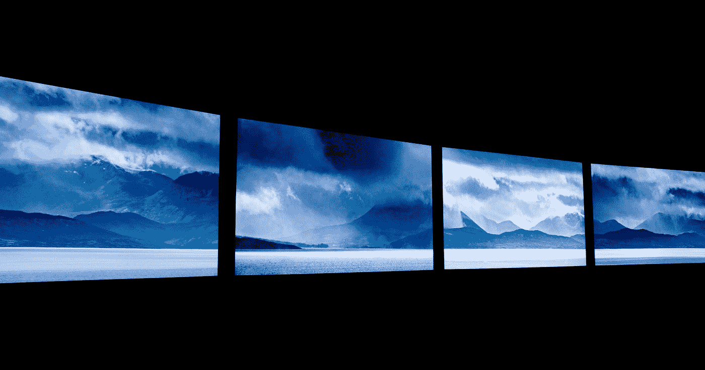

# 人工智能如何预测自然灾害

> 原文：<https://medium.com/geekculture/how-ai-can-predict-natural-disasters-2340199fb1ff?source=collection_archive---------18----------------------->

## 技术

## 给人们一些时间来准备

Photo by [Clark Van Der Beken](https://unsplash.com/@snaps_by_clark?utm_source=medium&utm_medium=referral) on [Unsplash](https://unsplash.com?utm_source=medium&utm_medium=referral)

当我 8 岁的时候，我记得我的姐姐曾教导我说，如果晚上天空晴朗，你可以眼冒金星，第二天就会阳光明媚。从那时起，我就一直遵循这个简单的天气预报技术。有时成功，有时不成功。但是，是的，我注意到了…