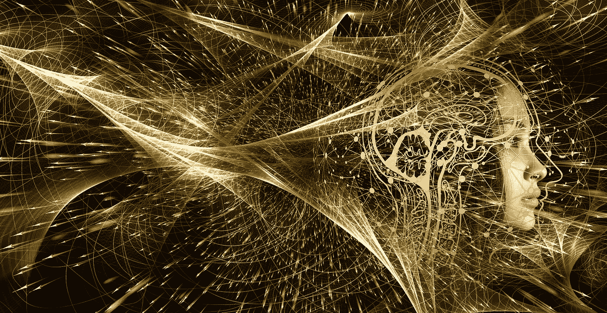

# 人工智能如何影响我们的行为

> 原文：<https://medium.com/geekculture/how-ai-is-influencing-our-behavior-94077e929f7a?source=collection_archive---------12----------------------->

Image by [Gerd Altmann](https://pixabay.com/users/geralt-9301/?utm_source=link-attribution&utm_medium=referral&utm_campaign=image&utm_content=4550602) from [Pixabay](https://pixabay.com//?utm_source=link-attribution&utm_medium=referral&utm_campaign=image&utm_content=4550602)

人工智能(AI)根据个人的行为建立个人档案。它使用这些数据来预测他们的下一步行为，并在搜索、广告和其他在线活动中向该人显示相关选项。人工智能塑造了你看到的东西，以及你如何与不断扩大的在线世界互动，影响你接下来做什么。