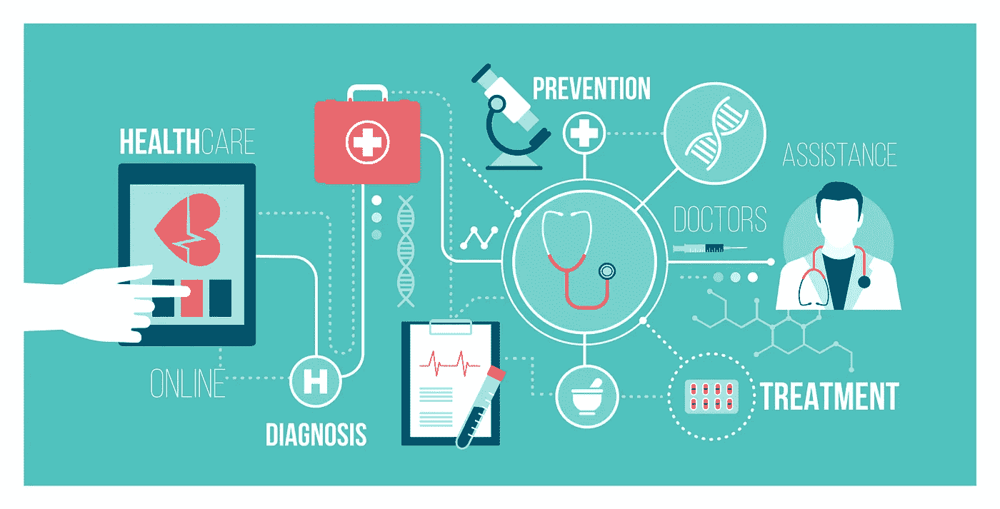

# 人工智能、人工智能、区块链和虚拟现实如何重新定义医疗保健和医学

> 原文：<https://medium.com/geekculture/how-ai-ml-blockchain-and-vr-are-redefining-healthcare-and-medicine-4125d33a9288?source=collection_archive---------19----------------------->

比医院里的机器便宜 100 倍的袖珍超声波设备。降低手术后疼痛程度的虚拟现实。人工智能应用可以在癌症的最早期阶段发现癌症。这些只是目前正在改变医疗保健行业的一些创新。

## **人工** …