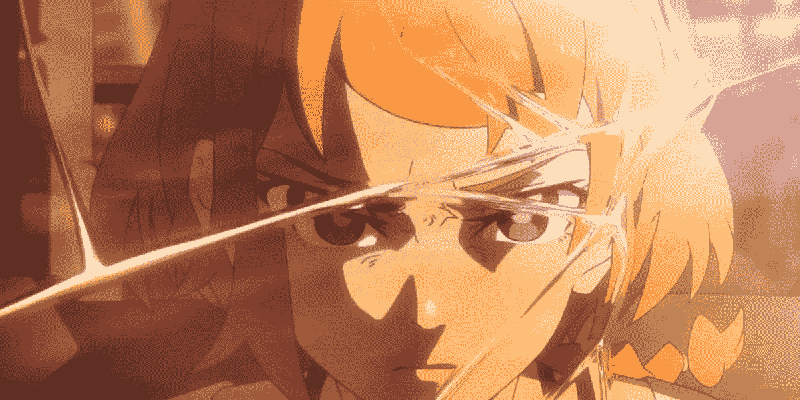
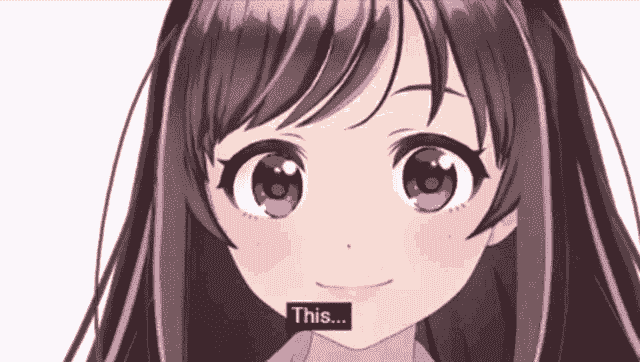
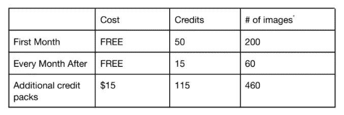
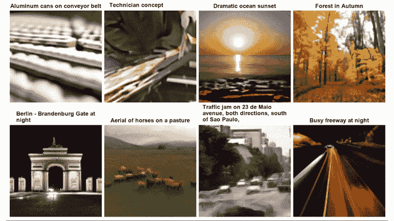
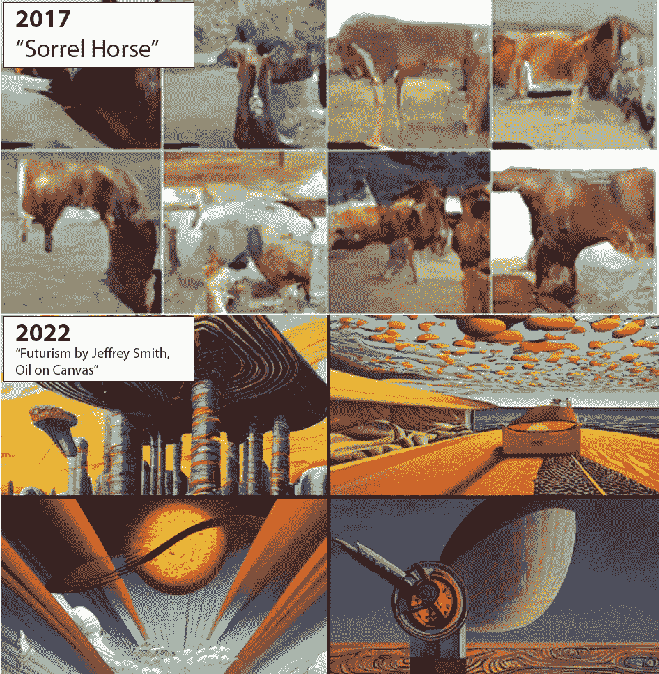
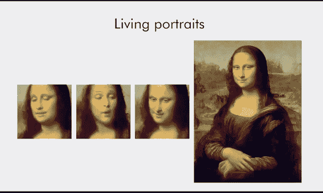
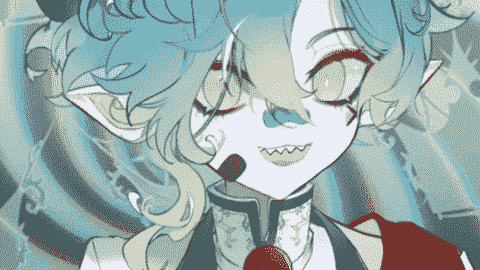
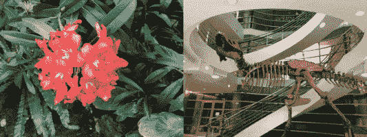

# AI 将如何在不到 5 年的时间里完全主宰动画产业

> 原文：<https://medium.com/geekculture/how-ai-will-completely-dominate-the-animation-industry-in-less-than-5-years-90e470890022?source=collection_archive---------0----------------------->

## 如果你想进入动画行业，你只有不到 5 年的时间。

把动画当成职业？你只有不到五年的时间去做一些有意义的事情。

为什么？

1.  [DALL-E 2](https://openai.com/dall-e-2/) 和[其他人工智能艺术模型](https://stability.ai/#aboutus)现在可以使用简单的文本提示制作近乎无限的各种插图。到 2025 年，他们将在每个指标上超越人类艺术家。
2.  [人工智能动画模型](https://www.youtube.com/watch?v=SWI5KJvqIfg&t=9s)已经存在，可以拍摄静态插图，并“想象”不同的运动、姿势和帧。你可以让《蒙娜丽莎》微笑、大笑或哭泣——没有什么可以阻止你对其他图像也这样做。
3.  [AI 视频模型](https://plai.cs.ubc.ca/2022/05/20/flexible-diffusion-modeling-of-long-videos/)就在眼前。很快，工作室将能够创建任何帧率的流畅视频，只需一个文本提示。接下来是短片。

如果[东映动画](https://www.youtube.com/watch?v=_RM1zUrY1AQ)(负责《海贼王》和 DBZ 的工作室)已经在做了……你或许应该认真对待。

完全清楚:我要说的是，这不是一个有后劲的行业。你将会失去工作，或者至少成为薪水和升迁机会大幅减少的牺牲品。

你对此真的无能为力。

# 财政激励

基于人工智能的动画可以廉价、快速地制作，并且比传统的手绘或计算机生成的动画需要更少的人力。而且随着这些技术的不断发展和完善，价格差异只会越来越大。

让我们通过查看 DALL-E 2 最近的收费模型来彻底简化这一点。

DALL-E’s new pricing model

看看这些数字，现在生成 4 幅图像的成本约为 0.13 美元。随着[竞争车型](https://stability.ai/beta-signup-form)的出现，这个价格可能会直线下降，但是我们会保守一点，假设它保持不变。

如果需要八代人才能找到一幅你满意的图像，你仍然只需支付大约四分之一，或 0.26 美元，就可以买到一件相当于高质量佣金的艺术品。

AI video prompts are already making incredible progress. Expect high-quality animations in just a few years.

相比之下，仅在三、四年前，一名传统的委托艺术家的成本就很高。如果这位艺术家每张图片收费 25 美元，价格差异已经很大:使用人工智能几乎便宜 100 倍。

但许多艺术家会收取五到十倍的费用，使差价接近 1000 倍。有些人仍然这样做，因为他们没有看到不祥之兆——他们想知道为什么销量直线下降，似乎没有人再对他们的东西感兴趣了。

# 速度和可靠性

但这不仅仅是钱的问题。有了 AI，你也可以更快地得到结果。DALL-E 2 可以实时生成图像，这意味着您不必等待数小时或数天才能得到响应。

这是，并将继续是，*任何动画师或工作室成功的关键*。这项工作最重要的部分之一是在决定方法之前快速测试概念艺术。

例如，DALL-E 2 极大地缩短了这个循环:它让设计师和插画师在投入时间和金钱制作昂贵的动画之前对一个想法进行迭代。下一个插图(或者可能是视频)模型将能够做得更快，更逼真。

AI image progress in just 4.5 years. The bottom images are ~8x the resolution of the top ones, and include much greater diversity, complexity, and creativity.

总而言之:在人工智能驱动的经济中，人类动画师、委员会艺术家或插画师根本没有未来。

# 桥梁:动画模型

一个可能的事态发展是:在全视频人工智能开发出来之前(我说的全视频人工智能是指那种破坏行业的人工智能，你可以用“一个更黑暗、更坚韧的火影忍者杀死一个忍者的场景”来提示)，动画机构和制作工作室将把更多的业务转移到首先使用 DALL-E 2 这样的模型来生成静态人工智能图像，然后应用[真人肖像风格的模型](https://www.myheritage.com/deep-nostalgia)(以削减成本并保持竞争力)。

重申一下，随着世界各地的工作室等待完整的视频人工智能被开发出来，他们将通过两步管道来弥合这一差距:第一步将静态物体/角色的图像，第二步将“想象”他们将参与的各种帧、角度和运动。见下面 Crypko 的例子。

# 完美与足够好

动画模型不会完美，至少未来几年不会。但他们不需要这样。即使是粗略的草图(充满错误)也会使传统动画师花费在工作上的时间减少一半以上，使他们的能力增加一倍，并使艺术家更难打入市场。

顺便说一下，这已经发生了:运动捕捉技术，一种新生的低效的动画人工智能形式，经常被用来显著提高单个静态图像的价值。

就拿最近的 [V-tuber 热潮](https://en.wikipedia.org/wiki/VTuber)来说吧。动画人工智能允许人们增加单个绘制帧的效用，增加可访问性，并大大降低动画师的准入门槛。

…作为一名艺术家，这听起来很棒，直到你意识到这个*也*在同一个市场中消除了人类的价值。

# （把汽车拆卸减重后举行的短程高速驾驶比赛中）冲撞别的汽车

另一个有趣的发展是神经辐射场(NeRF)。

近年来，许多动画工作室已经转向制作大部分 3D 作品，然后直接描摹或渲染结果。这有几个优点:

*   制作成本更低:每场戏需要的艺术家少得多
*   它消除了昂贵且耗时的旋转镜检查的需要
*   具有许多独立移动角色的场景，如人群或大规模战斗，可以更快地创建

人工智能将加速这种方法。特别是，NeRF 现在可以用于创建静态角色和对象的真实 3D 环境。几年之内，动画师将会经常使用这样的技术来自动渲染完整的 3D 环境，从而提高他们的输出和真实感。

这将给动画师和关键帧制作者带来巨大的压力，他们将不得不大幅降低价格，或者自己学习使用动作捕捉。即使这样，他们的时间也是有限的。

# 最后的想法

坦率地说，我不认为这是对人类社会的净负面影响。许多不可思议的故事被动画化的能力限制了范围。[狂战士](https://en.wikipedia.org/wiki/Berserk_(manga))就是一个最好的例子。

通过消除这一瓶颈，作家和梦想家可以自由创作和想象更好的故事。未来的 10 到 20 年可能会是人类艺术繁荣的时代，在这个时代，一些人类最伟大的作品将会流芳百世…

…至少在 AI 在*和*比我们好之前。

不管怎样，毫无疑问，这将对就业市场产生重大影响。DALL-E 2 和人工智能艺术运动已经导致艺术家佣金大幅下降，这种影响很快就会渗透到 B2B 和更广泛的世界。

如果你喜欢插画或动画作为职业，你可能应该把它归为爱好，从事一些不那么容易被破坏的工作。