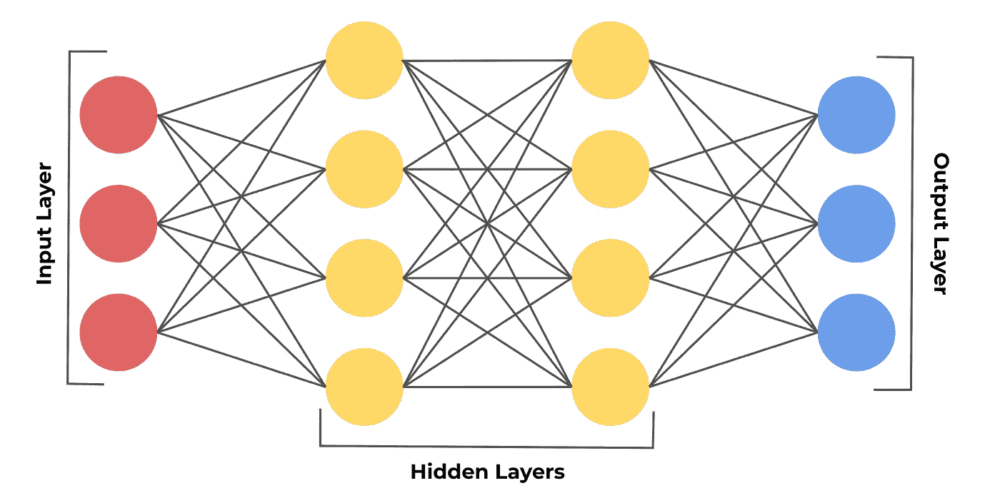
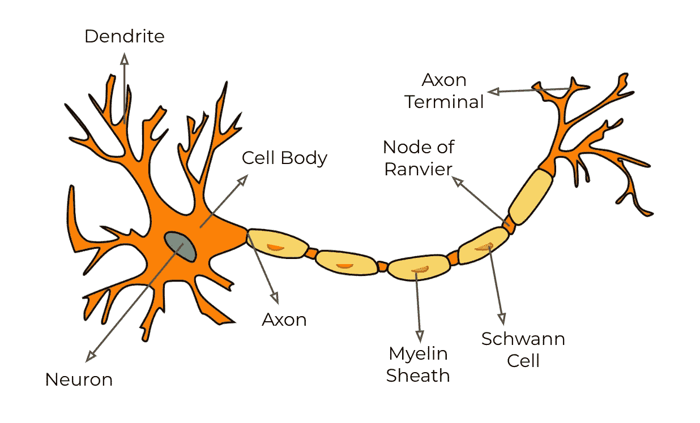
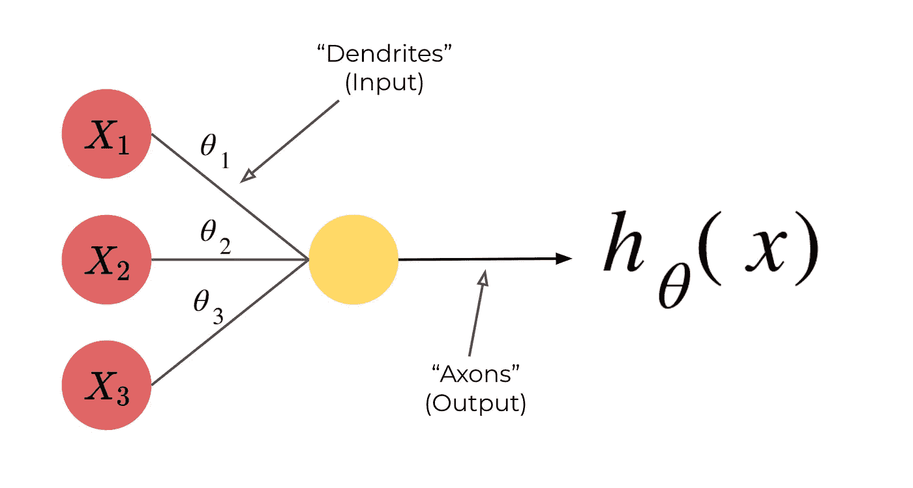
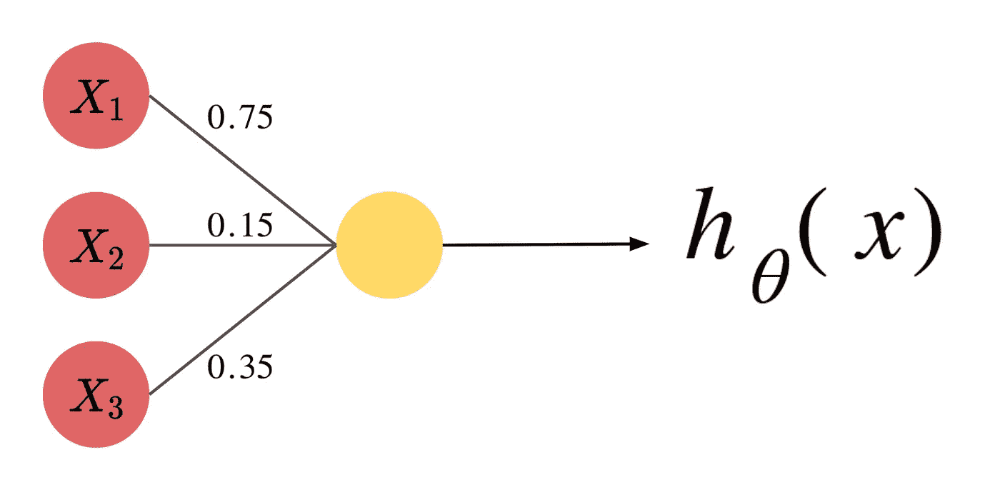
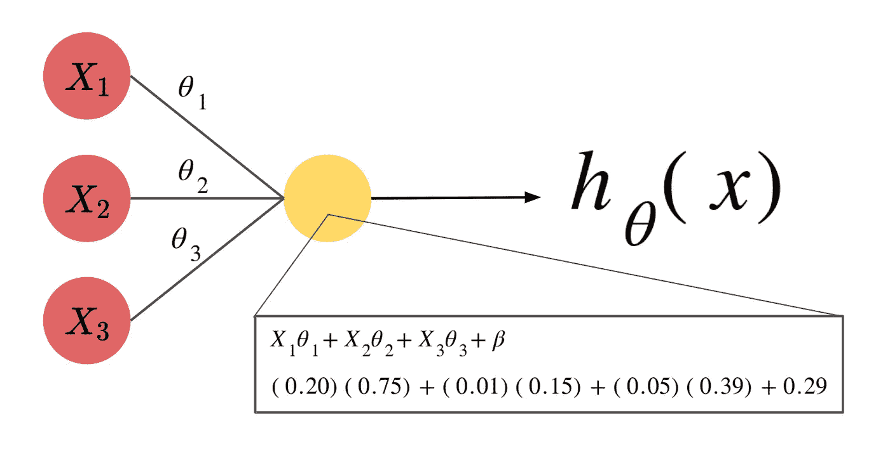

# 算法是如何像大脑一样思考的

> 原文：<https://medium.com/geekculture/how-an-algorithm-was-made-to-think-like-the-brain-c424fc05f46e?source=collection_archive---------20----------------------->

作为人工智能的一个子集，机器学习是一个极其广阔的领域，它解决了许多问题，例如从数据中找到各种分组，并使用回归技术进行预测分析。这篇文章主要关注机器学习的一个子类，称为深度学习。

每天都有新发现，深度学习是一个迷人的研究领域。深度学习是使用人工神经网络(ann)从给定数据中学习的方法。神经网络是一种受大脑中神经元的生物功能启发的算法。下面是人工神经网络最基本形式的一个例子:

# 节点

每个红色、黄色和蓝色的圆圈代表一个节点。节点对于神经网络就像神经元对于大脑一样。为了更深层次地理解这种关系，这里有一个生物神经元:

在高层次上，类似于生物神经元细胞如何通过其树突接收信息，并通过神经元之间的小间隙(称为突触)将信息传递到轴突外的其他神经元，人工神经网络中的神经元是一个计算单元，它接收输入并通过与其他神经元的不同连接输出结果信息。一个简单的人工神经网络架构如下:

这个大大简化的神经网络模型采用一个输入向量，用称为𝜃的权重向量进行计算，并将剩余值传递给一个激活函数。激活函数将输入值映射到 0 和 1 之间的另一个值。(更多关于这个的[这里](https://rohjag18.medium.com/activation-functions-4130bbbb2e3e)

# 它们是如何工作的？

当我们听到神经网络所做的惊人工作时，我们总是听到这些模型“学习”。神经网络到底是如何学习的？嗯，不要着急，因为我们首先要讨论输入是如何到达神经网络的输出层的。

上一段中大大简化的神经网络给出了神经网络如何工作的大量提示。输入图层有许多节点，每个节点代表一个输入值。从输入层到随后的隐藏层，以及从随后的隐藏层到下一个隐藏层的每个连接都具有权重。权重是一个数值，对应于特定输入值对模型其余部分的影响程度。

如果从 X₁到下一层的第一个连接的权重是 0.75，从 X₂到下一层的第二个连接的权重是 0.15，从 X₃到下一层的第三个连接的权重是 0.35，那么我们可以看到第一个连接的任何变化都会对模型产生最高的影响。这个变化到底是怎么应用的？从前一层的节点到下一层的节点的计算实际上没有人们想象的那么复杂。

将每个值乘以其相应的权重，然后将每个节点的该计算的总值加到偏差上。我们将称这个值为 z₁(X).此时 z₁(X)，将通过一个激活函数。(由于本文着重解释神经网络是如何工作的，所以我们现在选择的实际激活函数并不重要。然而，对于项目来说，这可能会改变，因为不同的激活功能更适合不同的任务。)激活函数输出的值将写成 a₁(X)，其中 X = z₁(x) —本质上是 a₁(X) = a₁(z₁(X)).该逻辑用于神经网络中的每个节点，用于每层中的每个节点。例如，如果我们有一个单独节点的第二个隐藏层，它的计算看起来像 a₂(z₂(a₁(z₁(x)+β₂)).这个过程一直持续到到达所有节点，然后输出一个值。

现在我们知道了神经网络如何为每个输入值返回一个输出值，我们终于可以讨论神经网络如何“学习”了。回想一下学校里的测验，学生是如何学习的？学生将首先完成测验，并获得他们的表现分数。对于学生做错的问题，他们或者参考他们的课程材料或者他们的老师来找出他们为什么错了。

这个类比很适用于神经网络。首先，神经网络需要知道所提供的输出的不同误差值。其次，神经网络必须更新其权重，以匹配数据集的正确输出。

## 查找输出中的错误

神经网络“学习”阶段的第一部分将通过成本函数来完成。换句话说，成本函数将神经网络的输出作为输入，然后将输入的值应用于函数，导致成本函数的输出作为描述神经网络模型有多“偏离”的数值。最流行的成本函数是均方误差(MSE)成本函数。

## 调整模型

要优化模型，需要对模型进行一些更改，以便它不会重复同样的错误。这个模型的调整是通过使用[梯度下降](https://rohjag18.medium.com/gradient-descent-the-descent-into-machine-learning-99e2b77df6b0)的反向传播过程实现的。该模型缓慢地分析来自 MSE 成本函数的结果，找到对应于最低误差的权重，然后对当前权重进行改变，使得它们更接近具有最低误差的权重。

# 应用程序

现在，我们已经解开了令人难以置信的神经网络的谜团，这可以应用到哪里呢？任何不需要推理的任务都是神经网络的任务。

这些任务从检测 x 光照片中的疾病，到通过手写数字检测数字和单词，甚至是对不同社交媒体帖子的情绪分析。(事实上，我创建了一个神经网络来检测手写图像中的数字，你可以查看这里的

关于我的更多信息——我的名字叫 Rohan，我是一名 16 岁的高中生，正在学习颠覆性技术，我选择从人工智能开始。要联系我，请通过我的[电子邮件](http://rohjag18@gmail.com/)或我的 [LinkedIn](https://www.linkedin.com/in/rohan-jagtap-1a07151b0/) 联系我。我非常乐意提供任何见解或了解你可能有的见解。此外，如果你能加入我的每月简讯，我将不胜感激。直到下一篇文章👋！