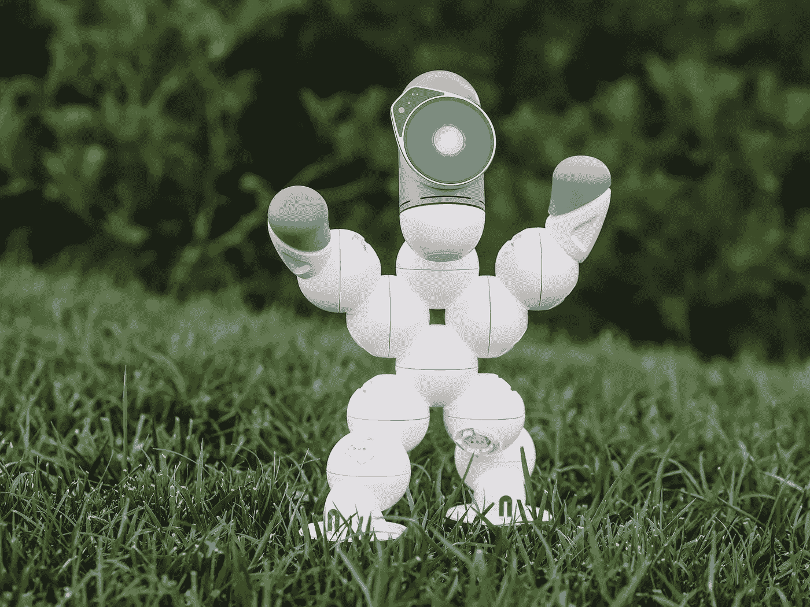

# 动物研究如何改变人工智能和物联网研究

> 原文：<https://medium.com/geekculture/how-animals-research-can-alter-ai-and-iot-research-91f0e7eaee21?source=collection_archive---------16----------------------->

## 一种意想不到却又奇怪的联系

Photo by [Kindel Media](https://www.pexels.com/@kindelmedia?utm_content=attributionCopyText&utm_medium=referral&utm_source=pexels) from [Pexels](https://www.pexels.com/photo/man-people-field-summer-9029803/?utm_content=attributionCopyText&utm_medium=referral&utm_source=pexels)

当我们谈论 AI 时，我们经常会想到一台模仿人类智能的机器。然而，在 AI 研究的现阶段，直到这种情况发生，还有很大的空间。

相反，一些研究人员认为，研究动物学习新信息的方式，相应地适应…