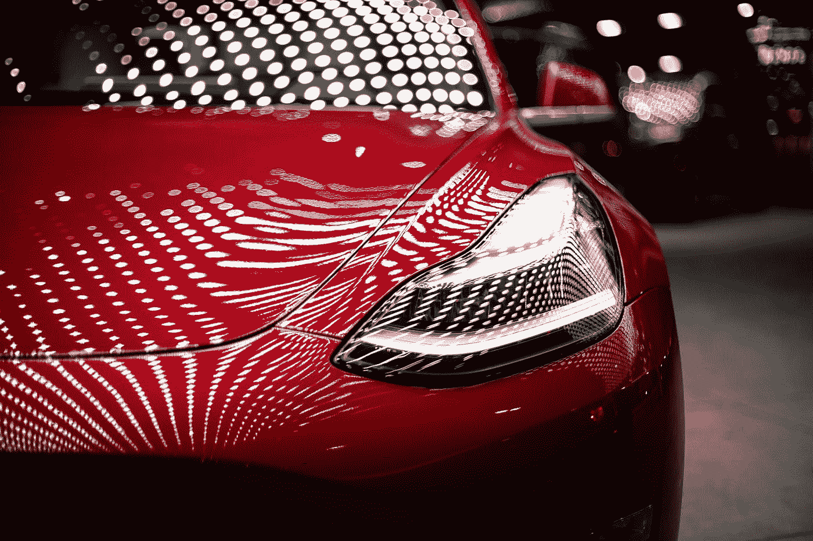
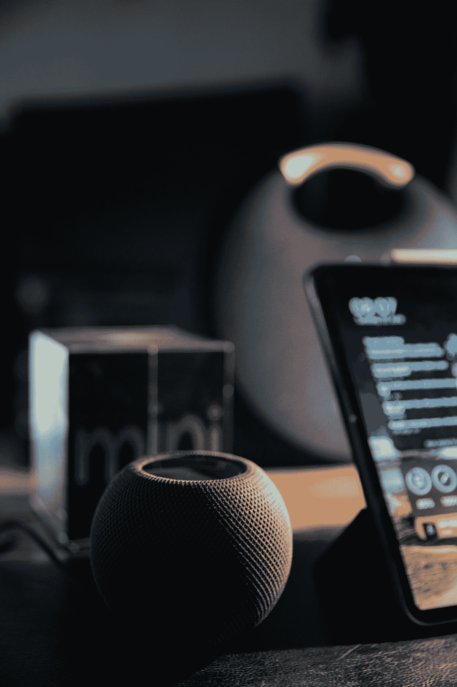

# 人工智能如何让人类变得懒惰

> 原文：<https://medium.com/geekculture/how-artificial-intelligence-has-made-man-lazy-77aeefd09b19?source=collection_archive---------1----------------------->

Photo by [Vlad Tchompalov](https://unsplash.com/@tchompalov?utm_source=medium&utm_medium=referral) on [Unsplash](https://unsplash.com?utm_source=medium&utm_medium=referral)

随着技术的进步，人类已经创造出了比他更好更快地帮助他完成任务的机器。

多亏了人工智能，我们现在有了自动驾驶汽车(特斯拉)，人工智能助手(Siri，Alexa，Cortana)，还有国际象棋和围棋等战略游戏系统。

研究表明，自动驾驶汽车使用的增加可能会降低道路上的事故率和交通流量。

Siri 和 Alexa 等智能助理通过自动化笔记和转录等任务来帮助提高我们的生产力。由于无需触摸即可访问，视障人士现在可以轻松浏览互联网。

由于 Alpha Zero、Deep Blue 和 Komodo 等人工智能，国际象棋选手现在可以分析他们的游戏，并找到最佳的棋步。

然而，这种对技术的日益依赖也使人类变得懒惰，生活中的一切都是有代价的，人工智能的使用也是如此，但代价是什么？

# 怎么开始的

1950 年，艾伦·图灵发表了一篇论文，其中他进行了一项名为图灵测试的实验，即一个人通过消息与另一个人和一台机器进行交互。如果人类不能识别他是在和机器交流还是在和人类交流，那么机器就被认为通过了图灵测试。

这项实验使机器能够像人类一样思考和行动变得有道理，从而为人工智能领域的严肃研究打开了大门。

# 人工智能是如何让我们变得懒惰的？

## 自动化

Photo by [Lenny Kuhne](https://unsplash.com/@lennykuhne?utm_source=medium&utm_medium=referral) on [Unsplash](https://unsplash.com?utm_source=medium&utm_medium=referral)

自动化日常工作是人工智能让人们变得懒惰的方式之一。能更快更准确地完成同样任务的机器已经取代了许多工作，特别是在工业和服务业。

因此，不再需要人类劳动，给了人们更多的自由时间。虽然这可能看起来是一个积极的发展，但它也导致了更少的体育锻炼和更多地依赖技术来完成我们的任务。

## 研究的下降

Photo by [🇸🇮 Janko Ferlič](https://unsplash.com/@itfeelslikefilm?utm_source=medium&utm_medium=referral) on [Unsplash](https://unsplash.com?utm_source=medium&utm_medium=referral)

人工智能提供快速获取知识和回答问题的能力也导致了人类的懒惰。

由于互联网和搜索引擎的发展，人们现在可以快速而容易地获得几乎任何主题的解决方案，而无需付出任何努力。

人们不再需要依靠自己的知识和技能来获得答案，这导致了解决问题能力和批判性思维的降低。

## 即时满足和便利

Photo by [Tron Le](https://unsplash.com/@tronle_sg?utm_source=medium&utm_medium=referral) on [Unsplash](https://unsplash.com?utm_source=medium&utm_medium=referral)

此外，由于人工智能提供了快速满足和便利，它使人们变得懒散。

由于电子商务和网上购物的发展，人们可以轻松地购买他们想要的任何东西，而不用离开自己舒适的房子。

因为人们不再需要外出购买必需品，这种便利导致了身体活动的减少。

与此类似，Siri 和 Alexa 等虚拟助手使现在无需太多努力就可以完成活动的轻松成为可能，这降低了个人责任感和自我激励。

## 社会化媒体

Photo by [Sara Kurfeß](https://unsplash.com/@stereophototyp?utm_source=medium&utm_medium=referral) on [Unsplash](https://unsplash.com?utm_source=medium&utm_medium=referral)

人工智能还通过促进即时社交和娱乐让人们变得懒惰。

随着社交媒体和流媒体服务越来越受欢迎，人们现在可以轻松地访问各种娱乐选项，而不必离开他们的家。

这导致了社交互动和面对面交流的减少，因为人们不再需要走出去与他人互动来娱乐。

类似地，人工智能聊天机器人和虚拟助理使得与他人交流变得容易，而不必付出太多努力，这导致了人际交往技能和同理心的下降。

# 结论

即使我们有可以自动完成写作和编码任务的人工智能，我相信它们应该是有帮助的，而不是替代的。

作家现在使用人工智能来编写完整的文章和电子书，我们现在有过度依赖 GitHub copilot 的开发人员。

我不记得上一次看到字典是什么时候了，更不用说阅读了。在字典中查找单词的过程中，我们会接触到其他我们从来不知道的新单词。

YouTube 和网络上有很多内容是由人工智能自动生成的，但人类和人工智能的区别在于情感。我们人类在创作内容时投入的情感无论是文字还是视频，人工智能都无法产生这样的情感，这也是为什么没有计算机通过图灵测试的原因之一。

我们人类练习得越多，进步就越大；写作、阅读、编码等等。但是把这些活动完全交给机器，从长远来看，对我们是不利的。

像鲍比·费舍尔和卡萨布兰加这样的国际象棋选手没有机会使用现在的大师们可以使用的国际象棋引擎来进行分析，这并不表明如果他们要比赛，他们会输给现在的大师们。对这些国际象棋引擎的过度依赖只是造就了一些大师，棋步的记忆者，而不是战略或战术的思考者。

作为人类，我们拥有改进的热情，这导致了技术的诞生，通过技术我们能够实现许多事情，使我们的生活更加轻松。

在试图让生活变得简单的过程中，我们对这些算法如此信任，正在让后代变得懒惰。

最后，我想说，人工智能通过自动化重复的任务，实现即时获取知识和解决方案，通过触摸按钮提供便利和满足，以及促进即时社交互动和娱乐，使人们变得懒惰。

虽然日常生活的许多方面因为这些创新而变得更加简单和有效，但它们也导致了身体活动、解决问题能力、批判性思维、个人责任、自我激励、人际交往能力和同理心的下降。

随着人工智能的不断进步，考虑对人类行为的潜在负面影响并确保个人不会过度依赖技术将是重要的。

我想用这句名言来结束这篇文章。

> 艰难时世造就强者，强者造就好时代，好时代造就弱者，弱者造就艰难时世。迈克尔·霍普夫

Photo by [Alexas_Fotos](https://unsplash.com/@alexas_fotos?utm_source=medium&utm_medium=referral) on [Unsplash](https://unsplash.com?utm_source=medium&utm_medium=referral)