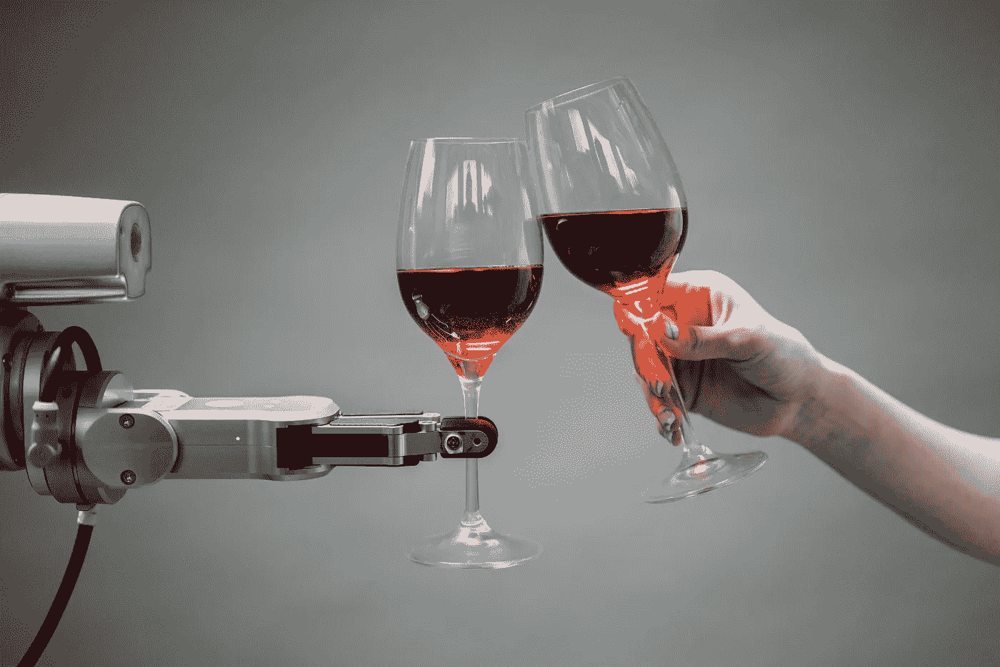
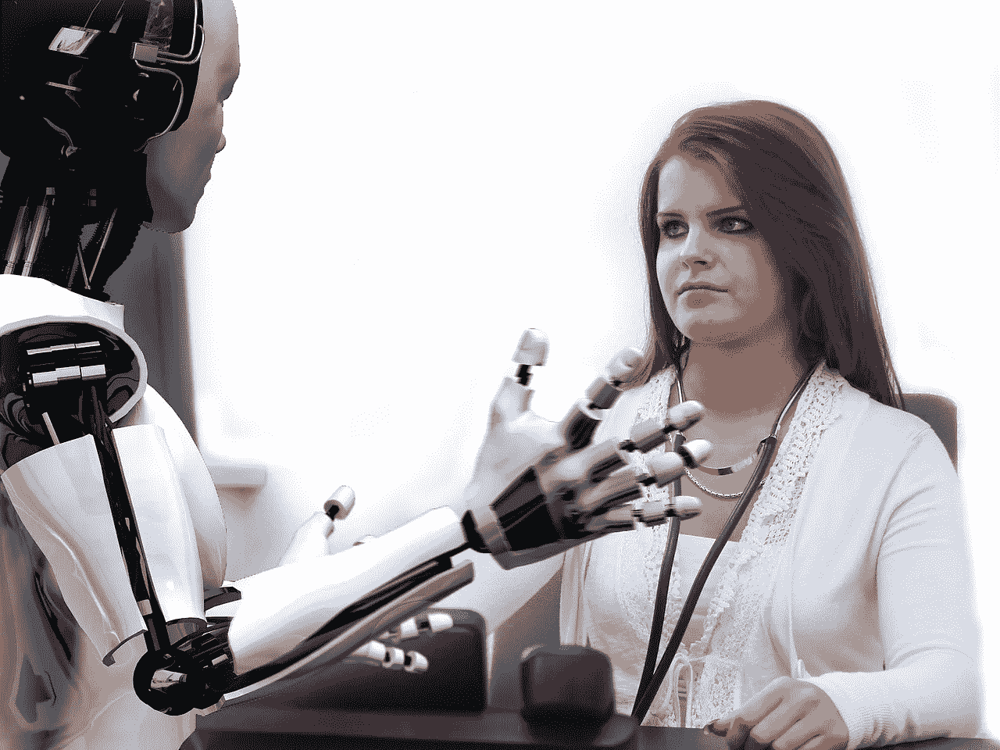

# 人工智能正在如何改变我们的工作方式？

> 原文：<https://medium.com/geekculture/how-artificial-intelligence-is-changing-the-way-we-work-6ea7d70d35a7?source=collection_archive---------14----------------------->

## ChatGTP 已经轰轰烈烈地登场了。

Image by [Pavel Danilyuk](https://www.pexels.com/@pavel-danilyuk/) on [Pexels](http://www.pexels.com)

人工智能(AI)是一个快速发展的领域，有可能彻底改变我们的工作方式和与技术的互动。机器理解和解释语言、识别模式以及从数据中学习的能力都是通常需要人类智能的人工智能能力的例子。

你们中的一些人可能已经听说过 ChatGTP、Jasper 或 Writesonic 等人工智能工具，这些工具正在彻底改变在线内容的游戏。此外，人工智能还极大地影响了你可能需要了解的其他各个领域，包括制造业、金融业和医疗保健业。

用户可以使用人工智能来自动化工作场所的流程和任务，提高生产力和效率。此外，它可以帮助决策，减少人为错误。在这篇博客中，我们将回顾它可能带来的好处和问题。

Image by [Malachi Witt](https://pixabay.com/users/mwitt1337-889520/?utm_source=link-attribution&amp;utm_medium=referral&amp;utm_campaign=image&amp;utm_content=2284501) from [Pixabay](https://pixabay.com//?utm_source=link-attribution&amp;utm_medium=referral&amp;utm_campaign=image&amp;utm_content=2284501)

# **人工智能已经在工作场所的什么地方被使用了？**🤖

人工智能已经被用于自动化流程和任务，提高效率，并在各种行业中辅助决策。在工作场所使用人工智能的行业包括:

**医疗保健:**在[医疗保健](https://bit.ly/3WVDlWs)领域，人工智能被用于帮助诊断、治疗计划和患者监测。例如，人工智能算法可以分析医学图像，找到可能指向特定状况的模式和异常。它们还可以帮助预测患者的结果，并制定最佳的治疗计划。

**金融:**在[金融](https://bit.ly/3G8mQzK)领域，人工智能正被用于自动化客户服务、风险评估和欺诈检测。例如，人工智能算法可以分析交易，找出可能指向欺诈的模式。他们还可以帮助预测市场趋势，使投资组合发挥最佳作用。

**制造:**在[制造](https://www.themanufacturer.com/articles/ai-transforming-manufacturing/)部门，人工智能被用于改善质量控制，优化生产流程，并协助维护和维修。例如，人工智能算法可以查看生产数据，并找到可能表明技术或设备问题的模式。它们还可以帮助预测工程师何时需要维护或修理。

这些只是人工智能已经在工作场所得到应用的众多领域中的几个。我们将在未来看到人工智能更广泛的应用。人工智能可能会改变广泛的行业和我们的工作方式。

# **在工作场所使用人工智能的优势**

人工智能有可能提高工作场所的生产率和效率，等等。以下是在工作环境中引入模拟智能的几个明显的[优势](https://bit.ly/3VCMqCE):

**流程和任务自动化:**许多流程和任务可以通过人工智能实现自动化，从而将时间和资源用于更有价值的活动。例如，用户可以使用人工智能来分析和处理数据，识别模式，进行风险评估或欺诈检测，从而将人类劳动解放出来，从事更具战略性的工作。

**更有效的决策:** AI 可以根据数据分析提供见解和建议。例如，人工智能(AI)算法可以分析客户数据，以发现人类可能不会立即注意到的模式和趋势。基于这种分析，算法可以提供采取什么行动的建议。

**提高效率:**人工智能有可能通过自动化任务和辅助决策来提高工作场所的生产力。例如，埃森哲的一项研究发现，在工作场所使用人工智能可以提高 40%的生产率。

**减少人为错误:** AI 可以通过自动化任务和基于数据分析提出建议来减少人为错误。因此，可以提高过程的准确性和可靠性，从而改善结果和客户满意度。

在工作场所实施人工智能可以显著提高准确性、生产率和效率。因此，考虑人工智能的潜在优势以及它如何增强行业程序和结果至关重要。

Image by [Thomas Meier](https://pixabay.com/users/tmeier1964-2034229/?utm_source=link-attribution&amp;utm_medium=referral&amp;utm_campaign=image&amp;utm_content=1193318) from [Pixabay](https://pixabay.com//?utm_source=link-attribution&amp;utm_medium=referral&amp;utm_campaign=image&amp;utm_content=1193318)

# **在工作场所依赖人工智能的顾虑或缺点**

虽然人工智能(AI)可以给工作场所带来许多优势，但也有必要考虑依赖人工智能的潜在问题或缺点。考虑以下潜在问题:

**失业:**工作置换的可能性是关于 AI 在工作场所扩大应用的主要担忧之一。由于人工智能可以自动化流程和任务，一些工作可能会过时或被人工智能取代。因此，个人和组织必须跟上人工智能的发展，它们对就业的潜在影响，以及提高或重新提高员工技能的必要性，为不断变化的就业市场做好准备。

道德考量:此外，人工智能的使用引发了偏见和透明度等道德问题。企业必须考虑利用人工智能的道德影响，并保证负责任地开发和实施人工智能系统。

**技术依赖:**对人工智能的依赖同样引发了对创新的依赖以及中断或失望的可能性的担忧。在出现中断的情况下，企业必须有应急计划来解决人工智能系统的潜在问题，并确保流程可以不间断地继续。

一般来说，尽管在工作场所使用人工智能可以带来许多好处，但考虑和解决任何潜在的问题或缺点是必不可少的。

Image by [Andrea Piacquadio](https://www.pexels.com/@olly/) on [Pexels](http://www.pexels.com)

人工智能有可能有力地改变我们的工作方式和与技术的互动方式。人工智能已经在各种行业中用于自动化任务和流程，提高效率，并辅助决策。

然而，工作场所对人工智能的日益依赖也引发了对工作置换和道德考虑的担忧。因此，个人和组织必须随时了解人工智能的发展，并考虑对就业和道德问题的潜在影响。

展望未来，我们很可能会看到人工智能在工作场所得到更广泛的应用。因此，为人工智能可能带来的潜在变化做好准备并随时了解其发展以利用其优势并解决任何可能的问题是至关重要的。

总的来说，人工智能有潜力极大地改变我们工作和与技术互动的方式。因此，保持对其发展的了解并考虑其潜在的好处和缺点以对其在工作场所的使用做出明智的决定是至关重要的。

感谢您抽出时间阅读。请留下掌声和评论，如果你喜欢这篇文章，请考虑关注我以获取更多内容😁