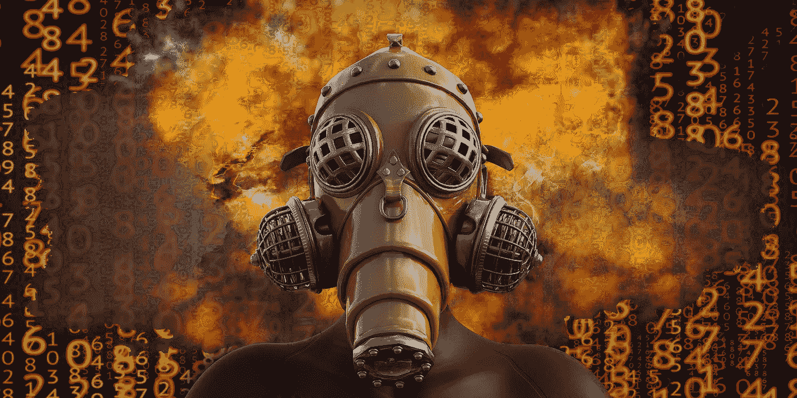

# 人工智能如何威胁世界和平

> 原文：<https://medium.com/geekculture/how-artificial-intelligence-threatens-world-peace-e2d992264ccb?source=collection_archive---------63----------------------->

## 另一场冷战正在到来吗？

Image from [Pixabay.com](https://pixabay.com/illustrations/nuclear-bomb-end-of-the-world-5078608/)

如果你关注我的博客，你会知道我一直在关注人工智能，以及它如何为*乐观主义和极端的道德暂停提出了理由。在这篇文章中，我想讨论随着核武器的发展和扩散，如何有可能爆发一场与冷战相似的新冲突…*