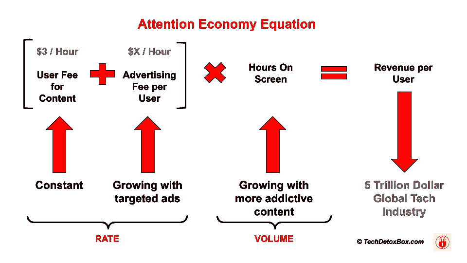
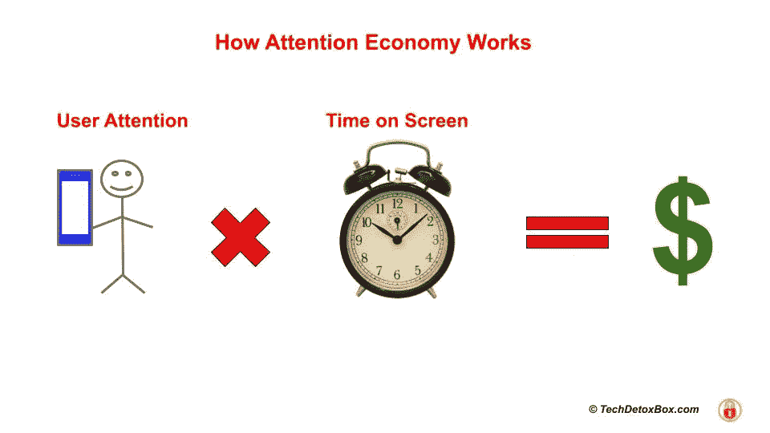
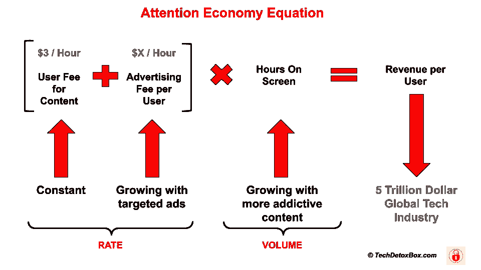
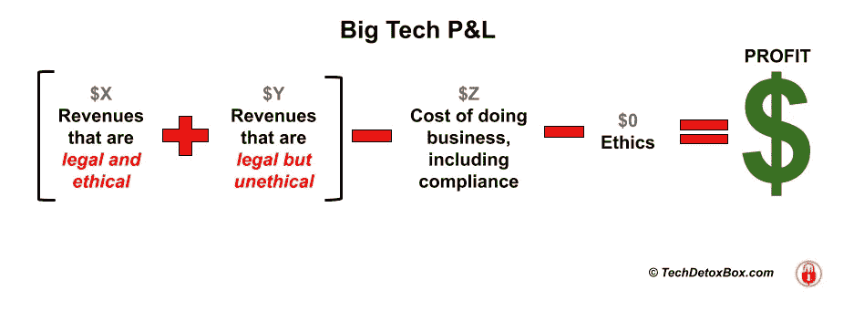

# 注意力经济是如何运作的

> 原文：<https://medium.com/geekculture/how-attention-economy-works-25838867134b?source=collection_archive---------16----------------------->

Image from [TechDetoxBox.com](https://www.techdetoxbox.com/)

# 什么是注意力经济？

Image from [TechDetoxBox.com](https://www.techdetoxbox.com/)

注意力经济最初是由诺贝尔奖得主、社会科学家希尔伯特·西蒙定义的，他在 1921 年写道:

***“在一个信息丰富的世界里，信息的丰富意味着其他东西的匮乏:信息所消耗的东西的匮乏。信息消耗的东西相当明显:它消耗了接收者的注意力。因此，丰富的信息造成了注意力的匮乏。”***

你的注意力是一种稀缺商品，因此极其宝贵。它在生物学上被限制为一天 24 小时，而消费它的数字媒体正呈指数增长。这是一个问题。争夺你的时间变得令人绝望。

为了抓住你的注意力，数字媒体在用户界面设计中使用了黑暗心理学——以牺牲你的健康为代价。利润是第一位的，用户的快乐不是——数十亿美元危在旦夕。

> 在这个弱肉强食的食物链中，顶级掠食者是科技巨头，而你是他们的猎物。

# 公式

Image from [TechDetoxBox.com](https://www.techdetoxbox.com/)

让我们用经典的比率/数量财务分析来解开注意力经济公式。

# 我们付给他们什么

预测了互联网革命的远见卓识的思想家凯文·凯利在他的书《不可避免的:理解将塑造我们未来的 12 种技术力量》中计算出，所有的媒体公司(音乐、书籍、电影、新闻)平均每小时只能获得 3 美元的关注——而且前提是它们包含让我们感兴趣的高质量内容。这些年来，这一比率惊人地稳定——凯利在 1995 年、2010 年和 2015 年使用相同的方法进行了计算，得出了 3.08 美元、2.69 美元和 3.37 美元，这意味着我们的注意力价值在 20 年里一直非常稳定。

我们似乎对媒体体验的成本有一种直觉，不会多付钱，尤其是当选择越来越多的时候。这是有道理的——如果网飞明天突然将订阅率提高一倍，他们将面临巨大的反弹风险，并将客户流失到竞争平台。

如果用户只愿意支付每小时 3 美元，**提高费率的唯一方法就是出售用户。**提取并出售他们的数据。

> 用户变成了产品。

# 我们卖了多少钱

你能卖多少钱？2020 年，脸书在美国每位用户的平均广告年收入为 53.56 美元。2021 年[脸书丑闻发生时](https://fairplayforkids.org/this-facebook-fiasco-is-different/)公司的利润(不是收入——利润！)总计 400 亿美元。[谷歌 2020 年广告收入 1470 亿美元](https://www.statista.com/statistics/266249/advertising-revenue-of-google/)。

大型科技公司拥有定向行为广告的世界:除非企业付钱给他们，否则他们是隐形的。

无论规模有多大，脸书和谷歌都是科技领域争夺你注意力的最明显的例子。与科技巨头相比，100 万其他小公司赚得很少，但所有人都通过销售注意力经济的产品赚了一些钱。

> 产品是什么？用户的算法行为修改。

Shoshana Zuboff 在她的巨著《监督资本主义》中称原材料注意力经济运行在“行为过剩”上。就像西班牙征服者征服新世界中无助的土著一样，科技公司捕捉我们的人类经验，并宣布它们拥有并以他们认为合适的方式使用这些经验。行为数据被塑造成预测产品，并出售给平台的真实用户，这些用户为期望的结果付费——无论是出售产品还是为某个政党投票。

当你登陆网站时，谷歌会根据你之前的网络行为在网站上投放个性化广告。越来越复杂的人工智能通过广告瞄准用户，这些广告[精确地修改行为](https://www.techdetoxbox.com/weapons-of-digital-manipulation/algorithm-of-you-how-ai-programs-human-behavior/)。一个“相关”的广告让我们点击，并为吸引用户注意力获得更高的价格。

精神控制越有效，越多的科技消费者愿意为此付费。这有很好的商业意义——如果一个广告有效，广告客户会不断回来购买更多。

另一种销售用户的方法是通过让内容看起来像观点、新闻或娱乐，在内容中加入更多潜意识广告。随着每个人每天 12 个小时粘在他们的屏幕上获取信息或娱乐，数十亿人的算法精神控制从未停止。

# 在你的皮肤下

屏幕将会一直存在，并会繁殖成“智能”物体的宇宙，收集我们的数据并预测我们的行为。我瞥见我的咖啡杯在早上 6 点试图向我推销什么东西，不禁打了个寒颤。

> 你有没有注意到现在每个人都想让你下载他们的应用程序？

监视的目标是深入你的内心。他们是为了你的“方便”而花时间和金钱开发 app 的吗？

不完全是。除非有钱可赚，否则一事无成。

> 就像连接到你血液中的静脉注射一样，你手机上的应用程序是直接通向你的主线。

它向你的系统中投放有针对性的行为广告，并吸取你的宝贵数据——你的位置、你的联系人、你的购买历史、你的社交媒体活动，所有这一切。

在应用程序建议的力量下，你当场购买产品，消费他们放在你屏幕上的数字内容，并免费交出你的行为数据。

> *有时他们会轻轻推你一下。有时候他们让你别无选择。*

我最近经历的几个例子:

*   Ticketmaster 强迫我下载一个应用程序——打印机票选项不再可用。该应用程序加载了交叉销售和通知，以便将他们的广告放入我的口袋。
*   Hotels.com 通知我，除非我下载他们的应用程序，否则他们将向我收取每次预订额外的 5 美元。
*   迪士尼世界应用程序是一个奇迹，它从我们的口袋里掏钱，促使疲惫的父母们在商品、排队、食物和照片上花更多的钱。
*   甚至不要让我开始谈论在 COVID 时代每个人都强加给我们的**二维码——从你附近的餐馆到徒步旅行路线。每个公共场所都有一个二维码，通过“定时进入”把你圈进他们的数据采集系统。所有这些都是为了我们的安全，但事实上，这是收集我们数据的完美借口。**

新冠肺炎是数据收集者的天赐良机。网上购物和安装应用程序的压力来自疫情。突然，一种病毒使得纸质门票和地图变得危险起来！这种说法并没有多少科学证据，但它给了每一家商店、博物馆、公园、动物园、溜冰场和学校肖像服务一个永久融入我们生活的权利。

每个人都成了数据经纪人，通过监控和广告侵犯我们的隐私。他们的通知将默认开启，我们的电子邮件将充满他们的营销议程。一个应用程序收集的数据将被出售给数量不明的第三方，这些第三方将加入对我们有限注意力的攻击。

成千上万的数据收集者正咄咄逼人地把自己推到我们已经拥挤不堪的屏幕上，让我们把钱花在我们不需要的东西上，提取我们的数据，偷走我们生命中的时间。

人类正在输掉这场争夺注意力的战争。算法赢了。

# 按下你的情感按钮

算法控制人类最简单的方法是通过潜意识，由进化生物学固定下来:

*   *快感*——用[随机奖励劫持大脑的多巴胺机制](https://www.techdetoxbox.com/weapons-of-digital-manipulation/random-rewards/)
*   *痛苦*——用[消极偏见](https://www.techdetoxbox.com/weapons-of-digital-manipulation/fear-how-negativity-bias-drives-user-engagement/)按下恐惧和愤怒的按钮

这从未失败过。环顾四周——在每个社交场合，人们都在现场，但他们并不在场——他们在打电话。我们的互动屏幕比我们的同伴更能吸引我们的全部注意力，我们的同伴和我们一样容易分心。

机器已经在学习使用人类已经失去的社交技能。最新的智能手机内置了视线追踪技术。通过测量你凝视的持续时间和方向，人工智能可以对抓住你注意力的内容进行排序，并给你更多的注意力。屏幕在看着我们。我们家中的语音识别设备一直在监听。

> 不像你的家人和朋友，Alexa 是一个伟大的听众。

操纵我们情绪的说服性设计被用来制造恐惧、愤怒和分裂的标题，让我们留在屏幕上:消极比同情更能推动参与。很快，我们的设备将能够实时辨别我们的情绪——让我们感觉更好或更坏，这取决于哪个更有利可图。

> 如果人工智能仍然被设定为[消极参与](https://www.techdetoxbox.com/weapons-of-digital-manipulation/fear-how-negativity-bias-drives-user-engagement/)，做好真正恐惧的准备。

当埃隆·马斯克开发出在你的大脑中植入一根电线的神经链接技术时，广告和政治议程可以直接上传到你的潜意识中，这意味着自由意志的终结。

今天，我们仍然可以放下电话，逃离算法操纵——如果我们选择行使我们的自由这么做的话。

# 盈利能力衡量:在屏幕上的时间

在我们的数字体验中没有自然的停止点。它们是为最长的屏幕时间而设计的。为什么？因为最大化的盈利是通过最大化的用户参与来实现的。

> 一周 7 天，一天 24 小时盯着屏幕，使用我们的数字产品——同时忽略竞争平台和琐碎的现实世界追求，如[睡眠](https://www.techdetoxbox.com/screen-time-problems/screen-time-and-childrens-sleep/)。

为了让用户在屏幕上呆得更久，劝导设计这门科学通过让数字媒体变得更“吸引人”来派上用场。更容易上瘾。更加消极和分裂。吸引我们本性中最坏的天使。只要能增加盈利能力的直接衡量指标——屏幕上的眼球，什么都可以。

即使你拿起电话时最初的冲动是有益的——比如工作或给妈妈打电话——你也可能被高度吸引人的内容转移注意力几个小时，[让你大脑的快乐中心沐浴在多巴胺中](https://www.techdetoxbox.com/weapons-of-digital-manipulation/random-rewards/)。或者由恐惧、愤怒和不安全感的情绪引发，这同样有效。

每个数字媒体企业都被困在这种注意力经济框架中——没有给用户休息的动力。

*   **电子游戏** [**让玩家永远留在游戏中**](https://www.techdetoxbox.com/screen-time-problems/gaming-addiction/) **。**
*   **社交媒体** [**操纵着越来越深的不安全感**](https://www.techdetoxbox.com/weapons-of-digital-manipulation/social-validation/) **。**
*   **新闻媒体竞相报道，看谁的** [**最让读者害怕**](https://www.techdetoxbox.com/weapons-of-digital-manipulation/fear-how-negativity-bias-drives-user-engagement/) **。**

如果我们不引起你的注意，别人会的，做一个好人是没有意义的。鼓励数字戒毒的平台会赔钱，但什么也改变不了。

因此，注意力经济将生物极限推向了荒谬的地步，年轻人每天花 11 个小时在屏幕上，据估计他们每天触摸手机 5427 次——这损害了他们的人性。

# 算法精神控制的危害

注意力经济，无论多么新，都是和时间一样古老的故事——都是关于钱的。人类一直是消费者。在注意力经济中，人类也成为了一种商品。

这让我想起了与奴隶制的一些不愉快的联系。

现代哲学家纳西姆·塔勒布写道:“技术和奴隶制的区别在于，奴隶们意识到他们不自由”。奴隶可以保持他们内心的自由和人性，但我们更像机器人一样遵从[的数字操纵——为任何行为结果编程，同时认为这是我们的主意。](https://www.techdetoxbox.com/weapons-of-digital-manipulation/algorithm-of-you-how-ai-programs-human-behavior/)

> 抵制算法精神控制需要意识到用户界面背后的心理操纵。

注意力经济商业模式的伦理困境在于[代理问题](https://en.wikipedia.org/wiki/Principal%E2%80%93agent_problem)，纳西姆·塔勒布在他的著作《反脆弱》中这样描述:*一方(代理人)的个人利益与使用他的服务的一方(委托人)的利益相分离。*

> *注意力经济代理问题:科技公司对他们的利润感兴趣，而不是他们用户的福祉。*

[我们的人性与大技术无关](https://www.techdetoxbox.com/human-brain-vs-machine-intelligence-not-a-fair-fight/)，我们只是一种资源，为用户参与度优化——最大屏幕时间。即使这意味着人们最终会疲惫不堪、情绪低落、效率低下、孤立无援、睡眠不足。甚至死亡——因为自杀的青少年会模仿他们在屏幕上看到的自残行为。

注意力经济等式没有道德限制。与医生不同，科技公司在给我们服用有毒的高剂量操控内容时，不会遵守“无害”的希波克拉底誓言。

> 他们可以随心所欲地做他们认为有利可图的事情。

# 注意力经济商业模式

一份简化的科技公司损益表如下所示:

Image from [TechDetoxBox.com](https://www.techdetoxbox.com/)

没有内置的道德参数。这在技术上是可能的，但为什么要这么麻烦呢？该行业不会自愿限制他们的算法——毕竟，为什么任何企业会有意识地削减自己的盈利能力？为什么要杀鸡取卵呢？尤其是如果十几个竞争对手会马上冲进来抢你的市场份额？

公司没有动力将不道德的收入减少到 0 美元，除此之外，还要在可选的道德支出上花钱。这两项活动都会损害底线。道德部门的工作描述是砍掉他们所坐的树枝。减少他们的工资收入。难怪公司不愿意介绍这些工作。

这里有一个任何人都可以做的实验:在 LinkedIn 上搜索“人工智能治理”方面的工作。你会发现很多——法律学位是必备条件。这意味着公司希望律师确保他们不做任何违法的事情，而不是心理学家确保他们不做任何不道德的事情。

> 让青少年抑郁是不道德的——但是合法且有利可图，所以这些平台没有理由改变。这不是治理，这只是遵从。他们不需要数字伦理学家——律师就足够了。

有两种力量可以改变这种局面。一个是政策——姗姗来迟。另一个影响更大——失去客户信任，以及随之而来的未来收入的潜在灾难性损失。像[脸书因知道其 Instagram 应用程序使青少年抑郁而被曝光的丑闻](https://fairplayforkids.org/facebook-research-children/)让公众意识到这个问题。

政府无可救药地落后于将道德准则强制纳入科技公司合规框架的政策。我们的政治家对他们正在处理的事情知之甚少。就这样，一切照旧:只要活动不违法，这个行业就可以继续从中赚钱。毕竟没有人违法。

所以，我们在这里:

*   ***科技行业被商业模式所困。***
*   科技用户被科技成瘾所困。
*   ***科技监管者受困于惯性。***

# 另一种选择

让我们设想一个世界，在这个世界中，人工智能被设计为将我们引向优化我们的快乐、表现和学习的内容，而不是当前优化从我们的注意力中提取的收入的默认模式。

人道技术中心提倡创造出对我们人性进行优化的过滤器。

现在，这些过滤器——在你访问的网站上向你展示的广告、你订阅源中的社交媒体帖子、游戏环境——都是为了从你身上赚取最多的钱。这意味着最大化你的屏幕时间——多项研究已经证明这对人类的繁荣是有害的。

有时候，我们的最佳利益和平台的利益是一致的——当我们在 Youtube 上观看激励性演讲时，Youtube 会推荐更多，这扩展了我们的知识。未来过滤技术的设计可以使这一过程是有意的，而不是巧合。

不幸的是，Youtube 更有可能推荐[煽动性的政治辩论和阴谋论](https://www.techdetoxbox.com/weapons-of-digital-manipulation/how-attention-economy-profits-from-outrage/)——让用户更加愤怒和不安的内容，因此，更关注这个平台。

由于我们的信息选择领域继续呈指数增长，我们实际上真的需要智能过滤器技术来告诉我们应该注意什么。我们的大脑在生物学上无法处理数百万种选择。即使我们的[注意力持续时间从 2000 年的 12 秒下降到今天的 8 秒](http://dl.motamem.org/microsoft-attention-spans-research-report.pdf)，一天的总时间仍然是有限的，只有 24 小时。

未来的过滤器会给我们提供帮助我们成为更好的自己的内容吗？或者，大型科技公司会继续利用我们人类的弱点，悄悄地破解我们进化的认知偏见，让我们按照数据操纵者的命令去思考、行动和投票吗？

这是今天的大问题，当然也是明天的大问题。我们几个人在问？

[TechDetox 妈妈](https://www.techdetoxbox.com/mission-screentime-children-wellbeing/)发现自己的孩子处于上瘾技术的[接收端，决定反击。](https://www.techdetoxbox.com/screen-time-problems/)

她对技术和心理之间关系的研究试图揭示数字行为操纵是如何影响人类福祉的。

她在她的博客[TechDetoxBox.com](https://www.techdetoxbox.com/)上写道，要找到[解决方案](https://www.techdetoxbox.com/digital-wellbeing/)来保护我们的家庭，恢复我们的人性。