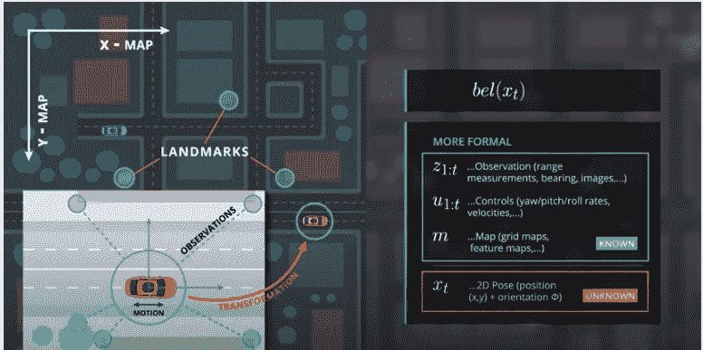
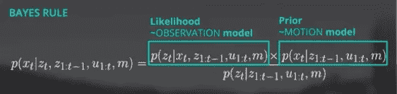
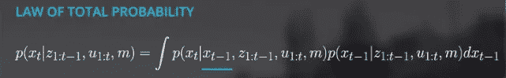

# 当车道标志丢失时，自动驾驶汽车如何保持在车道上？

> 原文：<https://medium.com/geekculture/how-autonomous-car-stays-in-lane-when-lane-markers-are-missing-795acaa14b39?source=collection_archive---------41----------------------->

## 自动驾驶系列

## *本地化帮助您找到自己的位置！*

Photo by [Martin Katler](https://unsplash.com/@martinkatler?utm_source=medium&utm_medium=referral) on [Unsplash](https://unsplash.com?utm_source=medium&utm_medium=referral)

一个机器人收集当前环境的信息，并将其与已知地图进行比较，以了解它在现实世界中的位置。

马尔可夫定位或用于定位的贝叶斯过滤器是最常见的定位框架之一。

*它是如何工作的？*

## 贝叶斯后验概率

车辆位置可以近似为概率分布。在测量之前，我们先假设均匀分布(先验)。

利用机载传感器，可以测量树木、电线杆等静态障碍物的距离和方位(方位)。

*每次车辆使用传感器进行测量时，其相对于静态障碍物的位置更加确定。因此，分布变得集中(狭窄)。*

在应用滤波器之前的每个状态表示先验，并且变窄的分布表示贝叶斯的后验。

*然而，每次车辆移动时，由于运动中存在不确定性，分布变得更加分散(更宽)。*

## 熵和迭代

熵代表系统中不确定性的数量。由于测量更新步骤减少了不确定性，熵将减少。运动这一步增加了不确定性，所以熵会在这一步之后增加。

然而，通过迭代这些感觉和运动步骤，贝叶斯滤波器降低了总熵。

*让我们来看一个插图。*

L 定位就是在给定从时间 *1 到 t 的所有先前观测值 **z** 、*和从时间 *1 到 t* 的所有先前控制 ***u*** 的情况下，估计状态**x(t)、**的概率分布，即汽车在某一时刻(t)的位置。

courtesy: Udacity (Assumption: Map does not change with time)

但是，观测列表 ***z{1:t}*** 携带了大量的数据。观察列表中的每个元素， ***z{t}，*** *都是另一个向量，其中包含了从汽车到地图中最近的可见 ***k*** 物体的*距离。另外，控制向量***【1:t】***包含汽车在 t 和 t-1 之间行驶的距离。

*我们如何避免携带所有的历史观察和运动数据？*

## 马尔可夫假设

由于过去的观察和控制已经用于估计时间(t-1)的 *x，它们不提供估计时间(t)的 x 所需的任何附加信息。于是，我们将整个观察列表* ***z{1:t}*** *拆分成当前观察值***【z { t }***和所有以前的信息* **z{1:t-1}** *。*

由于 *u(t)* 是参照 *x{t-1}的“未来”，所以*并没有告诉我们太多关于 x{t-1}的事情。

## 递归状态估计器

通过应用贝叶斯规则、全概率法则和马尔可夫假设，当前信念被表示为前一步的信念，并且仅基于新的观察来更新。因此，我们实现了一个递归状态估计器。

courtesy: Udacity

courtesy: Udacity

> 这种递归滤波器被称为贝叶斯定位滤波器或马尔可夫定位，使我们能够避免携带历史观察和运动数据。

在接下来的文章中，我们将学习粒子过滤器和各种运动模型。

参考资料:

来自 Udacity 自动驾驶汽车 nanodegree 的练习