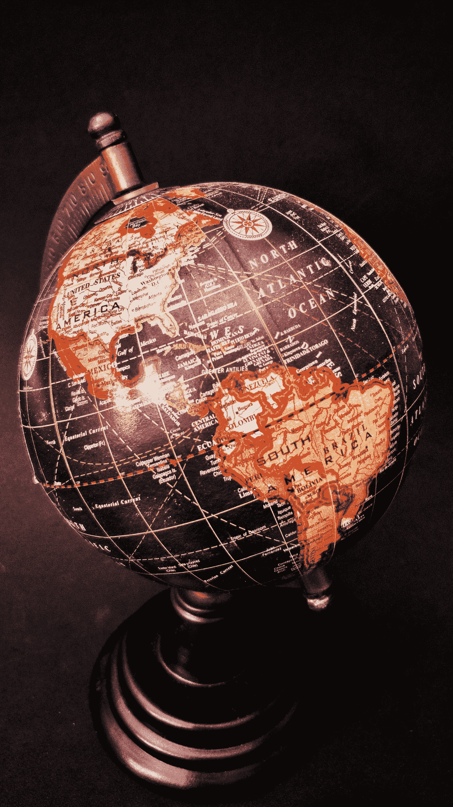

# 美国经济有多大？

> 原文：<https://medium.com/geekculture/how-big-is-the-american-economy-b8e43953c9e4?source=collection_archive---------6----------------------->

Image courtesy of [Anthony Acosta](https://www.pexels.com/@elitistczar?utm_content=attributionCopyText&utm_medium=referral&utm_source=pexels)

## 是什么让美国如此重要？

作为一个长期居住在美国的人，我经常和其他国家的朋友聊天。他们中的大多数人都有一个对美国的抱怨。无论他们来自以色列还是澳大利亚，伊朗还是阿根廷，他们都有一个共同的抱怨，那就是为什么美国表现得好像它是世界的中心？或者更具体地说，为什么这么多的新闻报道集中在…