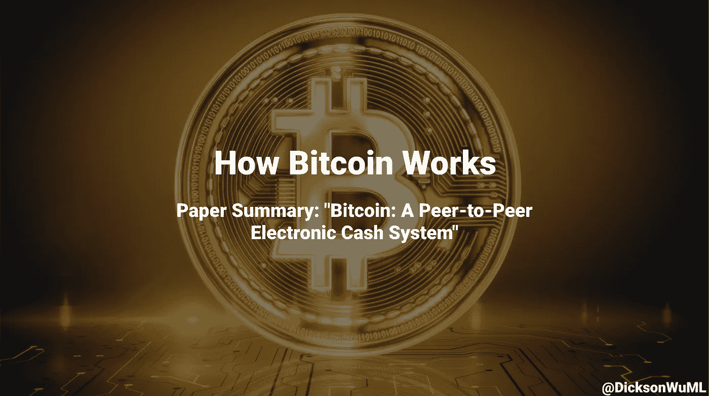

# 比特币的工作原理

> 原文：<https://medium.com/geekculture/how-bitcoin-works-97afb9eb450d?source=collection_archive---------10----------------------->

## 论文摘要:“比特币:点对点电子现金系统”

> 论文作者:中本聪

# 摘要:

目标:在没有任何第三方的情况下，以点对点的方式汇款。我们可以使用数字签名，但是我们仍然需要解决重复花费的问题。比特币是这个问题的解决方案。