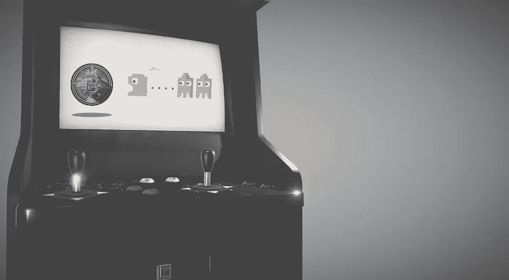
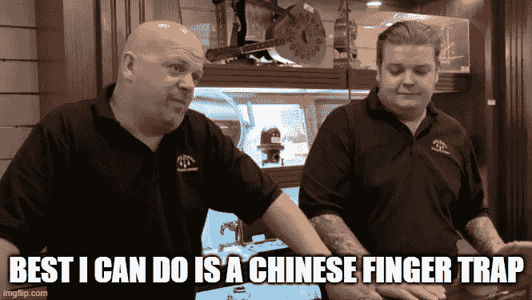

# 区块链技术如何达到大规模采用？

> 原文：<https://medium.com/geekculture/how-can-blockchain-technology-reach-mass-adoption-1d004d116dc?source=collection_archive---------23----------------------->

## 为什么区块链只是一个金融中心

我小时候对街机又爱又恨。

可能因为我隐约记得的第一件事就是铜的味道，汗水，还有孩子的眼泪。

或者……也许是因为我过早地看到了外汇、银行和经济的不幸本质。和我待在这里。

倒退 20 多年。行动。

你穿过预示吊桥进入“城堡公园拱廊”你的血压开始飙升，但你保持冷静——你还没有吃糖。

[Credit](https://hulafrog.com/san-fernando-valley-west-ca/sherman-oaks-castle-park-b/): hulafrog

你的父母拿出两张面值 20 美元的钞票，因为今天是你的生日，但圣诞节也刚刚过去，所以他们决定合并庆祝。

接下来的 3 个小时是各种街机游戏，与其他孩子的冲突，以及大量的哭泣。你的手闻起来像铜币，你吃的恶心披萨也是。在所有的血糖飙升、汗水和泪水中，出现了一袋来之不易的门票。这些票是你的劳动成果，准备用来换取荣耀。

当你接近门票兑换区时，战利品守门人与你进行眼神交流，并向你打招呼。

“啊，欢迎疲惫的旅行者！请站出来兑换一份特别的奖品！我可以帮你数票，指引你去正确的奖池……那是吐槽吗？”油腻的顾客以他令人印象深刻的中世纪形象问道。

在你绝望的语无伦次中，你对他咆哮，把你的票给他。

“恭喜你，小淘气，你已经累积了 1000 张奖券！“过来收你的收获吧，”油腻的顾客宣称。

你的肾上腺素，呕吐造成的缺水，以及危险的高血糖水平导致你失去知觉。

你坐在你父母的 1992 年日产 Maxima 的后座上，手里拿着一块粉色的橡皮擦，一袋酸酸的儿童饼干(全是橘子味的)，还有一个中国手指夹。你在座位上融化了。

结束场景。

这个奇怪的特定场景可能会引起一些人的共鸣，但对我来说，这是一个丰富的认识。生活是一个拱廊。不开玩笑。

# 这个世界。符号化。

生活可能是一个拱廊，但这不是这篇文章的主题。

当时，我的主要收获是

*   我只是需要更多的票
*   铜浸比萨不是我最喜欢的比萨类型

然而，直到今天我才意识到，油腻的赞助人是经济学的化身。在那个小小的反乌托邦街机世界里，他是财富的守门人。他的统治是健全的，他的市场支配地位是巨大的。

对我来说，反面乌托邦式的经济是区块链技术的起源——也许是由于铜中毒的长期慢性影响…

这些街机代币让我为今天的世界做好了准备，因为区块链和加密货币正在成为数字货币的有力竞争者。虽然令牌化作为一种数字工具或货币的概念今天正在发展，但令牌本身实际上并不重要，就像它们在当时并不重要一样。

我只知道我需要他们加入生态系统。这些代币除了在生态系统中发挥效用之外，没有任何实际价值。

代币只是简单的工具。

获得接近油腻顾客权利的工具。这些代币代表了我赎回代币时等待我的沮丧情绪的有形表现。

但是现在让我们认真一点。

代币化通常被视为某种融资和法定货币的终极方法。我有一个轻微的相反观点。我认为令牌化是对传统金融的补充。从这个意义上说，法定货币将永远是参与区块链空间的入口和出口。也许一百多年后，这种情况会改变，但我认为在我的有生之年，总会有一种密码/法定关联。

因此，从本质上来说，标记化是一种表示双方达成一致的方式。这种情况的一个迭代，通常称为智能契约，以令牌的形式表示两个或更多实体之间的承诺。等式中重要的区块链元素是确保透明度和安全性的基础架构，以确保契约得到维护。把它想象成一个数字调解器。

这是我对区块链和代币的外行定义——我觉得这是对大规模采用很重要的定义。

# 揭开符号化的神秘面纱，帮助大规模采用

令牌是信任的表示和服务的交换。简单来说，它代表一美元钞票。

从本质上讲，一美元钞票没有价值。一美元钞票只是一种法定货币。美钞代表了对货币债务的满意偿付。

令牌的目的也是如此。代币所在的基础技术(区块链)的可信度决定了我们作为一个经济体，对所使用的法定货币的信任度。

但是想象一个像游戏中(街机)货币的代币。它只是用来偿还债务的工具，然后可以用来赎回其他服务、产品或法令，如果你愿意的话。

对于大规模的采用，我认为代币需要被这样看待。

因为如果代币/区块链被视为传统菲亚特结构的补充，那么代币可以互换使用，技术可以嵌入市场。为了实现这一点，需要有一些区块链狂热分子反对的透明元素。为了让大众市场接受一种金融结构，需要有参与者的信任。

但这本身就是一个完整的话题。

目前，区块链技术**的大规模采用需要**用例来展示底层技术的效用，为用户提供简单性，并证明区块链最好地实现了这些目标。

我们来分解几个。

# 迎来大规模采用:4 个用例

统计数据显示，到 2020 年底，全球有 6300 万加密钱包持有者。

6300 万密码持有者相当于法国的人口，上下相差几百万。听起来很多，但在大计划中，区块链的采用仍有巨大的增长空间。

将区块链技术进一步嵌入各种行业的一种方式是创建真实世界的用例，在这些用例中，该方法具有价值。

**第一个**(或许也是众所周知的)例子是 [**NBA 顶级投篮。Top Shot 建立在他们自己的私人区块链上，是一个供用户买卖 NBA 热门时刻视频 NFT 的市场。可以把它想象成数字交易卡，其中对等体之间的交易通过区块链记录和执行。资产的所有权轨迹、交易成本历史和数字性质使区块链成为一个完美的真实世界用例。**](https://nbatopshot.com/)

NBA Top Shot — Video NFT marketplace

我认为第二个**用例实际上更有用的是[**Sorare**](https://sorare.com/)Sorare 的团队为足球运动员创建了一个类似的 NFTs 市场。然而，用户不仅可以以投机的方式进行买卖，还可以在每周的幻想比赛中使用那些球员。用例类似于 Top Shot，但是底层资产对用户具有常规效用。**

一个**第三个**用例(非运动)是 [**基本注意力令牌(BAT)**](https://basicattentiontoken.org/) 和勇者浏览器。简而言之，这是为了提高数字广告的安全性、公平性和效率。基本注意力令牌(BAT)用于跟踪媒体消费者在使用 Brave web 浏览器的网站上的时间和注意力。浏览器用户看到的广告要少得多，但当他们看到广告时可以获得代币。创作者在做出有价值的贡献时会获得付费代币。我认为这个用例是现有网络浏览器的长期替代方案，可以解决数字广告中的问题。

第四个也是最后一个用例是我工作的地方: [Liquiditeam](https://www.liquidi.team/) 。我们正在为运动队、创作者、影响者等创建一个白标粉丝平台。为粉丝建立一个优质社区，让他们参与并参与决策。该平台依靠“粉丝代币”运行，粉丝可以通过订阅、按菜单点菜套餐以及通过活动和参与来获得这些代币。我们认为这是一个推动大规模采用的用例，因为等式的区块链部分不在最前面。代币作为生态系统中的一种工具，用户可以用它们来表示对他们喜欢的创作者的支持。真的是一个赋能创作者经济的平台。

除了这个平台，我们还提供了一个安全令牌提供服务，让球队可以出售他们俱乐部%的股份。这是区块链因其安全性和透明性而被用作底层架构的一个例子。

## 街机的回归

虽然我的街机类比并不完美，但我认为它很好地代表了区块链现在的样子。许多投机者和钻石交易商认为比特币和其他加密货币最终会取代法定货币。我不知道这是否会发生，但我确实看到了一个健康的协同作用。

为了实现真正的大规模采用，需要进行简化。正如我之前提到的，我们已经看到了一些真实的用例。我渴望看到其他公司如何利用区块链的所有有益方面。在一天结束时，世界是拱廊，区块链可能是我们赢得门票的最公平的方式。

所以，下次你踏进那些汗流浃背的商场，与油腻的奖品看门人对视时，请记住，他是那个小生态系统的市场推动者，我希望你的努力不仅仅是收获一个中国手指陷阱。