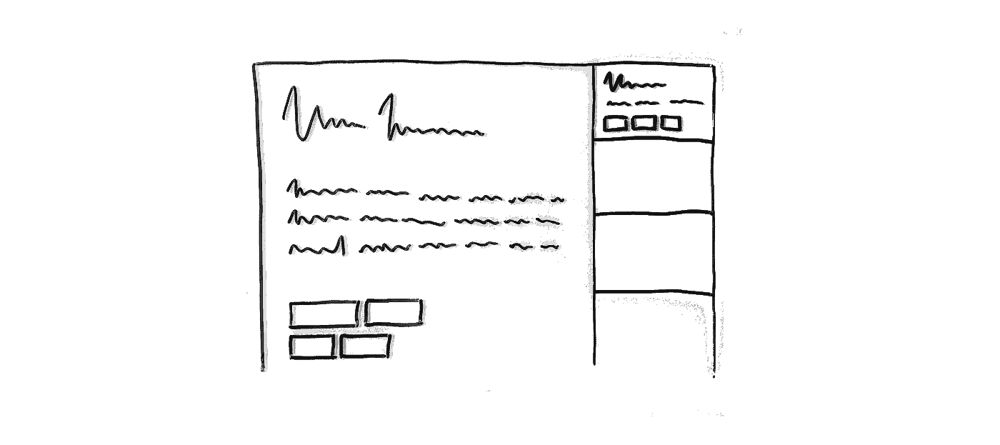
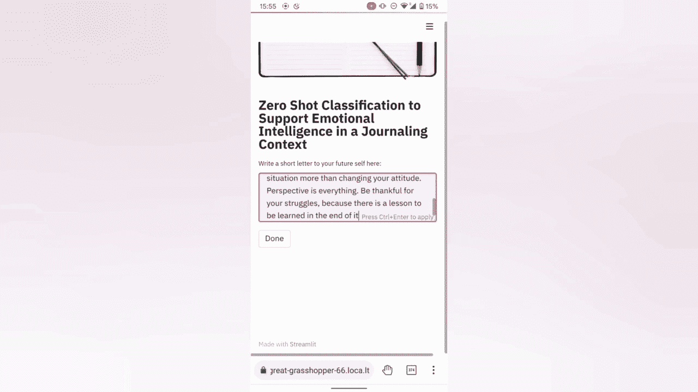

# 变压器模型如何放大日志的积极影响？

> 原文：<https://medium.com/geekculture/how-can-deep-learning-transformer-models-amplify-positive-impacts-of-journaling-8ad28517ccc5?source=collection_archive---------24----------------------->

## 使用具有拥抱面部变形器的零镜头分类🤗在日志环境中支持情绪智力。

Fig.1 — Journaling (Photo by [Green Chameleon](https://unsplash.com/@craftedbygc?utm_source=unsplash&utm_medium=referral&utm_content=creditCopyText) on [Unsplash](https://unsplash.com/s/photos/green-chameleon?utm_source=unsplash&utm_medium=referral&utm_content=creditCopyText))

开始写日记会带来意想不到的好处，从改善注意力、记忆力、睡眠习惯到减轻压力、增强免疫系统。

其中一个重要的观点是，当我们叙述和组织过去的事情时，写日志有助于我们反思想法和感受。这就是 transformer 语言模型的用武之地，它有可能**支持参与、认知**和**理解**。我们可以破译日志条目中编码的含义，并从预定义的用例集中用最合适的标签来标记它。这可以是一个更广泛的情感和感觉描述符池，也可以是一个狭窄的描述符池，为用户旅程的特定部分量身定制。

Fig.2 — Deciphering emotions in journal entries (Photo by [Andrea Piacquadio](https://www.pexels.com/@olly?utm_content=attributionCopyText&utm_medium=referral&utm_source=pexels) from [Pexels](https://www.pexels.com/photo/collage-photo-of-woman-3812743/?utm_content=attributionCopyText&utm_medium=referral&utm_source=pexels)).

# 机会

这种情感分析变化在目的驱动的产品环境集成方面可以采取多种形式。

例如，如**移情试探性问题所提示的**提供了确认、支持和进一步的反思性日志姿势。也许作为一个 ofs 或分支到一个类似对话的来回聊天机器人交流。

Fig.3 — Feedback and probing questions promoting emotional awareness (by author).

这个模型扮演了一个更被动的角色，可以帮助我们**自动标记日志条目**，并随后使用这些元数据进行**搜索**、**分类**和**分析**(类似于目前有多少正念产品整合了手动情绪跟踪)。

Fig.4 — Automatic ‘Empathic Tagging’ of journal entries (by author).

# 零射击分类原型

与训练来区分预定义情感集的情感分析模型相比，具有零触发学习能力的 transformer 语言模型给了我们更多的设计自由。

我们可以从模型的语义语言理解中受益，当它涉及到类别本身时，允许我们在推理时动态地修改它们。

由于这一点，我们可以在不同的背景下采用相同的预训练模型，甚至使用用户输入或元数据来通知这些设置。

此外，这允许在我们设计的产品功能内，对模型如何工作进行极快的实验和微调。

Fig. 5 — Web app with the model prototype (by author).

## 履行

我们使用[拥抱脸](https://huggingface.co/)高级管道 API 来查询模型，使用 [Streamlit](https://streamlit.io/) 来快速构建一个可测试的 web 应用:

并使用本地隧道部署它:

这种在 [Google Colab](https://colab.research.google.com/) 实例中按需托管的方式允许我们以最少的设置方便地试验模型和应用程序！

您可以遍历代码并直接在浏览器中构建原型！继续[本 Jupyter 笔记本](https://colab.research.google.com/drive/1LtC3KY2DeGoavKaOnTw8oHD8hq_7mU1F?usp=sharing)📔！

Fig.6 — Jupyter Notebook (photo by [Pxhere](https://pxhere.com/en/photo/764684)).

# 下一步是什么？

尽管存在隐私问题或与物理形式不兼容等障碍，但日志实践似乎已经准备好受益于当代自然语言处理(NLP)能力。

像 [Morningpages](https://morningpages.app) 或[reflective](https://reflectly.app/)这样的初创公司似乎同意这一点，并在这一领域做了一些令人惊叹的创新工作，但有些事情告诉我，仍然有很多东西有待发现。🤔

你怎么想呢?未来的日志体验能提供什么？

让我知道。谢谢你能走到这一步！👏

> 我对我们如何使用机器学习来解决使用其他方法无法解决的问题感到兴奋。*💭⚙️*
> 
> *查看*[***deep innovation***](http://www.deepinnovation.co.uk)*获取更多来自设计、创新和新颖深度学习的交叉用例！*

 [## 深度学习创新卡

### 数字卡-设计技巧-创新人工智能用例-深度学习概念。面向设计师和……

www.deepinnovation.co.uk](https://www.deepinnovation.co.uk/)