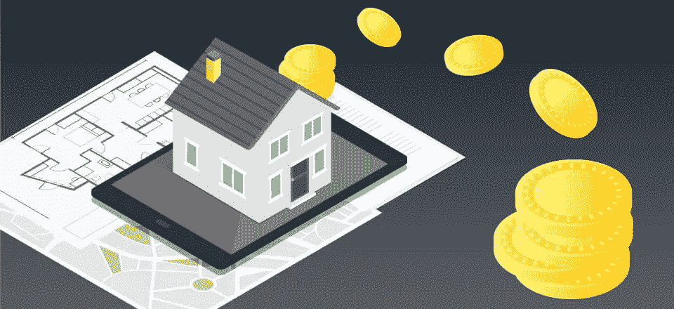
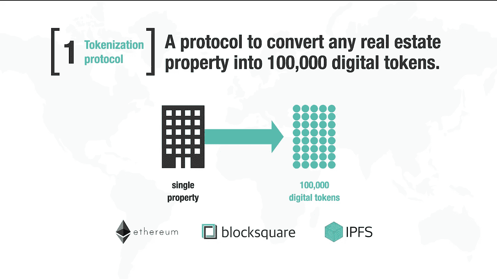
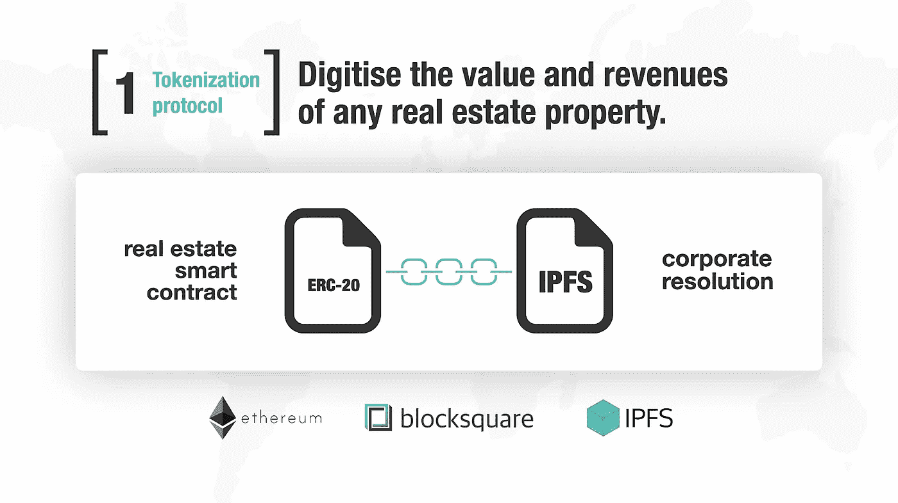

# 如何用 1 美元买一套房子的份额？当然是在区块链上！

> 原文：<https://medium.com/geekculture/how-can-i-buy-a-share-of-a-house-for-1-on-the-blockchain-of-course-7362aba0e99d?source=collection_archive---------6----------------------->

是时候让利润丰厚的房地产行业民主化了。

除非你是迈克尔·布里，否则我想你会同意我说的，房地产通常是一个有吸引力的、往往是有利可图的投资机会。然而，房地产投资的问题是，很少有人有足够的现金来购买这样的投资，更少有人有能力管理它。但是如果你能把一个财产的价值分成一千个小部分，那会怎么样呢？如果你能在网上和任何人在市场上交易这些东西会怎么样？

**进入令牌化房地产。**

以同样的方式，你可以将一件物品的价值分割成一千个称为股份的小块(与公司分割成股份的方式相同)，你也可以分割财产的价值。在一种情况下，估价是基于某个特定部分的租金。这叫做收入共享。在这个模型中，假设有一块土地每年产生 10，000 美元的租金。现在假设有 100 个代币持有者。每个代币持有者都会收到一块土地，每块土地的预期租金为 1000 美元。那么总价值会是多少呢？总价值将为 100，000 美元(100 x 1000)。如果房产价值或未来利润上升，股东可以出售他们的股份获利。

Source: [https://blocksquare.io/](https://blocksquare.io/)

# 简单地

房地产的令牌化是一个过程，使您能够像上市公司一样出售财产中的股份。

那么有什么好处呢？在此之前，除非你有足够的钱购买房产，否则你是不可能涉足房地产的。但有了令牌化的房地产，你实际上可以购买一处房产，而不必为整件事付足够的钱。

# 它是如何工作的？

令牌化房地产的概念并不新鲜。多年来，大型金融机构和其他此类公司一直在买卖和交易房地产股票。但是直到区块链科技的出现，这种投资的结构才能以一种真正有益于普通人的方式改变。让我们看看令牌化的房地产是如何工作的:

1)第一步是在出售股份之前核实财产所有权，并将其记录在区块链上。

2)接下来，您将需要一种方法来识别财产中的份额。一家利用区块链技术来做这件事的公司是 Brickblock。你可以访问他们的网站，了解他们如何使用智能合约来实现这一目标(【https://brickblock.io/】T4)

3)在您核实所有权并识别股份后，您将在以太坊等区块链上发行它们。这可以通过智能合约来实现。有关智能合同如何工作的信息，请访问[https://www.ethereum.org/token/](https://www.ethereum.org/token/)。

Source: [https://blocksquare.io/](https://blocksquare.io/)

4)股票发行后，它们将变得可以在交易所交易，就像任何其他加密货币或令牌一样。你可以在这里阅读更多关于代币的内容。此外，如果你想了解标记化如何让 NBA GIFs 这样的无形资产进入市场，请阅读[这篇](https://jesse-zhou.medium.com/how-i-turned-27-to-10-000-trading-gifs-on-nba-top-shot-2875db24312)文章。

5)当要出售你的房产股份时，你将使用允许你发行代币的相同技术，并创建一个智能合同，允许人们购买你房产的新股份。

这里有一个视频来解释不同资产类别的令牌化:

# 令牌化对财产所有者的好处:

1.  增加房地产资产的流动性。对于房地产所有者来说，令牌化有可能增加流动性，改善获得资本的渠道。这也可以降低他们筹集资金的总成本。
2.  改进市场价格发现。记号化使得综合市场价值变得更加容易，并且能够提高资产市场价格的准确性。这对需要评估房产价值的业主来说可能很有用。
3.  降低房地产交易成本。与令牌化相关的较低交易成本应使业主更容易出售其财产，这反过来可能导致他们获得比传统出售财产时更高的平均售价。
4.  消除地域限制，并降低欺诈、腐败和利益冲突的风险，因为之前的第三方已从等式中消除。
5.  为房地产开发项目提供新的资金来源。在市场上交易代币的能力通过消除投资者和资助者的进入壁垒增加了参与者的数量。

# 令牌化对投资者的好处:

1.  比传统的房地产投资结构更低的最低投资门槛。这使得资本较少的投资者能够进入全球房地产市场。
2.  降低成本和管理费用。这是因为消除了多个中介及其相关费用(想想房地产经纪人、律师、托管公司等。).
3.  获得以前无法获得的房地产资产，如私募股权基金和 REITs。资本的涌入增加了资产的流动性，允许它们获得市场价值，并以比以往更高的价格出售。
4.  所有权、支付和基金绩效完全透明。这是通过使用区块链技术来确保数据的不变性和透明性而实现的。
5.  增加财产和资产的流动性。智能合约所基于的底层技术——区块链保证了这一点。

然而，与任何新兴技术一样，也有需要权衡的缺点。

1.  监管不确定性。为了使令牌化正常工作，法律和法规必须改变，这样一个家庭出售他们家中的“股票”的想法就变得合法了。目前还不清楚在当今的监管环境下这将如何发生。
2.  可扩展性。我们看到的最后一个问题是基于区块链的系统处理大量交易的能力。在令牌化的情况下，不仅在出售令牌化的房地产时有大量交易量，而且在二级市场上发行和交易股票时也有大量交易量。这在可伸缩性方面给任何区块链平台都带来了挑战。
3.  专为符号化设计的用户界面/UX。从监管的角度来看，鉴于令牌化的新颖性(即法律和税务影响)，UI/UX 将需要设计为符合这些监管要求。

目前的房地产市场对投资者来说太慢了。中间商多，增加了放贷成本。项目资金可能很难找到。记号化是公司在业务中自动化许多中间人功能的一种方式。这有助于为需要流动性的资产类别增加流动性。总之，标记化有可能对房地产投资领域产生重大影响，标记化技术的成败在很大程度上取决于法律体系的跟上速度。