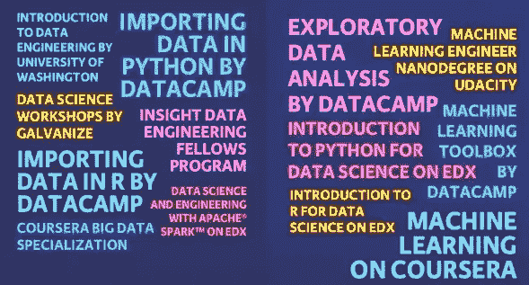

# 怎样才能进入数据工程？

> 原文：<https://medium.com/geekculture/how-can-i-get-into-data-engineering-9c5edd0194b1?source=collection_archive---------13----------------------->

## 帮助您导航早期数据工程师职业生涯的实用技巧&成为大数据革命的一部分！

Photo by [Alexander Sinn](https://unsplash.com/@swimstaralex?utm_source=unsplash&utm_medium=referral&utm_content=creditCopyText) on [Unsplash](https://unsplash.com/s/photos/data-heart?utm_source=unsplash&utm_medium=referral&utm_content=creditCopyText)

作为一名数据和分析工程师，我经常被问到这个问题。他们总是注意到我在谷歌开始职业生涯时是一名业务分析师，并想知道我是如何过渡到一个更加面向技术的数据工程角色的。

成为数据工程师的路径不止**！你可以来自不同的背景和学科，但仍然会成功。更重要的是，你拥有的技术技能和软技能会让你成为一名强大的数据工程师。**

F 首先，在你考虑进入数据工程之前，问问自己这是否真的是你想要的。我想大多数人都梦想进入数据科学&工程领域，因为它被称为 21 世纪最性感的*。事实是，大多数工作都没有那么迷人。与从头开始创建一些先进的实时数据处理和分析框架相比，您更有可能对遗留数据仓库进行维护。数据工程也是一条需要终生学习的职业道路。你将不断跟上最新的创新。不是每个人都适合的！*

*让我们假设你有必要的兴趣，并且你打算改变职业。接下来是什么？答案是通过大量的学习和项目来证明你拥有这些技能。光说你懂火花或者水槽是不够的。一个潜在的雇主会看你的工作经历和你的项目清单，看看你是否在职业环境中运用了这种技能。*

*更难的是，当你目前的角色不适合那些技术转型机会时。幸运的是，有许多自学的途径。我发现现在网上有如此多的资源可以真正促进你在数据工程领域的职业发展，这太令人惊讶了。有许多像[和](https://www.kdnuggets.com/2020/01/resources-become-data-engineer.html)这样的高质量在线课程，既有免费的，也有收费适中的，你可以用它们来增加你的技能。*

**

*Photo by [Jacob Moody](https://www.datacamp.com/profile/jakem) on [Datacamp](https://www.datacamp.com/community/blog/data-engineering-vs-data-science-infographic)*

*如果你追求自学路线，我推荐以下步骤:*

1.  ***学习基本技能组合** —管道、构建分布式系统和数据存储或组合数据源方面的特定技能都是其中的一部分。Scala、Python、Hadoop 等技能必不可少，但更重要的是底层概念。*
2.  ***拓展你的人际网络—** 跟上新趋势将变得越来越重要。你需要每天对新技术、工具、框架甚至编程语言保持非常**的好奇和开放。如今，事情变化得如此之快，尤其是在数据方面。在撰写本文时，传统的数据库管理员似乎是一个垂死的职业，而数据工程师是就业市场上最受欢迎的角色之一。***
3.  ***寻找机会展示你的工作—** 理想情况下，可能有机会为你当前的雇主开发一个需要一些数据管道和 ETL 设置的小型应用程序数据后端或试点 ML 项目。如果没有，在你的关系网中寻找无偿服务的机会。*
4.  ***获得专业认证—** 与其他一些拥有学位和明确道路的技术角色不同，数据工程不那么简单。这就是特别策划的认证发挥作用的地方。[比如 IBM](https://www.ibm.com/certify/) 、[微软](https://docs.microsoft.com/en-us/learn/certifications/azure-data-engineer?wt.mc_id=learningredirect_certs-web-wwl)、[谷歌](https://cloud.google.com/certification/data-engineer)和 [Cloudera](https://www.cloudera.com/about/training/certification/ccp-data-engineer.html) 都专门提供数据工程方面的认证。*
5.  *找一个导师——这个人正处于你所追求的角色中。这个人可以告诉你为了进入新的职业，你需要学习的技能。*

*最后，虽然大多数人认为与数据相关的职业仅仅是两种角色的同义词——数据工程师(技术方面)和数据科学家(统计方面)…但数据科学领域是非常多样化的！*

*在我目前的数据仓库团队中，我们有业务分析师、数据分析师、业务智能分析师、Tableau 开发人员、BSA、数据科学家、数据架构师、数据质量管理员和项目经理。在决定成为一名数据工程师之前，考虑一下这些潜在的职业选择。*

*希望这篇短文对你有用。感谢您的阅读！*

*▶️ *请在下面的评论中提出任何问题/疑问或分享任何建议。**

*▶️ *如果你喜欢这篇文章，那么请考虑关注我&并与你的朋友分享**

*▶️ *可以联系我-*[*LinkedIn*](https://www.linkedin.com/in/garvitarya/)*|*[*Twitter*](https://twitter.com/garvitishere)*|*[*github*](https://github.com/GarvitArya/)*|*[*insta gram*](https://www.instagram.com/garvitarya/)*|*[*Facebook*](https://www.facebook.com/garvitishere)*(几乎无处不在:P) 【T31**