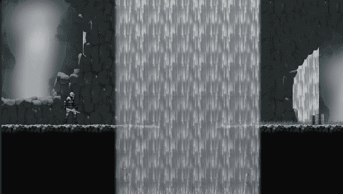
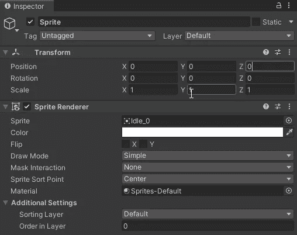
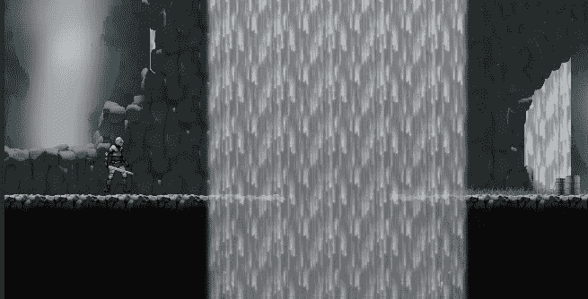
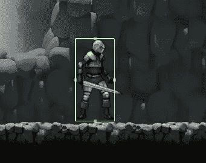
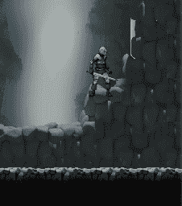
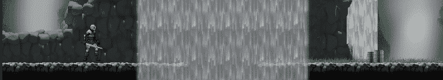
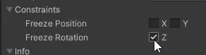
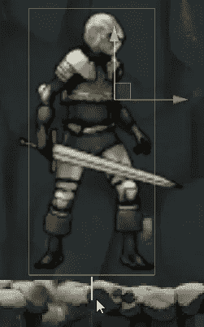
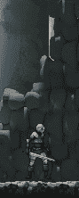

# 我怎样才能移动一个雪碧？—玩家移动脚本

> 原文：<https://medium.com/geekculture/how-can-i-move-a-sprite-player-movement-scripting-f695ccc10fd8?source=collection_archive---------21----------------------->

**目标**:创建一个玩家，并使用刚体方法编写其运动脚本

首先要做的是创建我们的玩家对象。正如在其他教程中对其他玩家对象所做的那样，我将遵循这种方法:将模型作为主对象的子对象。

因此，让我们创建一个空对象，并将播放器精灵拖入其中。这将创建一个包含精灵渲染器组件的子对象。让我们确定这个孩子在零位置。

主要对象将是携带脚本和其他组件的那个，所以让我们添加一个**刚体 2D** 和一个**箱式碰撞器 2D** 。如果需要，碰撞器可以调整以适应精灵。

现在玩家有了刚体组件，就要服从物理定律:重力是自动施加的。玩家摔倒，其他动作被其他碰撞体停止，比如地面。

## 运动脚本

移动不会通过变换来实现，而是通过对刚体应用速度来实现。速度是一个**刚体属性**，我们可以用 vector2 来设置它。

为了设置速度，我们需要一个 vector2 变量。它的组件将在每一帧设置:对于水平方向，我们从轴上获取输入，并将其乘以自定义速度。

自定义速度将在两种可能性中选择，检测另一个输入:当按下左移时，玩家将跑而不是走。在未来，我们甚至可以实现一个耗尽体力的功能。

一旦速度准备好了，我们就可以把它设置成刚体。

哎呀！

因为我们有一个真实的物理盒子在移动，**摩擦力**将沿着底部以与运动相反的方向推动它。这导致一些扭矩施加到身体上，然后旋转。为了防止这种行为，我们欺骗并要求 Unity 忘记旋转！

在刚体检查器中，让我们确保冻结旋转框被选中。

## 跳转脚本

至于运动，跳跃在于设置刚体速度，特别是其垂直分量**。**

**我们还需要在跳跃之前进行一些检查，即是否已经给出正确的**输入**以及玩家是否**接地**。**

**移动方法的变化很小:我们在最后添加了一个 y 速度的评估。该评估返回跳跃速度，这里由从跳跃高度开始的简单公式给出，如果满足跳跃标准(输入和接地玩家)，否则返回刚体垂直速度。这是必要的:如果玩家跳跃，速度的变化发生在一帧中，然后重力发生。如果没有跳跃(落地或在半空中)，我们仍然设置刚体的速度，但我们不想干扰重力，所以我们设置它的值。**

**要检查玩家是否被禁足，我们有很多可能性。仅举几个例子:使用**对撞机**或者使用**射线投射**。我选择后者。**

**Raycast 是一个物理工具，允许从一个点(原点)在给定的方向上投射一条光线或一条线，距离给定。这种射线可以在途中探测到对撞机，并返回大量关于它们的信息。**

**为了投射光线，我们需要一个原点，一个方向，可能还需要一个距离。我用了玩家盒子碰撞器作为参考。从这个位置开始，我使用碰撞器偏移来评估原点，使原点稍微在碰撞器本身之外。方向当然是*向下。*该距离已被选为最小有效距离。**

> **如果一个向下投射的光线将告诉我玩家是否被禁足，它不能到达太远:那么玩家将被认为被禁足，即使在半空中，但距离地面的距离小于光线投射的距离。**

**Raycast 方法返回一个包含被击中的碰撞体信息的对象(如果有的话):所以我们检查它是否存在，我们返回 true，玩家被禁足，因为它在某个东西的上面。Else，false。**

****

**我们还绘制了光线，使其在场景视图中可见。**

**把原点放在盒子外面的选择允许避免射线与播放器本身碰撞。这也可以更优雅地进行。Raycast 方法有另一个重载，它也接受一个层作为参数。**

********

**如果我们将玩家和地面分配到不同的层，然后我们将地面层传递给方法，我们会自动避免检测光线和玩家碰撞器之间的碰撞，无论其来源如何。**

****

**如果你喜欢，就鼓掌吧！看看我的游戏或者给我买杯咖啡:感谢每一种支持！！**

********