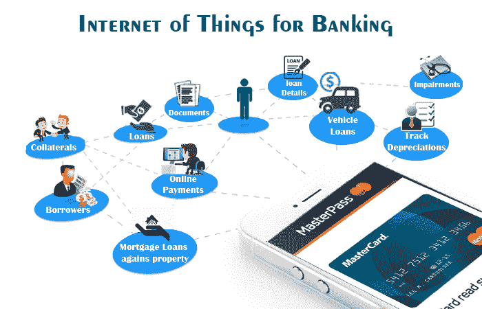
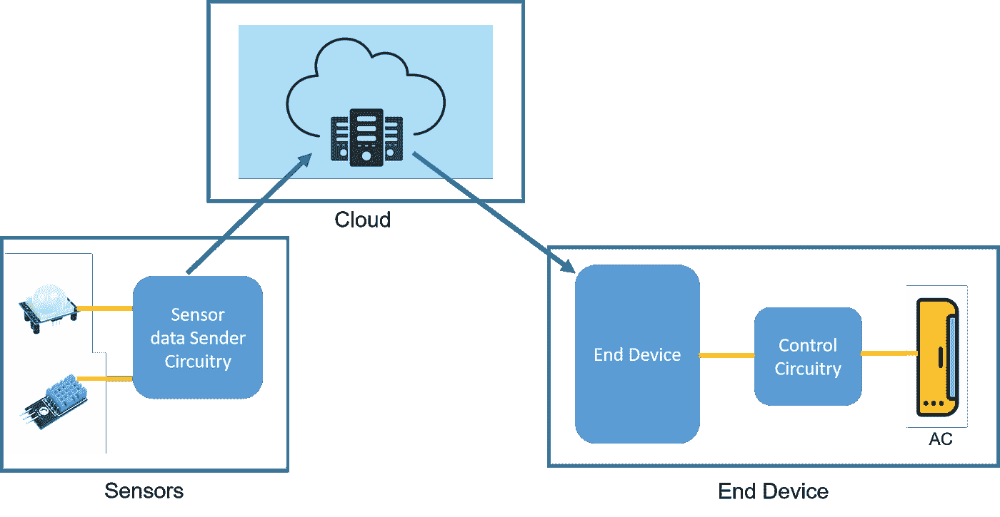

# 物联网如何在银行业蓬勃发展？让我们知道

> 原文：<https://medium.com/geekculture/how-can-iot-thrive-in-the-banking-sector-lets-know-de9a17e9fa3f?source=collection_archive---------2----------------------->

Image source: Google

在金融领域采用物联网将是全球银行业的一次重大转变。鉴于商业的高度敏感和保守性质，银行、金融机构和初创企业将预见到世界上更好的明天。

*据估计，到 2025 年*****全球将有 640 亿台物联网设备。2018 年****100 亿*** *小玩意以来的一次相当大的跃升。****

**随着每个行业的完全数字化指日可待，过去几年来，银行业采用物联网等技术的现象非常显著。物联网带来了个性化体验、实时数据和分析的范式转变。它改变了购买习惯、财务健康状况、创造了收入流，并使我们能够享受完整的数字银行体验。**

**仅在美国， **81%** 的消费者更喜欢手机银行，这一比例相对高于其他地区 84 %- 95%的在线银行服务。**

**有了这些统计数据，专家们预见到银行业数字化转型为运营的光明前景，但何时以及如何— —是物联网推动了变革！**

****物联网:银行业的重要组成部分****

**银行业物联网的关键因素将改变你与系统互动的方式。如其所言，物联网主要是物联网对象的处理和初始化。对于企业来说，**物联网软件开发**将像在需要专家干预的商业平台中寻找过道一样新奇。**

**有几种设备被使用，如**卡、电器、可穿戴设备**出现了改变游戏规则的技术。投资银行中的物联网是一种 M2M-机器对机器的趋势，使所有必要的购买变得更容易。**

**支付监管互联网的标准和协议按照管道模型工作。在金融科技行业，物联网将加强安全系统，并努力为更新的雄心壮志搭建平台。**

**因此，如果你一直在寻找**物联网移动应用开发，**这将是一个令人兴奋的机会，因为物联网将成为银行业的主流渠道。特别是随着开放银行和 PSD2 作为金融科技和第三方提供商的 IoP 提供商的扩张。**

****物联网技术的工作原理****

****

****Google****

**物联网通常使用内置传感器来构建和分析数据。数据专用设备按照地址接收信息。**

**物联网技术精确地工作，以确保没有数据是误导性的或错误的。这是为了发现不同的模式，以确定建议和修复任何问题。**

**物联网遵循特定的生态系统结构，如下所述:**

****传感器或事物** —物联网技术在传感器上工作，它使用互联网介质来感知设备、电器和车辆的任何中断。数据以各种环境形式收集，如温度、位置或其他重要信息。**

****网关**意指通过有线或无线技术传输数据的网桥，包括以太网或 Wi-Fi。这样的方法在带宽、连接范围&消耗功率的形式上有所不同。但是，您可以根据物联网系统选择一个。**

****控制单元** —一个有用的设备或小工具，帮助接收警报、网络连接和用户进行必要的设置。然而，这完全取决于系统在进行必要的改变时的复杂性。**

****基于云的服务** —物联网技术依靠基于云的服务来确保维持控制器和设备之间的控制。除此之外，基于云的数据仓库易于在设备上使用。**

****物联网在银行业的主要优势:****

****a)自动化将提高业务效率****

**物联网应用程序将通过程序自动化对提高性能进行更多控制。银行和经济解决方案市场中物联网使用的增加将有助于客户服务和简化日常功能。例如，花旗银行(Citibank)推出了一些标志，允许客户在下班时间使用智能手机作为安全设备进入 ATM 门，而不是使用重要的卡。**

****b)增加了认证&安全性****

**物联网行业正在增长，这表明金融科技正在有价值的情况下增长。要了解银行使用物联网设备的好处，让我们来深入了解一下。**

**物联网可穿戴设备的兴起促进了运营，并被视为金融科技领域的一项预防措施。Nymi 智能腕带在很大程度上利用心率进行生物认证。它被评估并证明在进行无绳结算时更安全。**

****c)促进无线情感****

**货币解决方案中的物联网改变了消费者的支付方式。可穿戴设备将在很大程度上取代智能手机和传统信用卡，为提现进行无线支付。**

****根据 STATISTA 的数据，**到 2022 年，联网可穿戴设备的数量将从 2016 年的 5.26 亿增加到**11 亿。****

**因此，在未来几年，无疑会有更多的人在日常生活中使用这些设备。**

****d)室内顾客导航****

**通过在日常运营中采用标志，与金融科技公司有联系的公司可以帮助消费者在商业场所浏览。这不仅会减少人们去银行的次数，还会远离人群，保持社交距离。当他们联系银行时，银行会给他们主动的解决方案。这个简单的选项有利于解决方案分发的有效性和客户体验。**

****e)进行无线结算****

**货币解决方案中的物联网正在重组个人以进行支付。可穿戴设备将取代(智能手机和传统信用卡)来执行无线支付和提现。**

****f)现场直线管理****

**在许多银行和其他金融机构，长队是突出的景象。**物联网**可以解决这样的问题。这将有助于客户在商业地产中走来走去，找到最适合他们的代表。**

**借助物联网工具，人们可以实现电子售票。它的工作方式是客户需要以同样的方式输入问题。在这种基于 IOT 的场景中，客户将问题输入到原始设备中。在门票中，他们将获得有关代理的信息和必须在线观看的号码。一旦轮到他们，他们就会收到警报。**

****g)提示客户协助****

**FinTech 在结合工业物联网和人工智能使用方面非常领先。**

**当消费者访问分行时，智能手机将有助于通知金融机构的账户主管。当消费者访问分支机构时，这将是通知金融机构账户主管的重要工具。通过这样做，金融科技公司将主动帮助客户并节省他们的宝贵时间。**

****银行业物联网以用户为中心的本质****

**物联网行业正在增长，这表明金融科技正在有价值的情况下增长。要了解银行使用物联网设备的好处，让我们来深入了解一下。**

****增强的财务状况** —对于用户来说，物联网技术肯定会更智能地增强财务习惯和金钱支出。当用户超过限制时，用户会被发出警报的可穿戴设备震惊。**

****服务范围** —银行业物联网的一个显著优势是服务主要以用户为中心，这有助于排除传统方式。因此，这不仅仅是使用信用卡&借记卡，而是保持健康以获得奖励和奖金。**

****信用卡体验** —物联网技术将在各个领域牢牢占据一席之地，在智能信贷领域也是可行的。因此，消除对塑料卡和互动的需求将通过使用数字媒介来实现，如信用卡限额、实时查询等。**

**未来，我们将见证许多其他技术趋势，这些趋势将改变银行和金融业影响我们生活的面貌。物联网正引领这场竞赛。许多领先的银行已经在蓬勃发展其业务，并正在研究 ***物联网开发服务*** *以提供无忧的银行体验。***

****结论:****

**总之，物联网将把它带到一个先前看起来只是假设的水平。它将解决银行业的许多棘手问题，如盗窃和入室盗窃。由于银行业将热衷于物联网，金融行业将对 [**物联网开发者**](https://www.valuecoders.com/hire-developers/hire-iot-developers#utm_source=IOTinbanking&utm_medium=Ang_N12&utm_campaign=medium) 产生前所未有的需求。**

**物联网将不得不走很长的路，类似于电信中的 5G。有必要与熟练的团队一起适当地利用技术，而不是将它的弱点放在一边。**

**因此，即使你超越了现代技术公司或内部专家，也要保证你与一家 [**物联网软件开发公司**](https://www.valuecoders.com/hire-developers/hire-iot-developers) 合作，该公司牢牢掌握可行且经济的技术，并在物联网领域拥有深入的专业知识。**