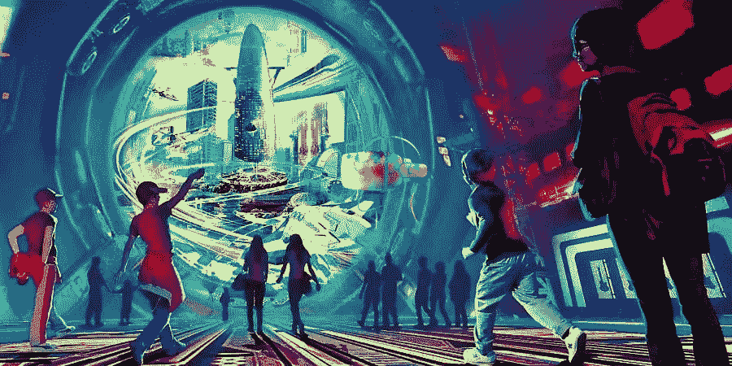
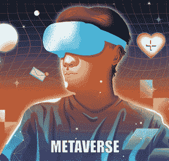

# 元宇宙如何提升你的业务和扩大你的销售？

> 原文：<https://medium.com/geekculture/how-can-metaverse-upgrade-your-business-and-proliferate-your-sales-fb0a7025f76c?source=collection_archive---------12----------------------->

**Metaverse upgrades your business**

还记得那些好莱坞电影中的角色进入了一个完全不同的虚拟世界，所有的动作都发生在那里吗？嗯，现在已经变成现实了。**“元宇宙”**已经成为数字领域谈论最多的术语，并且正在成长为最大的市场之一。到 2028 年，全球元宇宙市场规模预计将增长至 7300 亿美元，CAGR 为 23.2%。 [**元宇宙进化**](https://bit.ly/3CJzu6v) 揭开了娱乐、游戏、教育、健康和工作空间的新可能性。由于这个巨大的市场，许多大公司如微软、Meta 和 Epic Games 已经开始开发他们的 metaverses。如果您仍对元宇宙及其商业可能性感到疑惑，不要担心，我们会帮您解决。

## **元宇宙**

**Metaverse**

元宇宙是一个 360 度的沉浸式世界，结合了社交媒体、在线游戏、虚拟和增强现实的各个方面。在元宇宙中，用户可以相互交流，玩游戏，并沉迷于各种社交活动。这一虚拟领域开启了许多新的商机，因为品牌可以与任何地方的任何人合作和交流。

## **企业如何使用元宇宙**？

由于元宇宙允许世界上任何地方的任何人相互交流，企业可以创造新的方式来吸引客户并更有效地合作。

让我们看看企业可以利用元宇宙的一些方法。

⏭**数字营销:**在元宇宙上推广可能是吸引目标受众的最有效方式之一。许多受欢迎的品牌，如耐克、古驰和可口可乐，已经开始与堡垒之夜和 Roblox 等平台合作，在元宇宙推广他们的品牌。

⏭**游戏化:**将类似游戏的元素应用到现实生活情境中的过程被称为游戏化。这有助于为用户创造身临其境的体验，并提高客户保持率。随着元宇宙的游戏化，企业可以将其用于培训、教育、娱乐、营销等。

⏭**身临其境的产品预览:**借助元宇宙，品牌可以无障碍地向全球观众提供产品演示和预览。他们可以开发 3D 产品和体验，这为用户提供了更好的沉浸式体验，而不像 2D 的产品演示。世界各地的任何人都可以像地区公司一样访问产品。

⏭**活动:**现场活动可以在元宇宙进行，让参与者获得像真实生活一样的迷人体验。它还融入了人工智能、虚拟现实、区块链、加密货币等各种元素。，在虚拟环境中为用户提供逼真的体验。 [**元宇宙赛事**](https://medium.datadriveninvestor.com/5-interesting-events-in-the-metaverse-that-might-lure-the-audience-39ee5cbcdc1) 不像物理赛事有任何座位限制；任何数量的人都可以参加。

⏭**内容分发:**有了元宇宙，共享的内容变得更加精致、吸引人和实时。这有助于促销内容更加精简、多样和有效。

## **如何在元宇宙发展你的业务？**

从初创公司到大公司，许多有远见的企业已经开始涉足元宇宙，从其提供的独特功能和好处中获取利润。但是你如何在元宇宙发展你的业务，或者你如何将你的业务转移到元宇宙？

👉**寻找合适的平台:**在元宇宙为您的企业寻找合适的位置。不同的平台专注于不同的领域，如房地产、游戏和 NFT 项目。选择适合你的受众和其他需求的平台。在选择你的元宇宙平台之前，研究一下所有的顶级元宇宙平台和它们吸引的观众。

👉**提升在线形象:**在这个数字时代，几乎所有的公司都通过网站、社交媒体等进行在线宣传。在你进入元宇宙之前，确保你有一个强大的网络形象，并相应地重新评估你的品牌战略。

👉开发 AR 和 VR 应用:根据最近的一项调查，近 75%的全球商业领袖计划在未来两年内推出自己的元宇宙平台。所以，如果你想与市场保持同步，开发自己的 VR/AR 应用程序可能是理想的选择。

👉**找到你的目标市场:**如果你很了解你的目标市场，你的产品或服务就会自己营销。不要用你的品牌去关注市场上的每一个人；相反，要关注目标受众的需求和愿望。例如，如果你计划推出一款游戏应用，那么就把重点放在更容易接触游戏的年轻受众身上。

👉保持适应性:保持适应虚拟世界的变化，因为这将帮助你了解消费者在寻找什么，并帮助你适应未来的创新和趋势。

## **元宇宙的未来**

元宇宙正显示出非凡的未来迹象。可以肯定的是，元宇宙将在未来彻底改变人类的互动。像**谷歌**和**微软**这样的顶级公司投资虚拟现实清楚地表明了元宇宙充满希望的未来。

## **总结**

AR 和 VR 市场预计将在未来几年呈指数级增长。因此，元宇宙不断扩大，为企业家提供了许多新的商机。随着许多公司和品牌步入元宇宙，它们已经开始蓬勃发展。可以肯定地说，元宇宙逐渐变化的生态系统和新兴用例将彻底改变商业生态系统。如果你想开发一个元宇宙来把你的生意扩展到虚拟空间，那么你可以向元宇宙的一家开发公司寻求专业帮助。