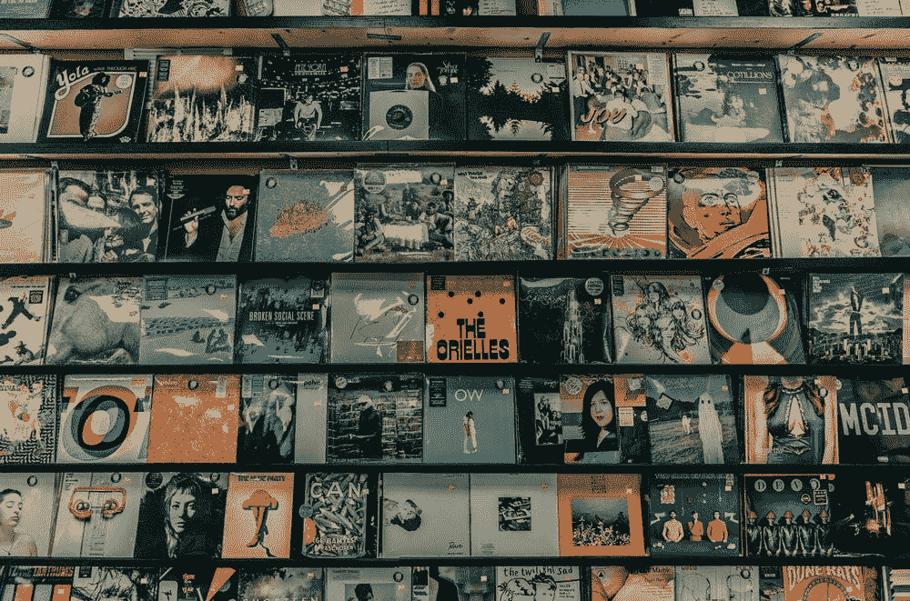

# 音乐人如何从将他们的歌曲转化为非音乐作品中获益

> 原文：<https://medium.com/geekculture/how-can-musicians-benefit-from-turning-their-songs-into-nfts-701a3b0b4f8e?source=collection_archive---------5----------------------->

## 音频 NFTs

## 你以为它们只是视觉艺术作品吗？

What about an animated album cover turned into an NFT? Photo by [Clay Banks](https://unsplash.com/photos/fEVaiLwWvlU) from Unsplash

一个艺术家的主要收入来源来自现场音乐会，但这些日子很难得到。

另一种方法是流式传输。粉丝听他们的音乐，支持他们的工作。除非你是个大…