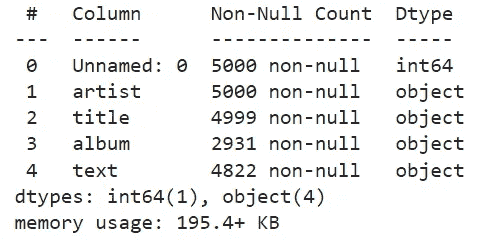
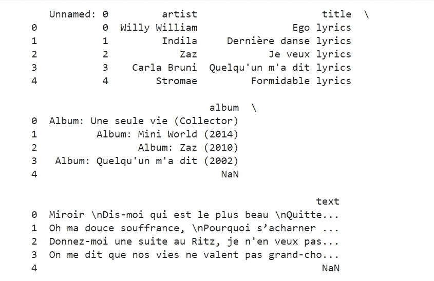
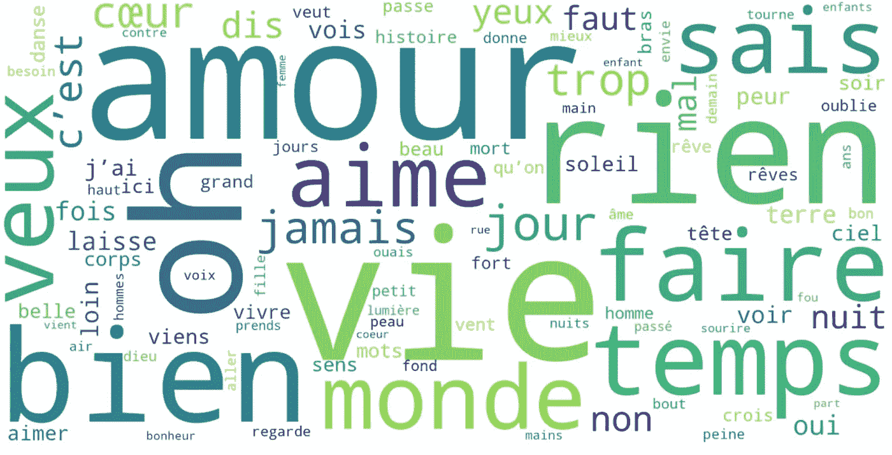
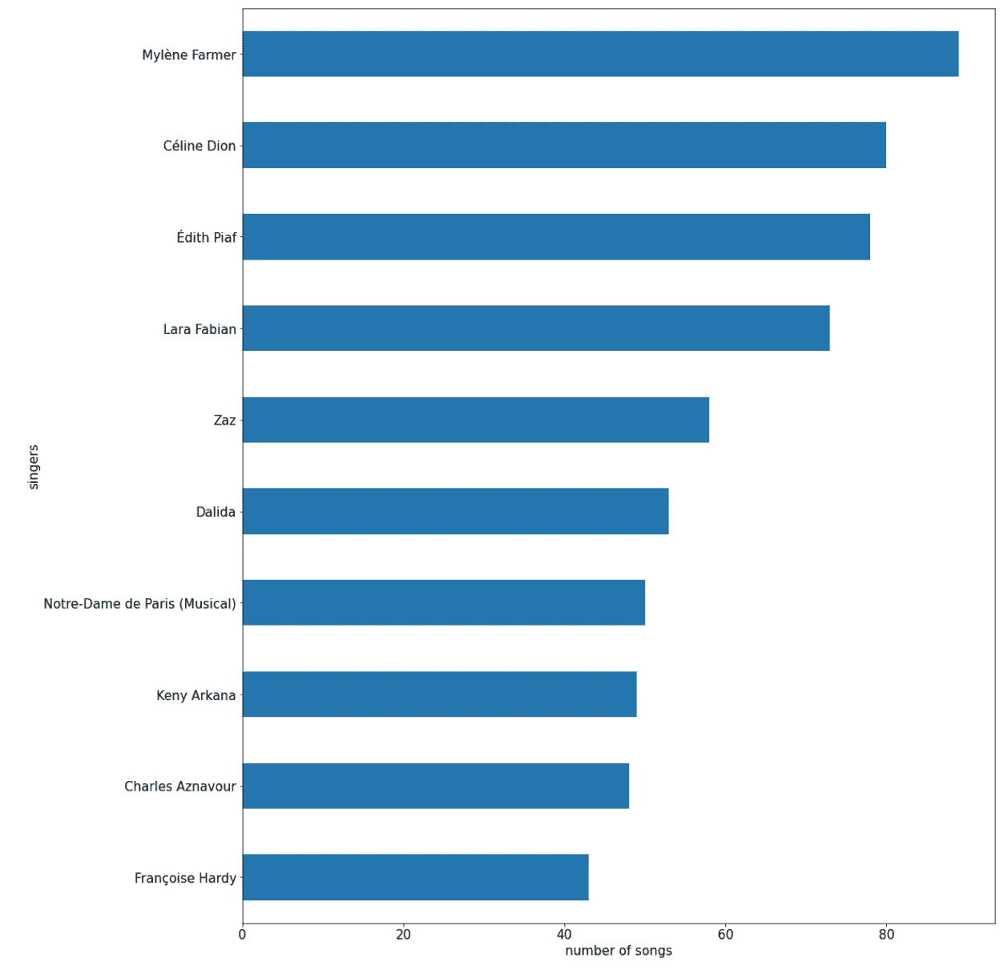
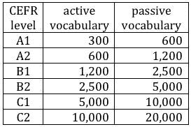
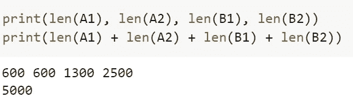
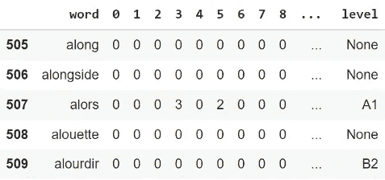
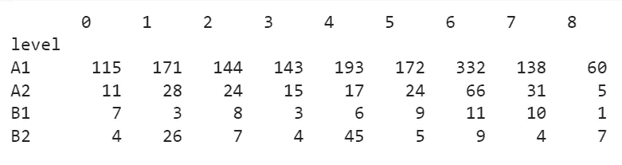
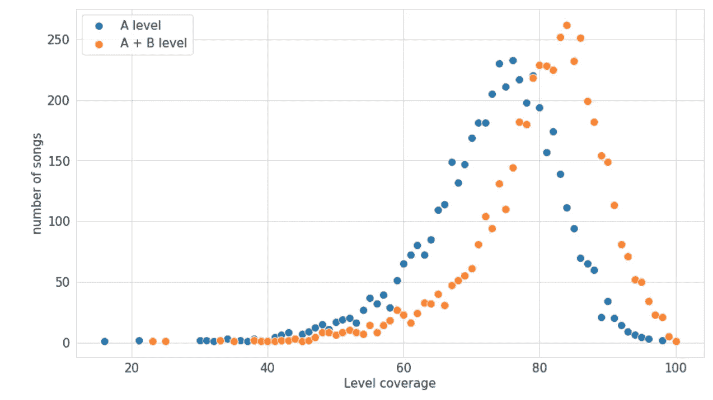
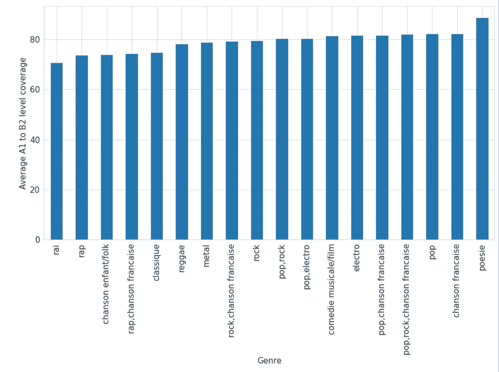

# NLP 如何帮助法语学习者找到符合自己目前水平的歌曲？

> 原文：<https://medium.com/geekculture/how-can-nlp-help-french-learners-find-songs-that-match-their-current-level-a1efdc4dc8fb?source=collection_archive---------9----------------------->

这些年来，我教过很多学生法语，我自己也曾多次站在初学者的立场上。这漫长的语言学习经历教会了我一件事:当你是一个初学者时，获得词汇和语言韵律感的最佳途径是通过歌曲。然而，每当我向我的学生解释这一点时，我看到他们期望我给他们一些精选的歌曲，然而，我的口味不是他们的，我发现我给他们的歌曲既不是他们的水平也不是他们的口味。

在阅读了由 [Frank Andrade](https://frank-andrade.medium.com/) 撰写的一系列文章后，他使用数据科学工具根据语言水平对超过 [3000 部电影](https://towardsdatascience.com/the-best-movies-to-learn-english-according-to-data-science-2dccb4b3ee23)和电视节目进行了分类，我想我会尝试对法语歌曲做同样的事情。

Photo by [Simon Noh](https://unsplash.com/@simon_noh?utm_source=medium&utm_medium=referral) on [Unsplash](https://unsplash.com?utm_source=medium&utm_medium=referral)

因此，该分析的目的是根据歌曲的 [CEFR 等级](https://www.coe.int/en/web/common-european-framework-reference-languages/level-descriptions)对歌曲进行分类。但是，我如何评价一篇课文的水平呢？显然，有许多方法可以解决这个问题(语法、长度、可读性、发音……)，因为我把这看作是发展语言理解和提高词汇量的一个工具，所以我将把重点放在所使用的词汇上。在这篇文章中，我将向你展示我是如何应对这一挑战的，然后再揭示每一关最合适的歌曲。如果你只对歌曲列表感兴趣，你可以直接进入结果部分。

## 我们需要什么信息？

所以我必须去寻找数据，但是什么信息是必不可少的呢？至少，我需要每首歌的文本、艺术家和标题。对此，我还想补充一下流派，因为学习者没有意识到法国音乐场景的实际多样性，认为它相对较小，仅限于跨越法语国家边界的艺术家。一般来说，学习者只会听到流行歌曲或伊迪斯·皮亚芙等著名歌手的老歌。如果你喜欢金属，你学习法语的事实不应该强迫你听几个小时的流行歌曲。除了所有这些元素，我还需要一个根据级别分类的单词列表(例如 A1 到 C2)。

# 获取数据

第一部分，我在 [Lyricstranslate](https://lyricstranslate.com/en/songs/22/none/none/0) 网站上收集了所有归类为“法语”的歌曲。然而，我意识到，这意味着我的语料库中存在一个重要的偏见，即这些歌曲已经被用户翻译成其他语言(这意味着它们已经受到非法语用户的欢迎)。尽管如此，我还是喜欢它，因为它提供了一个重要的信息:这首歌的受欢迎程度。的确，在排序歌曲的时候，你可以选择按人气来排序列表。因此，我的语料库的索引将作为了解它们的受欢迎程度的基础。

收集完歌曲后，我仍然没有找到流派。为此，我创建了几个列表:摇滚、流行、[、法国香颂](https://fr-academic.com/dic.nsf/frwiki/335294)、金属、电子、民谣/儿童音乐和电影音乐。在每个列表中，我添加了与流派对应的艺术家。

最后，我需要的只是一个按级别分类的单词列表。然而，不像在英语中很容易找到一个按照从 A1 到 C1 的等级分类的词汇列表，在法语中，我找不到一个，不得不创建一个。为了做到这一点，我在网上找到了两个清单，它们能给我一个法语学习者应该知道的词汇的概述。第一个来自[法国国民教育和青年部](https://eduscol.education.fr/186/liste-de-frequence-lexicale)，它给出了法语中 1500 个最常用单词的列表，另一个来自 [Memrise](https://app.memrise.com/course/131111/5000-most-common-french-words) ，在那里你可以找到 5000 个最常用单词的列表(根据列表的创建者，所以必须谨慎对待)。我将在下面解释我是如何使用这两个列表按级别对单词进行分类的。

所以我开始了我的工作，列出了 5000 首歌曲，几个根据流派分类的艺术家名单，以及一个根据频率排列的超过 6000 个法语单词的名单。他们都在自己的 CSV 文件中。

# 数据争论

第一步是将歌曲的歌词 CSV 文件加载到数据帧中，用`df.info()`检查其信息，用`df.head()`检查结果如下:

我注意到我丢失了一些歌词和许多专辑名称。我也有一个要删除的列“未命名:0”。更具体地查看歌曲的文本，我可以看到在能够正确地对文本进行词法分析之前，有一些元素必须消失(HTML 残余、换行符、标点符号……)我使用带有正则表达式模式的 replace 方法来做到这一点(例如，`<.*>`将是 regex 模式，用于删除所有剩余的 HTML 元素，如`
`或`<em>`)。以下是完整的代码:

我不得不手动添加 178 首丢失的歌曲。然而，我把自己局限于排名前 300 的歌曲，因为我主要对流行的歌曲感兴趣。主要是来自[司徒迈](https://www.youtube.com/channel/UCXF0YCBWewAj3RytJUAivGA)、[吉姆斯](https://www.youtube.com/channel/UCCB1Byx5yTbLpQaV-rlfmtA)和[雅克·布雷尔](https://www.youtube.com/channel/UCzmPKJcdeMKGiy-93Jn4pZA)的歌曲。我还添加了对应于每个艺术家的流派。此外，通过查看一些歌曲，我很快注意到其中一些不是法语的。这并不引人注目，因为他们只会在排名的底部，但我仍然想知道 Python 库是否能告诉我文本的语言。我很高兴发现 Langdetect 库可以让你做到这一点。多亏了 langdetect，我创建了一个函数，如果歌曲是法语，它返回 True，如果是另一种语言，它返回 False。这允许我在我的 df 上创建一个新的列来存储它。下一步只是从我的 df 中删除这个 French 列的值为 False 的所有行。

在继续讨论 lemmatisation 之前，我还想创建一个包含每首歌的字数的最终列。这将有助于更好地理解我的数据，并获得每个级别的单词百分比。

下一步是对我的文本进行词条匹配，但是**什么是词条匹配？**

> 给予(一个词)标准中性形式的动作，例如，在字典中( *Le Robert* )
> 
> 使用基于词性标记或查找表的规则将基本形式分配给标记的组件。(*空间*)

事实上，为了避免我们的分类器将“bon”(好的，阳性单数)、“bons”(好的，阳性复数)、“bonnes”(好的，阴性复数)作为不同的词，只保留中性形式似乎更连贯。当然，这也产生了一些问题，例如学生可能知道指示形式“vouloir”，但不知道它的虚拟形式“veuille”。然而，我认为积极影响大于消极影响。

为了能够将每首歌曲的歌词进行分类，我使用了 Spacy 的 lemma tizer(T1 ),它提供了不错的法语表现，我还创建了一个函数来将一个名为“lemmatised”的新列添加到我的数据框中。

举一个具体的例子，伊迪斯·皮亚芙的歌曲《玫瑰人生》中的第一句话是“un，oeil，qui，faire，baisser，le，mien，un，rire，qui，se，perdre，sur，son，bouche”。完成所有这些前期工作后，我的数据框就可以进行分析了。这是第一部分之后的样子。现在我们有 **4632 首歌曲**(去掉 nan 后)分布在这 7 个栏目中:

# 理解数据

在开始分析每首歌曲的级别之前，让我们试着更好地理解我们的语料库。首先，我们可以看看列表中使用最多的单词。为了做到这一点，我使用了一个 [**词云**](https://www.geeksforgeeks.org/generating-word-cloud-python/) ，并从列表中删除了所谓的**停用词**，即在语料库中频繁使用且不添加任何意义的词。我使用了 Spacy 给出的停用词表，在上面添加了几个排名靠前但没有增加权重的词(' j '，' c'est '，…)，最后得到了这个词云。

我们可以看到，诸如' amour '、' aime' ('love ')、' vie' ('life ')、temps ('time ')、' veux'('want ')等词在歌曲中非常突出。

然后，我创建了一个条形图，根据艺术家在语料库中的歌曲数量对他们进行排名(注意，从技术上讲，雅克·布雷尔以 100 多首歌曲领先，但由于他的许多歌曲没有排名前 300，我没有将它们添加到语料库中，因此在 lemmatisation 之前将它们从数据框中删除)。

然后我试着找出哪种音乐流派的平均字数最多。我们可以看到说唱音乐在很大程度上处于领先地位。事实上，如果我们看看每个艺术家的平均字数，我们可以看到 [Fonky Family](https://www.youtube.com/channel/UC9XW6KSafvrm6_jgpitJS9w) 每首歌平均 1186 字，其次是 [Kery James](https://www.youtube.com/channel/UCjfIMz-a7tpPZCYQoD8pMEQ) (1105 字)和 [Mafia K'1 Fry](https://www.youtube.com/channel/UCZuIi-AXxSOHuG3QdkAxyaQ) (1089 字)，他们三个都是说唱歌手或说唱团体。

# **分类**

在这些让我们更好地理解数据集的第一批输入之后，我们可以继续进行分类部分。然而，我们仍然缺少一个重要的元素，那就是每一关的单词列表。如前所述，我已经有了一个按使用频率分类的 1500 个单词的列表。除了这个列表，我还有一个由 Memrise 用户制作的法语中最常用的 5000 个单词的列表。但是，我怎么能按级别来分类呢？

在网上做了一些研究后，我发现了这个表格，它可以帮助我:

Source: [http://polydog.org/index.php?threads/the-cefr-scale-and-language-level.26/](http://polydog.org/index.php?threads/the-cefr-scale-and-language-level.26/)

我们在做理解练习，所以我会对“被动词汇”部分更感兴趣，我会把自己限制在 A1、A2、B1 和 B2 水平，因为我有大约 5000 个单词。我觉得合乎逻辑的假设是，对于 A1 和 A2 级别来说，最好认识那些被广泛使用的单词。因此，我将用法国教育部的词频列表填充这些第一批列表。然后，在删除已经出现在频率列表中的单词后，我使用记忆列表并完成所缺少的，以达到不同 CEFR 级别的配额。由于 Memrise 列表不是由专业人士制定的，B1 级和 B2 级之间的差异将被视为半信半疑。

所以现在我有四个单词列表，总共有 5000 个单词，分为四个级别，如下所示。

我终于可以开始分类了。

为了做到这一点，我将使用我在 Frank Andrade 的帖子中发现的 scikit-learn [计数矢量器](https://scikit-learn.org/stable/modules/generated/sklearn.feature_extraction.text.CountVectorizer.html)。计数矢量器“将文本文档集合转换为令牌计数矩阵”(scikit-learn 文档)。

一旦我有了这个矩阵(26551 行超过 4633 列！)，我把每个单词的等级加到上面，得到了下面的表格。例如，我们可以看到，单词“alors”(then)在索引 3 的歌曲中出现了三次，在索引 5 的歌曲中出现了两次，并且排名为 A1 级。

然后我创建了一个表格，使用`df_dtm.groupby(by=’level').sum()`对每个类别的单词总数进行分组，我得到了每首歌曲的列表以及每个类别的单词数。

在该表中可以看到，索引 4 处的歌曲具有来自 A1 列表的 193 个单词、来自 A2 列表的 17 个单词、来自 B1 列表的 6 个单词和来自 B2 列表的 4 个单词。最后一部分包括将该信息与歌曲的信息相关联。为此，我创建了一个字典，将歌曲的索引作为关键字，将每首歌曲的四个级别列表作为其值。索引允许我将这些信息链接到在原始 df 中有相同索引的歌曲。我也一样，用每一级的字数除以歌曲的总字数，得到每一级的百分比。

您可以在上面的代码中看到，我还创建了两个新列:一个名为“A ”,涵盖 A1 和 A2 的词汇范围；另一个名为“A+B ”,涵盖从 A1 到 B2 的词汇范围。

# 结果

最后，我们可以分析结果！首先，我创建了一个图表，让我们可以根据歌曲的级别覆盖范围(A 或 A+B)来查看歌曲的分布。

在下图中，你会发现每种音乐类型的平均 A1 到 B2 等级。毫不奇怪，诗歌和法国歌曲排名第一，而说唱和 rai 的词汇较少。这可以用 rai(一种阿尔及利亚音乐流派)来解释，因为歌词中使用了许多阿拉伯词。至于说唱，这可以归因于许多俚语、新词或外来词的使用。

然后我创建了三个歌曲列表:一个是 A1 级别的已知单词百分比最高的列表，然后是 A2 级别的列表，最后是 B2 级别的列表。为此，我收集了在所选级别中排名最高的歌曲，并且从 A2 级开始，我还删除了已经在先前列表中的歌曲。我因此获得了这三个列表。

**如果你达到 A1 水平，学习法语的 10 首最佳歌曲**

*   曼吕·乔的《食槽》
*   “您想吃什么？”由 Le Roi Soleil(类型=喜剧音乐剧/电影)
*   玛莲·法莫的《不为所动》(流派=流行音乐，法国香颂)
*   梅利莎·M 的《Elle 》(流派= R&B)
*   米亚·玛蒂娜的《你是我的男人》
*   可润·安的《安息》(流派=流行，法国香颂)
*   安妮·玛丽·大卫的《你去过海边》(流派=流行音乐)
*   席琳·狄翁的《出席》(流派=流行，法国香颂)
*   达琳达的《花儿》(流派=流行)

我还在 Spotify 上创建了一个 [**播放列表，选择了 A1 级别的歌曲**](https://open.spotify.com/playlist/4AzvFz5fEpRkK2XA4LeuYp?si=d08a12d4f6f84ac2) **。**

**如果你处于 A2 水平，学习法语的 10 首最佳歌曲**

*   帕特里克·沃森的《我喜欢音乐》
*   用塑料制品(流派=流行音乐)
*   玛丽·麦的《为了一个人》(流派=流行)
*   路易丝·阿塔克的《不平衡》(流派=流行、摇滚、法国香颂)
*   朱迪思的《我的歌词》
*   谢丽法·卢娜的《你是我的男人》
*   维基·莱安德罗斯的《花的时间》歌词(流派=流行)
*   印度支那的“黑色之夜”(流派=流行、摇滚、法国香颂)
*   席琳·狄翁的《你的歌词》
*   Garou 的《Sous le vent》

这里是 A2 级 的 [**Spotify 播放列表。**](https://open.spotify.com/playlist/3SlzKQIfXU87bvADOn1MCz?si=aa83177e52ad4610)

**如果你是 B2 级别，学习法语的 10 首最佳歌曲**

*   席琳·狄翁作词的《没有我的一部分》
*   科琳·爱马仕的《生命是一首歌》
*   mon Dieu ' byédith Piaf
*   丹尼尔·达尔克的《我的梦》(流派=摇滚)
*   安格莉娜的《我的妈妈》(流派=流行)
*   罗拉·菲比安的《安歌是汤姆贝》
*   约翰尼·哈里戴的《我爱你》(流派=流行、摇滚)
*   珍妮特创作的《你看起来怎么样》(流派=流行音乐)
*   耶拿·李的《我的引用》(流派=流行音乐)
*   巴斯汀·拉尔芒的《小天使》

以及 [**最终播放列表**](https://open.spotify.com/playlist/76nJUFO3jFlL16rRQ97Ejv?si=071f3277f25544f4) **。**

如果你想根据你的喜好自己搜索，你可以使用下表浏览整个语料库

To view this table in full page mode follow this link [https://datawrapper.dwcdn.net/6Q7LS/5/](https://datawrapper.dwcdn.net/6Q7LS/5/)

我对结果很满意。然而，有一些事情需要考虑，可以改善这个列表。首先，只在词典上评价一首歌的水平是相当简单的。在标准中加入语法点和动词时态来评估一首歌的水平是很有趣的。其次，发音是一个被忽视的重要因素。最后，理想情况下，能够按主题对歌曲进行分类会很有趣。如果我们正在研究生态学的主题，有几首符合学习者水平和主题的歌曲将是一个非常有价值的工具。

你可以在我的 Github 上找到完整的代码:[https://github.com/StMaCre/french_song_level_analysis](https://github.com/StMaCre/french_song_level_analysis)。感谢您的阅读！