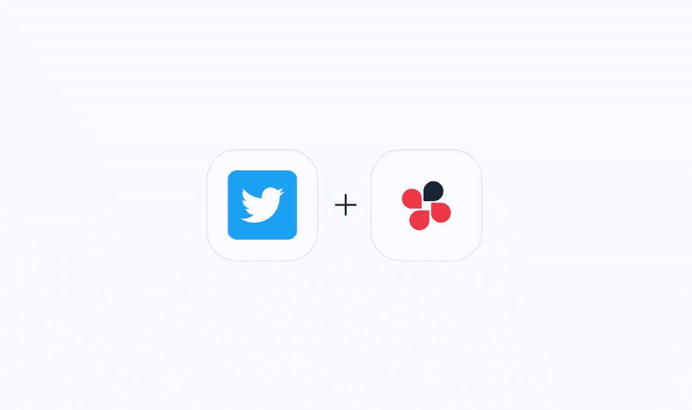

# Quickwork 如何帮助您提高 Twitter 参与度？

> 原文：<https://medium.com/geekculture/how-can-quickwork-help-you-increase-your-twitter-engagement-dcb0a6c143f4?source=collection_archive---------18----------------------->

Twitter 是一个流行的社交网站，允许用户发布他们的想法或观点，并找到其他人的推文。所有推文、帖子、用户信息和数据分析都可以方便地与任何应用程序或网站集成。您可能会收到根据贵公司需求定制的推文搜索结果列表。

使用吸引人的媒体材料，如 gif、视频和迷因，将立即提高你的有机 Twitter 参与度。监控热门 Twitter 账户上的流行内容或关注流行趋势是获取想法和创建独特视频内容的简单方法。

以下是 Twitter 与知名应用的一些重要集成。

**谷歌表单——推特:**

**将收到的 Twitter 消息保存到 Google Sheets 电子表格中。**

无论你是在 Twitter 上搜索你的品牌名称、公司账户还是营销标签，都可以使用这个自动化功能将推文保存到 Google Sheets 电子表格中。电子表格使查找、组织和与团队共享数据变得更加容易。保存推文的数据，以及作者的名字，处理，追随者计数，位置，等等！

**Twitter — Slack:**

**在 Slack 中分享 Twitter 列表中更新的推文。**

Twitter 列表可能是一个跟踪趋势或从您最感兴趣的 Twitter 帐户获取最新消息的好地方。使用这个 Twitter Slack 集成从 Slack 内部的 Twitter 列表接收新的推文，而不是不断地监控 Twitter。

**推特——脸书页面:**

**从新脸书页面帖子创建 Twitter 图片推文。**

这种整合将从您的新脸书页面帖子中生成图片推文。

**推特——聊天工具:**

**从新脸书页面帖子创建 Twitter 图片推文。**

这种整合将从您的新脸书页面帖子中生成图片推文。

既然你知道 Twitter 营销值得进一步探索，为什么不花几分钟时间使用 [Quickwork](https://bit.ly/3469Bk3) 创建你最喜欢的 Twitter 工作流程，帮助你更好地了解你的营销工作呢？