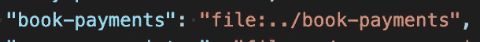

# Symlink 是如何导致停机的？

> 原文：<https://medium.com/geekculture/how-can-symlink-cause-an-outage-6863ac526172?source=collection_archive---------18----------------------->

## 一个小小的无害的便利会变成一个非常有害的不便。

A vector-based artwork showing a man with a bat trying to fight a huge insect coming off the computer screen

我在 Monorepo 的一个 NodeJS Web 服务器上工作。该项目有多个彼此相同的 npm 项目，每个项目都在一个可部署的。自制的网关/代理将用户请求转发到每个单独的服务中。

其中一个 NPM 模块(我们称之为" **PrincipalModule** ")包含了另一个兄弟模块`npm install --save ../my-dependency`(我们称之为" **DependencyModule** ")。PrincipalModule 使用 NPM 本地模块安装添加了依赖项:

这个问题始于对方便的需求。

我做了一个更改，在 DependencyModule 中使用`[app-root-path](https://www.npmjs.com/package/app-root-path)`从其项目的根目录加载组件，比如`const something = require(`${root}/src/path/to/something`);`。它导入了 DependencyModule 的一些公共类，这些类将在 PrincipalModule 的上下文中运行。

在本地开发和整个 CI 流程中，一切都很好。包括 UI 测试在内的所有测试都是绿色的，这些测试会在部署之前将所有的服务器一起旋转起来。然而，在代码进入生产阶段后，我收到一条短信警告，说 prod 关闭了，并显示以下错误:“找不到模块 x”。`x`是代码使用`app-root-path`解析根导入的一个类的名称。

这是一个用户数量很少的小项目。我们已经推迟了一些操作更改，这可以使系统在服务器启动失败时 100%可用。由于这个原因，这个错误导致了停机。

在这个项目中有大量的测试覆盖。如果您查看代码和部署过程，似乎不可能在一些代码更改后立即发生中断。在达到这一点之前，您可能会想到一些测试会失败。当然，仍有可能出现第三方欺诈或随后触发一些 bug，考虑到业务环境，这是我们可以安全承担的风险。然而，在部署之后立即出现 bug 是不可预料的。这几乎是不可能的，到底发生了什么？

我很困惑。集成测试是绿色的，所有使用真实服务器的 UI 测试也是绿色的。我尝试运行相同的 CI 命令来构建类似 prod 的应用程序。没有骰子。我无法重现这个问题。

有趣的事情正在发生。

> 该系统有体面的测试覆盖率和高于曲线的部署过程；似乎不可能在部署后立即观察到中断。发生了什么事？

我在恢复到工作提交后，通过部署一些日志记录，开始在 prod 中进行一些调试。以下是我的发现:

当在 PrincipalModule 的上下文中运行 DependencyModule 时，我希望`app-root-path`将它解析为 DependencyModule 的根。然而，它被解析为主模的根。在本地开发模式和 CI 服务器中，行为是我所期望的:根是相对于 DependencyModule 的。

经过一些研究，我发现当你运行`npm install ../dependency`时，NPM 会自动在依赖项和主体之间创建一个符号链接；符号链接位于主体的`node_modules`文件夹中。`app-root-path`模块使用`__dirname`寻找根，由于符号链接，解析为`../dependency`的根。我试着删除所有的`node_modules`、`package-lock.json`文件，并在本地重新安装。NPM 总是创建那个符号链接，所以我仍然不能在本地重现“找不到模块”的问题。

为什么代码的行为与 prod 中的不同？同样的节点版本，同样的 NPM 版本，同样的`app-root-path`principal module 和 DependencyModule 版本！我直接从管道生成的工件下载了 zip 文件中的代码，并尝试在本地运行它。

这时候我终于重现了 bug！这是问题的根源:

代码在 prod 中找不到某个模块，因为主体和依赖项之间的符号链接已不存在。`app-root-path`包在 prod 中从 PrincipalModule 模块解析根，但是在本地，它从 DependencyModule 模块解析根。与`app-root-path`项目中报道的[这个问题](https://github.com/inxilpro/node-app-root-path/issues/33)相关的是不同的上下文。

> 哦，好吧…你提到“压缩文件”了吗？

我用的是弹性豆茎(EBS)。EBS 要求在运行`eb`命令上传到服务器之前，将项目作为 zip 文件发送。

在部署之前，构建过程使用 macOS `zip`命令行压缩所有代码并发送给 EBS。然后，它将 zip 文件上传到 prod 服务器，并解压缩代码以调用`npm start`。

如果你知道 symlink 是如何工作的，你现在可能已经找到了问题所在。

捆绑`node_modules`，然后在构建过程中压缩，然后在不运行`npm install`的情况下在 prod 中解压缩的行为删除了 NPM 自动创建的符号链接。由于符号链接消失了，`app-root-path`解析了 PrincipalModule 的根路径，而不是 DependencyModule 的根路径。

prod 中导入的文件的位置是不正确的，并且当您在机器上安装该项目时也不可能再现。

这是不可思议的，直到你找到根本原因，然后变得愚蠢。

## **我的一些收获**

*   压缩会删除符号链接。是的，我不经常使用 symlink，所以我不知道这件事。
*   使用 NPM 时，要理解运行 npm install 时 NPM 背后的符号链接魔力。

我开始使用`app-root-path`只是为了方便从根目录导入我的所有模块。现在，我学会了不要太依赖这些东西，并结合依赖于环境的第三方依赖来对系统做出推断。依赖于这一点使得系统容易出现难以调试的边缘情况。

## **对@npmjs 的一些建议:**

每当命令出现在文档中时，记录它们背后的魔力。

在`npm install`司令部的文件中确实有一行这样写道:

> `npm install <folder>`:
> 
> 将包安装在目录**中，作为当前项目中的符号链接**。
> 
> —[https://docs.npmjs.com/cli/v7/commands/npm-install](https://docs.npmjs.com/cli/v7/commands/npm-install)

然而，在研究这个问题的时候，我没有看那部分文档。这是有原因的。

原因是在我运行`npm install`安装 DependencyModule 之后问题并没有发生，所以查看`install`命令的文档没有任何意义。相反，代码已经在 PrincipalModule 中安装了 DependencyModule 在代码试图使用`_dirname`到`app-root-path`之后，bug 才暴露出来。

相反，我查看了 NPM 网站上的[本地路径文档](https://docs.npmjs.com/cli/v7/configuring-npm/package-json#local-paths),那里没有任何东西说明有一个符号链接正在安装本地包。

> 今天我学到了:NPM 在本地文件上安装会创建一个符号链接。默认情况下,“zip”命令行没有符号链接。

现在我可以:

1.  停止使用`app-root-path`。相反，相对于模块在文件系统中的位置来导入模块，而不考虑项目的根[1]。
2.  使用`zip --symlink`压缩 prod 的代码，并给出明显的注释说明原因[2]。

这个问题很好地展示了无害的便利何时会变成中断。

> 一个小小的无害的便利会变成一个非常有害的不便。

你对此有什么想法？你能防止这种错误发生吗？

很高兴听到你的想法。

1:这里的问题是，无论何时创建新目录，您都必须依赖 IDE 自动调整相对路径。另一个问题是，Git 显示了从`../`到`../../`的目录变化，而不是更清晰的从`${root}/src/book-payments/ConnectRepository.js`到`${root}/src/book-payments/storage/ConnectRepository.js`的目录变化。

2:这是以将系统的一部分中使用的一个命令与另一部分中使用的一个命令耦合为代价的。当开发人员阅读代码时，各部分之间没有明确的因果关系。

如果你的团队从我关于这篇文章或我正在进行的任何其他项目的谈话和/或问答中受益，请在`contact at fagnermartins.com`给我写信。

感谢 **Marcel Silva、**和[**Raimo Radczewski**](https://twitter.com/rradczewski)对本文的深刻见解。

感谢阅读。如果您有任何反馈，请通过 [Twitter](https://twitter.com/FagnerBrack) 、[脸书](https://www.facebook.com/fagner.brack)或 [Github](http://github.com/FagnerMartinsBrack) 联系我。